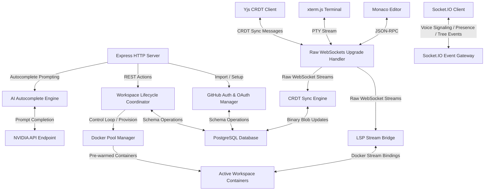

# NexusIDE

<div align="center">

### Production-Ready Collaborative Cloud IDE

Real-time collaboration • Docker Sandboxing • Persistent Terminals • AI Autocomplete • Language Server Protocol • GitHub Integration

<p align="center">
  <a href="https://github.com/AmanKashyapp07/sandbox-ide"><strong>View Repository</strong></a>
  ·
  <a href="https://github.com/AmanKashyapp07/sandbox-ide">Live Demo</a>
  ·
  <a href="https://github.com/AmanKashyapp07/sandbox-ide/issues">Report Issue</a>
</p>


> **Inspired by GitHub Codespaces and Replit, NexusIDE is a production-oriented cloud IDE that focuses on real-world infrastructure challenges such as collaborative editing, secure code execution, container lifecycle management, language intelligence, and distributed synchronization.**

</div>

---

# Table of Contents

- Features
- Architecture
- Engineering Highlights
- Technology Stack
- Security
- Performance Optimizations
- Getting Started
- Testing
- Engineering Learnings
- Future Improvements
- License

---

# Features

| Feature | Description |
|----------|-------------|
| Real-time Collaboration | Conflict-free collaborative editing using Yjs CRDTs |
| Persistent Workspaces | Long-lived Docker development environments |
| Interactive Terminal | xterm.js connected directly to Docker PTY |
| AI Autocomplete | NVIDIA-powered Fill-in-the-Middle completion |
| Language Intelligence | Pyright & TypeScript LSP integration |
| GitHub Import | Import repositories through OAuth |
| Live Collaboration | Presence indicators and multi-user editing |
| Voice Collaboration | WebRTC signaling via Socket.IO |
| File Synchronization | Editor ↔ Docker bidirectional synchronization |
| Role Based Access | Secure Admin / Editor / Viewer permissions |

---

# Interview Summary

> **NexusIDE is a browser-based collaborative development environment that securely executes user code inside isolated Docker containers while supporting real-time CRDT editing, persistent terminals, language servers, GitHub integration, and AI-powered code completion.**
>
> **The backend focuses on production engineering problems including container pooling, workspace multiplexing, binary CRDT persistence, PTY streaming, JSON-RPC language server bridging, and aggressive resource optimization.**

---

# Architecture



---

# Engineering Highlights

## Persistent Docker Workspaces

Unlike traditional online compilers, every workspace owns a persistent development container.

### Implemented

- Interactive PTY bridge using xterm.js
- Persistent shell sessions
- Dynamic workspace allocation
- Automatic workspace restoration

### Optimization

- Warm Docker container pools
- Zero-latency terminal startup
- Workspace reference counting
- Multiple browser tabs share one container
- Automatic idle hibernation after 30 minutes

---

## Real-Time Collaboration

Built on **Yjs CRDTs** for conflict-free concurrent editing.

### Features

- Binary CRDT persistence
- State-vector synchronization
- Incremental update propagation
- Debounced database persistence
- Presence synchronization

Result:

- No merge conflicts
- Offline editing support
- Eventual consistency
- Low bandwidth synchronization

---

## Docker Sandboxing

The execution environment is heavily isolated.

### Resource Isolation

- 1 GB RAM
- 1.5 CPU cores
- PID limits
- Container networking isolation

### File Hydration & Persistent Storage

* **Current Implementation:** Workspace files are physically persisted on the host server's disk (`backend/workspace_data/`) and mapped into the container using **Docker Bind Mounts**. This simulates enterprise Persistent Block Storage (like AWS EBS), eliminating the need to repeatedly stream tarballs from the database into a temporary RAM filesystem. This results in instant container hydration and native SSD speeds for massive operations like `npm install`.
* **Future Deployment Storage Strategy:** When deploying this project to a production cloud environment:
  * **Single Instance Deployment:** The host-side `workspace_data/` directory will be backed by a dedicated **Persistent Block Storage Volume** (such as AWS EBS or GCP Persistent Disk) attached to the host Virtual Machine, ensuring workspace data survives host crashes or VM upgrades.
  * **Multi-Node Cluster Deployment (Kubernetes / AWS ECS):** The directory will mount a **Shared Network Filesystem** (such as AWS EFS, GCP Filestore, or NFS) to allow containers running on different servers to access the same workspace volume seamlessly.

---

## Language Server Bridge

Instead of embedding language servers inside the frontend, NexusIDE launches language servers inside the user's Docker workspace.

Supported:

- Pyright
- TypeScript Language Server

Communication uses JSON-RPC packets streamed through Raw WebSockets into Docker exec streams.

---

## Bidirectional File Synchronization

Editor changes automatically synchronize with Docker while terminal-created files immediately appear inside the frontend explorer.

Synchronization includes

- File creation
- File deletion
- Rename detection
- Live explorer updates

---

# Technology Stack

| Layer | Technologies |
|--------|--------------|
| Frontend | React, TypeScript, Tailwind CSS, Monaco Editor, xterm.js |
| Backend | Node.js, Express, Socket.IO, ws, Dockerode |
| Database | PostgreSQL |
| Collaboration | Yjs CRDT |
| AI | NVIDIA API |
| Language Intelligence | Pyright, TypeScript Language Server |
| Authentication | JWT, GitHub OAuth |
| Infrastructure | Docker Engine API |

## NVIDIA API Notes

- Configure `NVIDIA_API_KEY` and optionally `NVIDIA_AUTOCOMPLETE_MODEL`.
- The autocomplete path uses NVIDIA's chat-completions endpoint at `https://integrate.api.nvidia.com/v1/chat/completions`.
- Rate limits and quotas are account- and model-dependent on NVIDIA's side; this project does not enforce its own AI quota.
- If the key or quota is unavailable, the backend returns a clear error (`503` for missing key, `401`/`429`/`5xx` depending on upstream behavior).

---

# Security

- Docker container isolation
- JWT authentication
- Workspace authorization
- Role-based permissions
- Environment variable secret management
- Resource limiting
- Dynamic port exposure
- Network isolation
- Protected REST endpoints
- Protected WebSocket handlers

---

# Performance Optimizations

| Optimization | Purpose |
|--------------|---------|
| Warm Docker Pool | Eliminate container startup latency |
| Workspace Multiplexing | One container shared across multiple tabs |
| Docker Bind Mounts | Instant zero-hydration startup & native SSD speeds |
| Binary CRDT Storage | Reduce synchronization overhead |
| Debounced Database Writes | Prevent excessive writes |
| AFK Heartbeat | Automatic idle cleanup |
| State Vector Sync | Transfer only missing CRDT operations |

---

# Repository Structure

```
frontend/
│
├── components/
├── pages/
├── hooks/
├── services/

backend/
│
├── routes/
├── websocket/
├── docker/
├── lsp/
├── github/
├── collaboration/

database/
│
├── schema.sql

shared/
│
├── types/
├── utils/
```

---

# Getting Started

## Prerequisites

- Node.js 20+
- PostgreSQL 14+
- Docker Engine
- GitHub OAuth Application

---

## Installation

Clone repository

```bash
git clone https://github.com/AmanKashyapp07/sandbox-ide.git
cd sandbox-ide
```

Initialize database

```bash
createdb sandbox

psql -d sandbox -f database/schema.sql
```

Configure environment

```env
PORT=4000

DATABASE_URL=postgresql://username@localhost:5432/sandbox

JWT_SECRET=...

GITHUB_CLIENT_ID=...

GITHUB_CLIENT_SECRET=...

NVIDIA_API_KEY=...

NVIDIA_AUTOCOMPLETE_MODEL=meta/llama-3.1-8b-instruct
```

Install dependencies

```bash
cd backend
npm install

cd ../frontend
npm install
```

Start backend

```bash
cd backend

npm run dev
```

Start frontend

```bash
cd frontend

npm run dev
```

---

---

# Testing

NexusIDE has a comprehensive, multi-layer test suite that validates everything from individual units to full real-browser multi-user collaboration flows. All 4 suites run against the actual production code — nothing is mocked at the infrastructure level.

---

## Test Suites Overview

| Suite | Tool | Scope | Files |
|-------|------|-------|-------|
| **Backend Unit Tests** | Vitest | Auth routes, workspace CRUD, collaborator permissions, CRDT persistence | `backend/src/tests/` |
| **Frontend Component Tests** | Vitest + React Testing Library | CodeEditor Yjs lifecycle, provider creation/teardown, awareness, role enforcement | `frontend/src/tests/` |
| **E2E Collaboration Tests** | Playwright | Full multi-user CRDT editing, presence, file tree sync, role transitions, CRDT stress | `frontend/e2e/collaboration.spec.ts` |
| **E2E Terminal Tests** | Playwright | PTY session, command execution, npm run dev, restart, viewer restrictions | `frontend/e2e/terminal.spec.ts` |

---

## Running the Tests

### Backend Unit Tests

```bash
cd backend
npm test
```

Tests cover:
- `POST /auth/test-login` — user creation and JWT issuance
- `GET /auth/me` — token verification and user hydration
- `POST /workspace` — workspace creation with Docker container provisioning
- `GET /workspace/:id` — authorization and role resolution for owner / collaborator / stranger
- `POST /workspace/:id/collaborators` — invite flow with role assignment
- `PATCH /workspace/:id/collaborators/:userId` — role update (admin only)
- `DELETE /workspace/:id/collaborators/:userId` — remove collaborator (admin only)
- CRDT document persistence and state-vector sync

### Frontend Component Tests

```bash
cd frontend
npm test
```

Tests cover:
- `CodeEditor` mounts a `WebsocketProvider` per `(workspaceId, fileId)` room
- Provider is torn down and recreated when `fileId` changes (file switch)
- `MonacoBinding` is not created until the Yjs sync is complete
- Editor is `readOnly` for `viewer` role and fully editable for `editor`/`admin`
- Awareness state is correctly broadcast and cleaned up on unmount
- Remote cursor widgets are added and removed on peer join/leave

### E2E Collaboration Suite (Playwright)

> Requires both backend and frontend dev servers to be running.

```bash
# Terminal 1
cd backend && npm run dev

# Terminal 2
cd frontend && npm run dev

# Terminal 3 — run the suite
cd frontend
npx playwright test e2e/collaboration.spec.ts --reporter=list
```

| # | Test | What it validates |
|---|------|-------------------|
| 1 | Typing sync & role enforcement | Bidirectional CRDT sync between two users; editor→viewer downgrade blocks further writes |
| 2 | File tree sync & rug-pull deletion | Peer sees new files instantly; active editor closes safely when file is deleted under it |
| 3 | Presence & ghost cursor cleanup | Avatar appears in navbar; remote cursor renders in Monaco; both disappear on tab close |
| 4 | Interactive terminal streaming | `node script.js` executes in each user's independent PTY; output streams correctly |
| 5 | Simultaneous CRDT stress test | Both users fire concurrent keystrokes; documents converge to identical state via Yjs |
| 6 | File rename & socket stability | `mv` via terminal creates new sidebar entry; WebSocket room stays live after rename |

### E2E Terminal Suite (Playwright)

```bash
cd frontend
npx playwright test e2e/terminal.spec.ts --reporter=list
```

Tests cover PTY lifecycle, command execution, `npm run dev` port detection, terminal restart, and viewer access restrictions.

---

## E2E Test Design Philosophy

The E2E tests exercise the **full production stack** — real Chromium browsers, real HTTP/WebSocket connections to the backend, real PostgreSQL, and real Docker containers. No infrastructure is mocked.

Key patterns used:

- **`loginUser()` helper** — hydration-safe login that waits for the input to be stable before interacting, preventing React re-render race conditions.
- **`createFile()` helper** — waits for the React tree to settle before clicking "New File", preventing the inline input from closing prematurely on re-renders.
- **`page.keyboard.type()`** over `.fill()` inside Monaco — Monaco's `<textarea>` is permanently `readonly="true"` at the DOM level (key events are intercepted globally); `.fill()` always fails, `.keyboard.type()` works correctly.
- **`waitForTimeout(2000)` after typing** — allows the 800 ms server debounce to flush CRDT changes to disk before terminal execution.

---

# Engineering Learnings

- CRDTs simplify distributed collaborative editing compared to Operational Transform.
- Warm container pools dramatically reduce perceived startup latency.
- Reference-counted container reuse significantly lowers infrastructure cost.
- Language servers should execute inside the same filesystem visible to users.
- Binary persistence minimizes storage and synchronization overhead.
- Proper lifecycle management and graceful cleanup are essential for long-running container workloads.

---

# Future Improvements

- Kubernetes deployment
- Horizontal container scaling
- Redis Pub/Sub for distributed collaboration
- Collaborative debugging
- Workspace snapshots
- Version history
- Distributed LSP workers
- Multi-region deployment

---

# License

Distributed under the MIT License.

---

# Author

**Aman Kashyap**

IIIT Allahabad

GitHub:
https://github.com/AmanKashyapp07

Repository:
https://github.com/AmanKashyapp07/sandbox-ide

---

### Project Goal

NexusIDE was built to explore the systems engineering challenges behind modern cloud development environments. Rather than wrapping existing services, the project implements the underlying infrastructure—from collaborative synchronization and container orchestration to language intelligence and resource management—to demonstrate production-oriented backend and distributed systems design.
