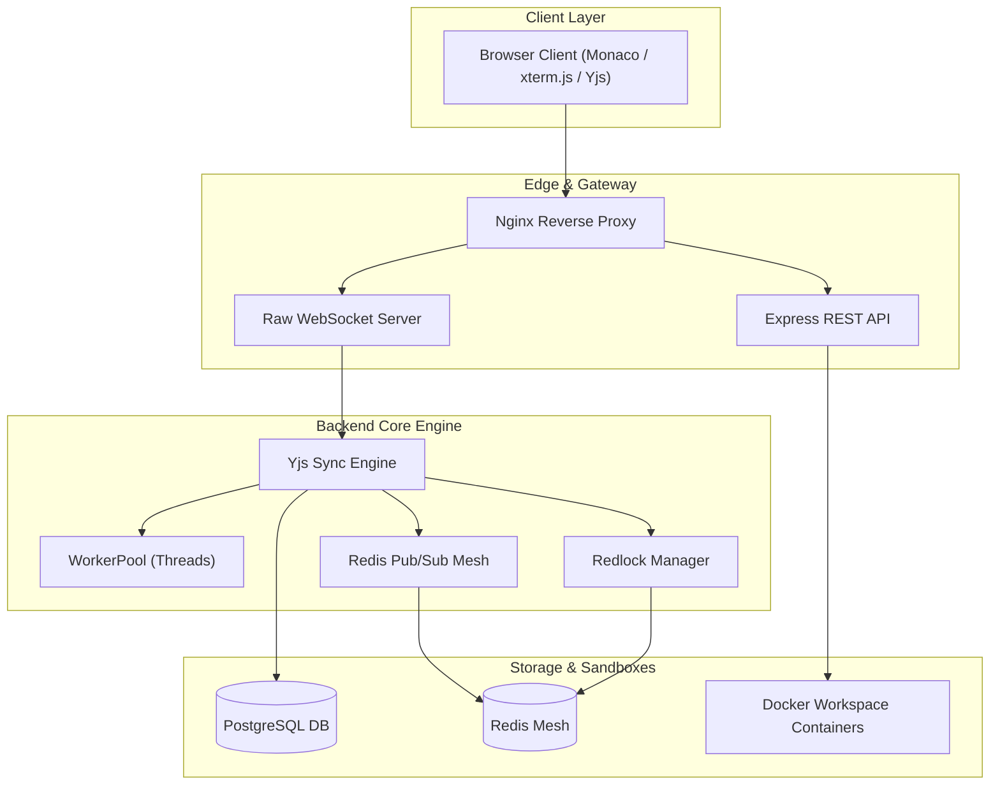
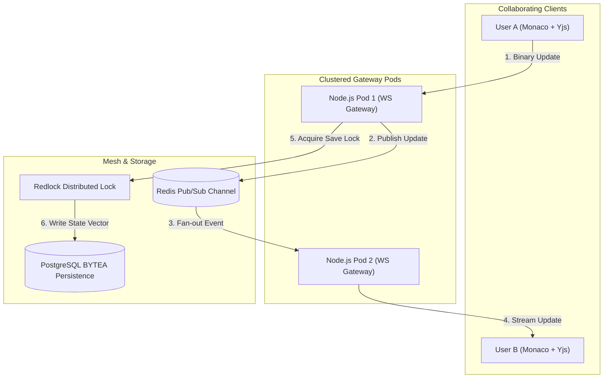
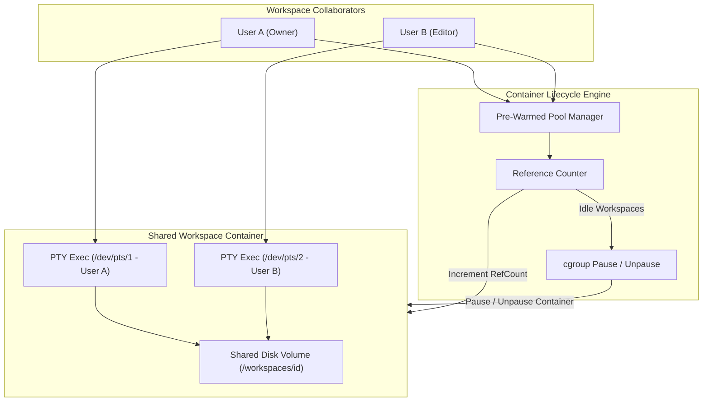

<div align="center">

# NexusIDE: Collaborative Cloud IDE

### A Production-Ready Collaborative Cloud IDE

**Real-time Collaboration** • **Docker Sandboxing** • **Persistent Terminals** • **Language Server Protocol** • **Stateless Redis Clustering**

[View Repository](https://github.com/AmanKashyapp07/NexusIDE) · [Live Demo](http://129.154.39.198/ide/login) · [Report Issue](https://github.com/AmanKashyapp07/NexusIDE/issues)


---

</div>


**NexusIDE** is a browser-based, multiplayer development environment where users can write code, run commands in real interactive terminals, and collaborate live — all inside sandboxed Docker containers. Think a self-hosted, from-scratch take on Replit or GitHub Codespaces.

Under the hood it implements CRDT-based real-time state synchronization, pre-warmed container pool management, streaming language server (LSP) integration, and a horizontally-scalable, stateless Redis-backed cluster with distributed locking — the same class of problems that production cloud IDEs have to solve.

### Why I Built This

I built NexusIDE to get hands-on with the hard infrastructure problems behind modern cloud IDEs: keeping persistent state consistent across browser sessions, making collaborative editing feel instant without losing data, and safely isolating untrusted, user-supplied code execution in a multi-tenant environment.


---


## Table of Contents

- [Tech Stack](#tech-stack)
- [Live Environment & Deployment Infrastructure](#live-environment--deployment-infrastructure)
- [Getting Started (Local Development)](#getting-started-local-development)
- [Core Features & Optimizations](#core-features--optimizations)
- [Systems Architecture](#systems-architecture)
- [Deep-Dive Engineering Highlights & Postmortems](#deep-dive-engineering-highlights--postmortems)
- [Security & Isolation](#security--isolation)
- [Repository Structure](#repository-structure)
- [Testing Suite](#testing-suite)
- [Future Plans & Architectural Roadmap](#future-plans--architectural-roadmap)
- [License](#license)


---


## Tech Stack

#### Frontend & UI Layer
[](https://react.dev/)
[](https://www.typescriptlang.org/)
[](https://tailwindcss.com/)
[](https://microsoft.github.io/monaco-editor/)
[](https://vitejs.dev/)

#### Backend & Real-Time Gateway
[](https://nodejs.org/)
[](https://expressjs.com/)
[](https://socket.io/)

#### Database & State Mesh
[](https://www.postgresql.org/)
[](https://redis.io/)

#### Infrastructure, Sandboxing & Observability
[](https://www.docker.com/)
[](https://www.kernel.org/)
[](https://nginx.org/)
[](https://pm2.keymetrics.io/)
[](https://prometheus.io/)

#### Testing & Quality Assurance
[](https://vitest.dev/)
[](https://playwright.dev/)


---


## Live Environment & Deployment Infrastructure

NexusIDE is continuously deployed and accessible directly in your browser:

**http://129.154.39.198/ide/login**

### Infrastructure Details

| Infrastructure Component | Specification & Architecture |
| :--- | :--- |
| **Cloud Hosting** | Oracle Cloud Infrastructure (OCI) Compute Instance running Ubuntu Linux. |
| **Reverse Proxy & Edge** | **Nginx** handling Gzip compression, REST API proxying (`/ide/api`), and WebSocket upgrades (`ws://.../ide/ws`). |
| **Process Management** | **PM2** process orchestrator maintaining high-availability Node.js Express server instances and background cron workers with auto-restart daemonization. |
| **Container Sandboxing** | **Docker Engine** running in-container Pyright/TypeScript Language Servers and Unix PTY pseudo-terminals (`/dev/pts/X`) isolated by cgroups and custom bridge networks. |
| **Relational Database** | **PostgreSQL 16** with covering B-Tree indexes, byte-packed `BYTEA` CRDT binary storage, and prepared query execution plans. |
| **In-Memory Cache & Mesh** | **Redis 7** handling real-time Pub/Sub cross-pod event fan-out, user session presence keys, and Redlock distributed locking (`SET NX PX` + Lua scripts). |
| **Automated CI/CD Pipeline** | Version-controlled git pre-push hook (`.githooks/pre-push`) executing automated Vite builds, rsync delta code syncing, PM2 zero-downtime reloads, and health checks on every `git push origin main`. |


---


## Getting Started (Local Development)

### Prerequisites

- **Node.js**: v18.0.0 or higher
- **Docker Engine**: Installed and running locally (required for sandbox containers)
- **PostgreSQL**: v16.0 or higher
- **Redis**: v7.0 or higher

### Local Setup

```bash
# 1. Clone the repository
git clone https://github.com/AmanKashyapp07/NexusIDE.git
cd NexusIDE

# 2. Install backend and frontend dependencies
cd backend && npm install
cd ../frontend && npm install
cd ..

# 3. Initialize PostgreSQL schema
psql -U postgres -d sandbox -f database/schema.sql

# 4. Configure environment variables in backend/.env
# Example environment configuration:
# DATABASE_URL="postgresql://postgres@localhost:5432/sandbox"
# JWT_SECRET="your_jwt_secret_key"
# GITHUB_CLIENT_ID="your_github_client_id"
# GITHUB_CLIENT_SECRET="your_github_client_secret"

# 5. Run the services in separate terminal windows
# Terminal 1: Backend Server (runs on http://localhost:3000)
cd backend && npm run dev

# Terminal 2: Frontend Client (runs on http://localhost:5173)
cd frontend && npm run dev
```


---


## Core Features & Optimizations

### Core Features

| Feature | Description | Architectural Implementation |
| :--- | :--- | :--- |
| **Real-time Collaboration** | Multi-user conflict-free text editing with live cursors and presence. | Powered by Yjs CRDTs, awareness protocol broadcasting, and binary state vectors over WebSockets. |
| **Stateless Clustering** | Horizontally scaled application instances without sticky sessions. | Redis Pub/Sub mesh relays delta updates across pods; Redlock Lua locks prevent DB write races. |
| **Shared Workspace Containers** | Multi-user collaboration within 1 shared container per workspace. | xterm.js binds to independent Docker PTY exec sessions (`/dev/pts/X`) with private history & git attribution. |
| **Full-Fidelity Timelapse Engine** | Interactive per-keystroke time-travel playback and author attribution. | Deterministic Yjs StructStore reader (`gc: false`) reconstructing document revisions without data loss. |
| **Worker Pool Compute** | Offloads CPU-bound Merkle hashing and CRDT update compaction. | Dedicated Node.js `worker_threads` pool (`casWorker.js`) prevents event loop stalls under heavy load. |
| **LSP Language Intelligence** | Real-time autocompletion, diagnostics, and hover information. | Streams Pyright and TypeScript Language Servers via JSON-RPC 2.0 directly over WebSockets. |
| **Merkle DAG Snapshots** | Content-Addressable Storage (CAS) versioning and state recovery. | Git-style Merkle trees with SHA-1 blob deduplication (`git_blobs`, `git_trees`, `git_commits`). |
| **Git Conflict Resolver** | Interactive side-by-side collaborative merge conflict resolution. | Parses Git conflict markers, supports three-way diffs, and auto-stages (`git add`) on resolution. |
| **Granular RBAC Enforcer** | Dynamic role enforcement (`Owner`, `Editor`, `Viewer`). | Validates request context against workspace roles at both REST gateway and WebSocket socket layers. |
| **Observability & GC Engine** | Runtime metrics scraping and automated host maintenance. | Prometheus endpoint (`/api/metrics`) for event loop lag percentiles; background storage GC cleanup cron engine. |


---


### Key Optimizations

| Optimization Area | Technical Approach | Engineering Benefit |
| :--- | :--- | :--- |
| **Vite Rollup Code-Splitting** | Vendor chunking (`manualChunks` for Monaco, Yjs, React, Lucide). | Slices main JS bundle size from 4.68MB to 609KB, enabling long-term vendor caching. |
| **Worker Threads Offloading** | Dedicated Node.js `worker_threads` pool for Merkle hashing & CRDT compaction. | Keeps main event loop responsive during multi-file snapshot builds and compaction. |
| **Adaptive Velocity Debouncing** | Dynamic typing-velocity tracking (`AdaptivePersistenceDebouncer`). | Scales persistence windows based on edit bursts, pauses, and pastes to prevent SQL write amplification. |
| **WebSocket Backpressure** | Inspects `ws.bufferedAmount` with soft (1MB) and hard (5MB) thresholds. | Controls socket memory growth and drops non-critical awareness frames during congestion. |
| **Terminal Stream Micro-Batching** | Micro-coalescing buffer (`TerminalStreamBuffer`) for Docker PTY stdout streams. | Batches rapid terminal stdout chunks to prevent browser UI rendering freezes during heavy builds. |
| **VM Storage Cleanup Cron** | `CleanupCronService` and CLI runner (`cleanup.cli.ts`) for background purging. | Reclaims host disk space by purging soft-deleted workspaces, logs, and unreferenced CAS blobs. |
| **Render Batching (60fps)** | Coalesces awareness/cursor state updates via `requestAnimationFrame`. | Prevents React component re-render thrashing during rapid multi-user typing bursts. |
| **Bit-Packed Binary Cursors** | Compact fixed-width binary frame layout (`[uint16 userHash, line, col, len]`). | Replaces bulky JSON cursor payloads with micro binary update buffers. |
| **Container Pre-Warming & Hibernation** | Docker cgroup freezing (`pause`/`unpause`) for idle workspace containers. | Freezes RAM/CPU consumption while preserving running bash processes and uncommitted states. |
| **Covering Indexing & UNNEST Inserts** | B-Tree indexes with `INCLUDE` clauses and vectorized SQL bulk `UNNEST` inserts. | Fulfills lookups via index-only scans without table heap fetches and reduces SQL roundtrips. |


---


## Systems Architecture

### 1. End-to-End Infrastructure Topology


```mermaid
flowchart TD
    subgraph Client ["Client Layer"]
        Browser["Browser Client (Monaco / xterm.js / Yjs)"]
    end

    subgraph Gateway ["Edge & Gateway"]
        Nginx["Nginx Reverse Proxy"]
        Express["Express REST API"]
        WSServer["Raw WebSocket Server"]
    end

    subgraph Core ["Backend Core Engine"]
        YjsEngine["Yjs Sync Engine"]
        WorkerPool["WorkerPool (Threads)"]
        RedisAdapter["Redis Pub/Sub Mesh"]
        Redlock["Redlock Manager"]
    end

    subgraph Infra ["Storage & Sandboxes"]
        Postgres[("PostgreSQL DB")]
        Redis[("Redis Mesh")]
        Docker["Docker Workspace Containers"]
    end

    Browser --> Nginx
    Nginx --> Express
    Nginx --> WSServer

    WSServer --> YjsEngine
    YjsEngine --> WorkerPool
    YjsEngine --> RedisAdapter
    YjsEngine --> Redlock

    RedisAdapter --> Redis
    Redlock --> Redis
    YjsEngine --> Postgres
    Express --> Docker
```


---


### 2. Real-Time CRDT State Synchronization & Redis Mesh Flow


```mermaid
flowchart TD
    subgraph Peers ["Collaborating Clients"]
        ClientA["User A (Monaco + Yjs)"]
        ClientB["User B (Monaco + Yjs)"]
    end

    subgraph GatewayPods ["Clustered Gateway Pods"]
        Pod1["Node.js Pod 1 (WS Gateway)"]
        Pod2["Node.js Pod 2 (WS Gateway)"]
    end

    subgraph SyncMesh ["Mesh & Storage"]
        RedisPubSub[("Redis Pub/Sub Channel")]
        RedlockLua["Redlock Distributed Lock"]
        PostgresDB[("PostgreSQL BYTEA Persistence")]
    end

    ClientA -->|"1. Binary Update"| Pod1
    Pod1 -->|"2. Publish Update"| RedisPubSub
    RedisPubSub -->|"3. Fan-out Event"| Pod2
    Pod2 -->|"4. Stream Update"| ClientB

    Pod1 -->|"5. Acquire Save Lock"| RedlockLua
    RedlockLua -->|"6. Write State Vector"| PostgresDB
```


---


### 3. Workspace Shared Container & Multi-User PTY Isolation


```mermaid
flowchart TD
    subgraph Users ["Workspace Collaborators"]
        User1["User A (Owner)"]
        User2["User B (Editor)"]
    end

    subgraph Lifecycle ["Container Lifecycle Engine"]
        PoolManager["Pre-Warmed Pool Manager"]
        RefCounter["Reference Counter"]
        Hibernation["cgroup Pause / Unpause"]
    end

    subgraph Sandbox ["Shared Workspace Container"]
        Volume["Shared Disk Volume (/workspaces/id)"]
        PTY1["PTY Exec (/dev/pts/1 - User A)"]
        PTY2["PTY Exec (/dev/pts/2 - User B)"]
    end

    User1 --> PoolManager
    User2 --> PoolManager

    PoolManager --> RefCounter
    RefCounter -->|"Increment RefCount"| Sandbox

    User1 --> PTY1
    User2 --> PTY2

    PTY1 --> Volume
    PTY2 --> Volume

    RefCounter -->|"Idle Workspaces"| Hibernation
    Hibernation -->|"Pause / Unpause Container"| Sandbox
```


---


## Deep-Dive Engineering Highlights & Postmortems

<details>
<summary><b>Key Engineering Takeaways & Postmortem Lessons Learned</b></summary>
<br/>

* **CRDT Convergence vs. Database Write Amplification:** 
  Yjs Conflict-free Replicated Data Types provide deterministic, mathematical state convergence without centralized operational transformation servers. However, persisting every binary edit directly to disk creates unsustainable SQL write amplification. Decoupling hot in-memory CRDT synchronization from cold persistence via dynamic typing-velocity debouncing and Redis write-behind buffers is essential for scaling database write throughput under concurrent multi-user load.

* **Node.js Buffer Slicing & TypedArray Offset Pitfalls:** 
  Passing a sliced Node.js `Buffer` directly to `new Uint8Array(buffer)` silently ignores `buf.byteOffset` because Node allocates small buffers out of a shared 8KB internal `ArrayBuffer` pool. When binary decoders read `buffer.buffer` from index 0, they parse unrelated memory regions, leading to subtle state corruption. The defensive pattern required for binary CRDT parsing is always explicit offset construction: `new Uint8Array(buf.buffer, buf.byteOffset, buf.byteLength)`.

* **Stateless Redis Cluster Mesh & Feedback Loop Prevention:** 
  In horizontally-scaled multi-pod WebSocket deployments, every pod must relay CRDT updates to peer pods via Redis Pub/Sub. However, without origin isolation, peer pods re-broadcast incoming pub/sub messages back to Redis, creating infinite network feedback loops. Tagging every Redis-sourced message with an explicit `'redis'` origin and gating re-publication on `if (origin !== 'redis')` cleanly eliminates recursive message storms across the cluster.

* **WebSocket Backpressure Management & Traffic Batching:** 
  High-velocity streams (such as rapid terminal stdout or intense multi-user typing) can easily overflow client socket buffers, causing Node.js memory spikes and browser UI rendering lockups. Checking `ws.bufferedAmount` against explicit soft (1 MB) and hard (5 MB) thresholds allows the gateway to safely drop non-critical cursor frames or terminate stalled sockets. Furthermore, batching awareness updates into micro-tick windows (~16ms) prevents frame transmission queue buildup.

</details>

<details>
<summary><b>Production Performance & System Optimization Architecture</b></summary>
<br/>

NexusIDE incorporates a 5-phase optimization architecture designed for high-throughput, real-time cloud collaboration:

* **Phase 1: Heavy Compute Offloading via Worker Threads (`workerPool.service.ts` + `casWorker.js`):**
  Offloads CPU-intensive SHA-256 Merkle tree calculation (`buildMerkleTree`), canonical JSON entry sorting, and Yjs binary delta compaction (`mergeYjsUpdates`) to a dedicated Node.js `worker_threads` pool. Keeps the main single-threaded event loop responsive during multi-file snapshot creation and batch compaction.
* **Phase 2: High-Velocity WebSocket I/O & Network Backpressure (`yjsSyncEngine.service.ts`):**
  - **Socket Backpressure Controls:** Inspects `conn.bufferedAmount` per socket. Soft limits automatically drop non-critical cursor/presence awareness frames. Hard limits disconnect choked connections to reclaim server RAM.
  - **Micro-Tick Awareness Frame Coalescing:** Batches rapid cursor and selection vector triggers into consolidated awareness broadcasts per room.
  - **TCP Ping/Pong Heartbeat:** Detects silent network drops and terminates dead client sockets to eliminate ghost presence entries.
* **Phase 3: Memory Optimization, Storage GC & VM Cleanup Cron Service (`cleanupCron.service.ts` + `casGarbageCollector.service.ts`):**
  - **CAS Storage GC:** Scans and hard-deletes unreferenced `git_blobs` and `git_trees` not linked to active commit trees.
  - **Automated Maintenance:** Background cron engine and CLI runner (`cleanup.cli.ts`) purges soft-deleted workspaces, execution logs, obsolete CRDT `file_updates`, and temporary files.
* **Phase 4: Frontend Code-Splitting & Render Batching (`vite.config.ts` + `useCodeEditorSetup.ts`):**
  - **Vite Rollup Code-Splitting:** Configured manual vendor chunking (`monaco-vendor`, `react-vendor`, `yjs-vendor`, `icons-vendor`), separating third-party libraries into distinct browser-cached vendor bundles.
  - **Render Batching:** Wraps React awareness/cursor updates in `requestAnimationFrame` batching to cap UI re-renders and Monaco remote cursor decorations per animation frame.
* **Phase 5: Distributed Scaling & Continuous Observability (`metrics.service.ts` + `metrics.routes.ts`):**
  Exposes Prometheus metrics at `/api/metrics` tracking Node.js event loop lag percentiles (p50, p90, p99) via `perf_hooks.monitorEventLoopDelay`, RSS memory, V8 heap usage (`heapUsed`, `heapTotal`), active WebSockets count, and CRDT queue depth.

</details>

<details>
<summary><b>Stateless WebSocket Clustering via Redis Pub/Sub & Redlock</b></summary>
<br/>

NexusIDE's collaboration engine operates as a stateless cluster — multiple independent Node.js WebSocket pods serve the same workspace concurrently without shared memory or sticky-session requirements.

* **Redis Pub/Sub Mesh (`redisAdapter.service.ts`):** Every Yjs CRDT update and awareness cursor packet written on one pod is fanned out via pattern-matched channels (`yjs:update:*`, `yjs:awareness:*`). Peer pods consume these on their `pmessageBuffer` handler and apply them with a `'redis'` origin tag to break re-broadcast feedback loops. Binary payloads are decoded using `new Uint8Array(buf.buffer, buf.byteOffset, buf.byteLength)` to respect `byteOffset` on pooled Node.js `Buffer` slices.
* **Distributed Locking (`distributedLock.service.ts`):** Before each debounced PostgreSQL save, the engine acquires a per-file Redlock distributed lock via an atomic Lua `SET NX PX` + `EVALSHA` script, guaranteeing mutual exclusion across pods and preventing conflicting `UPDATE files` queries during simultaneous saves.
* **Cluster-Wide Workspace Eviction:** Snapshot restores and workspace deletions broadcast a `workspace:evict:<workspaceId>` signal to Redis. Every subscribed pod locally invokes `cancelAndEvictWorkspaceDocs` with `skipBroadcast=true` and force-closes connected clients with WebSocket close code `4100` ("Snapshot restored"), triggering client-side editor reload.
* **Yjs State Caching:** Freshly saved Yjs binary states are pushed to a Redis cache. Subsequent cold loads check Redis before falling back to PostgreSQL, reducing DB read latency for warm documents.

</details>

<details>
<summary><b>Persistent Docker Workspaces & PTY Streaming</b></summary>
<br/>

NexusIDE provisions an isolated backend Linux environment per workspace.
* **PTY Integration:** xterm.js in the browser binds directly to a Unix pseudo-terminal (`/bin/bash` or `/bin/sh`) inside a sandbox container via `dockerode`. Keystrokes and terminal resize (`SIGWINCH`) events are packed as raw binary packets and piped bidirectionally over WebSockets.
* **Warm Container Pools:** A background pool-manager daemon maintains a standing reserve of pre-warmed, idle developer containers to eliminate cold-start container initialization overhead during workspace launches.
* **Reference-Counted Multiplexing:** To manage RAM usage under multi-tab access, concurrent tabs from the same user to the same workspace share a single underlying container via reference counting, with idle containers scheduled for graceful teardown after an inactivity timeout.

</details>

<details>
<summary><b>Single Shared Container per Workspace & Multi-User PTY Isolation (`workspaceContainer.ts`)</b></summary>
<br/>

NexusIDE operates on **1 Docker container per workspace (`workspaceId`)**, enabling real-time co-presence with independent terminal sessions.

* **Container Memory Consolidation:** Collaborating users in a workspace share a single isolated container instance rather than spinning up per-user containers, reducing total host memory consumption.
* **Multi-User PTY Session Isolation:** Each user's WebSocket spawns an independent `container.exec()` PTY instance (`/dev/pts/X`) with custom session environment variables (`USER`, `GIT_AUTHOR_NAME`, `GIT_COMMITTER_NAME`). Collaborators maintain private command histories, working directories, and git attribution while collaborating on the shared `/workspaces/${workspaceId}` disk volume.
* **Predictive Pre-Warming:** `prewarmWorkspaceContainer()` asynchronously claims and populates a developer's container when they log into the dashboard.
* **Container State Hibernation:** When a workspace is idle, `hibernateWorkspaceContainer()` pauses Docker container cgroups (`container.pause()`), freezing RAM and CPU consumption while preserving running bash processes, environment variables, and uncommitted shell states. On reconnect, `unhibernateWorkspaceContainer()` unpauses the container.

</details>

<details>
<summary><b>PostgreSQL Database Optimizations (`db.ts` & Repositories)</b></summary>
<br/>

NexusIDE applies database engineering optimizations to maintain query execution performance:

* **Covering B-Tree Indexing (Index-Only Scans):** Multi-column indexes with `INCLUDE` clauses (`idx_files_tree`, `idx_collab_auth`, `idx_file_updates_ordered`) serve file tree and RBAC lookups directly from B-Tree leaf pages without table heap fetches.
* **Named Prepared Statements:** High-frequency queries compile execution plans in PostgreSQL process memory, bypassing AST re-parsing.
* **Vectorized Bulk `UNNEST` Insertion:** Template and repository bootstrapping batches file records into a single SQL query (`INSERT INTO ... SELECT ... UNNEST`), reducing network roundtrips during workspace scaffolding.
* **Defensive Pool Guardrails:** Configured `statement_timeout` and `query_timeout` boundaries prevent lock contention from exhausting connection pool slots.

</details>

<details>
<summary><b>Frontend Collaborative Engine & IDE Optimizations (`useCodeEditorSetup.ts` & `IdePage.tsx`)</b></summary>
<br/>

NexusIDE implements frontend rendering optimizations for collaborative editing:

* **Monaco Native `deltaDecorations`:** Remote collaborator cursors, selection highlights, and hover badges are mounted onto Monaco editor's native glyph and decoration tree without triggering React component tree re-evaluations.
* **Multi-Model Tab Caching:** Maintains an LRU cache of warm `monaco.editor.ITextModel` instances and `Y.Doc` providers in browser memory, enabling tab switching without WebSocket teardown.
* **Optimistic Local State for File Tree Mutations:** File creations and deletions update local UI state immediately, reconciling with backend responses asynchronously and rolling back on validation errors.

</details>


---


## Security & Isolation

Security and multi-tenant isolation are essential when executing user code in sandbox environments:

* **Container Resource Boundaries:** Docker containers are configured with cgroup resource limits (memory limits, CPU quotas, and PID caps) to mitigate process fork-bombing and resource exhaustion.
* **Non-Root Execution & Privilege Dropping:** Sandbox processes run under unprivileged container user accounts with system commands restricted or aliased to standard allowlists.
* **Network Isolation:** Workspaces are attached to isolated Docker bridge networks with egress restrictions to limit internal network access.
* **Granular RBAC Enforcer:** REST and socket gateways validate incoming requests against role assignments (`Owner`, `Editor`, `Viewer`).
* **MicroVM Architectural Roadmap:** While container-level namespaces and cgroups provide standard isolation, shared host Linux kernels present inherent attack surfaces for multi-tenant code execution. Migrating to microVM architectures (e.g., AWS Firecracker) is planned to provide hardware-virtualized kernel boundaries for arbitrary code sandboxing.


---


## Repository Structure

```
nexus-ide/
├── backend/
│   ├── src/
│   │   ├── cli/
│   │   │   └── cleanup.cli.ts           # Standalone system cleanup CLI entrypoint
│   │   ├── middleware/
│   │   │   └── auth.ts                  # JWT authentication & RBAC middleware
│   │   ├── repositories/
│   │   │   ├── snapshot.repository.ts   # Merkle DAG commits & tree repository
│   │   │   └── workspace.repository.ts  # Workspace entity CRUD repository
│   │   ├── routes/
│   │   │   ├── auth.ts                  # GitHub OAuth & test login routes
│   │   │   ├── metrics.routes.ts        # Prometheus observability endpoint (/api/metrics)
│   │   │   └── workspace.ts             # Workspace REST endpoints & file tree routes
│   │   ├── sandbox/
│   │   │   ├── pool.ts                  # Pre-warmed Docker container pool manager
│   │   │   └── workspaceContainer.ts    # Workspace container lifecycle & cgroup hibernation
│   │   ├── services/
│   │   │   ├── adaptiveDebouncer.service.ts # Velocity-based persistence debouncer
│   │   │   ├── cas.service.ts           # SHA-256 CAS Merkle tree builder
│   │   │   ├── casGarbageCollector.service.ts # Storage GC for unreferenced blobs/trees
│   │   │   ├── cleanupCron.service.ts   # Automated VM storage cleanup scheduler
│   │   │   ├── crdtCompactor.service.ts # Incremental Yjs delta compactor
│   │   │   ├── crdtWriteBehind.service.ts # Redis RAM write-behind buffer queue
│   │   │   ├── cursorCodec.service.ts   # Bit-packed binary cursor codec
│   │   │   ├── distributedLock.service.ts # Redlock Lua distributed lock manager
│   │   │   ├── metrics.service.ts       # Event loop delay & system metrics collector
│   │   │   ├── redisAdapter.service.ts  # Redis Pub/Sub collaboration mesh
│   │   │   ├── redisPresence.service.ts # User session presence registry
│   │   │   ├── socketPresence.service.ts # Socket.IO awareness dispatcher
│   │   │   ├── websocketServer.service.ts # Raw WS upgrade handler & backpressure manager
│   │   │   ├── workerPool.service.ts    # Node.js worker_threads compute offloader
│   │   │   ├── workspaceFile.service.ts # File content & Yjs persistence service
│   │   │   └── yjsSyncEngine.service.ts # Core CRDT state synchronization engine
│   │   ├── terminal/
│   │   │   ├── lspHandler.ts            # Pyright / TypeScript Language Server bridge
│   │   │   └── terminalHandler.ts       # Docker PTY exec stream & ANSI buffer
│   │   ├── workers/
│   │   │   └── casWorker.js             # Background worker script for CPU offloading
│   │   ├── db.ts                        # PostgreSQL connection pool configuration
│   │   ├── docsRegistry.ts              # In-memory WSSharedDoc map & eviction
│   │   └── server.ts                    # Main Express HTTP & WebSocket server entrypoint
├── frontend/
│   ├── src/
│   │   ├── api/                         # REST clients (workspace, auth, files, snapshots)
│   │   ├── components/                  # React UI components (Monaco, xterm, ConflictResolver)
│   │   ├── contexts/                    # React Contexts (Workspace, Socket, Collaboration, LSP)
│   │   ├── hooks/                       # Custom hooks (useCodeEditorSetup, useBlameAnnotations)
│   │   ├── pages/                       # IdePage, Dashboard, Login pages
│   │   └── services/                    # Language server adapter services
│   ├── vite.config.ts                   # Vite build config & Rollup vendor manualChunks
│   └── package.json
├── database/
│   └── schema.sql                       # PostgreSQL tables, indexes, and triggers
├── testing/
│   ├── frontend/
│   │   └── render_batching.test.ts      # Rollup manualChunks & 60fps render batching suite
│   ├── integration/
│   │   └── backend.test.ts              # REST API & live Yjs WebSocket integration suite
│   ├── services/
│   │   ├── metrics_observability.test.ts# Prometheus metrics & event loop monitor suite
│   │   ├── websocket_backpressure.test.ts # Socket backpressure & micro-tick batching suite
│   │   └── worker_compute.test.ts       # Worker pool compute offloading suite
│   ├── db/
│   │   └── query_performance.test.ts    # Database query performance benchmarks
│   ├── test-utils.ts                    # Test setup helpers & mock utilities
│   └── setup.ts                         # Global Vitest environment setup
├── .githooks/
│   └── pre-push                         # Git pre-push hook for automated deployment
├── test.sh                              # Master test suite orchestrator
└── deploy.sh                            # Oracle Cloud VM automated deployment script
```


---


## Testing Suite

NexusIDE includes a 20-tier master test orchestrator system validating real-time collaboration flows, property-based CRDT proofs, chaos resilience, security boundaries, and database query performance.

```bash
# 1. Run all default Unit, Security, & Integration test suites
bash test.sh

# 2. Run specific test suite categories:
bash test.sh --property      # Fast-check property-based CRDT fuzzing
bash test.sh --idempotency   # Stripe-standard update replay & idempotency
bash test.sh --chaos         # Netflix-standard fault injection & Redis disconnections
bash test.sh --security      # Docker cgroup PID limits & socket RBAC enforcement
bash test.sh --auth          # OAuth 2.0 & JWT security boundary suite
bash test.sh --ws            # Raw WebSocket framing & close code conformance
bash test.sh --snapshot      # SHA-256 Merkle DAG integrity & snapshot restore
bash test.sh --migration     # Database schema & rollback safety suite
bash test.sh --rate-limiting # Sliding-window IP rate limiting & burst protection
bash test.sh --crdt-stress   # Large document state convergence & history compaction
bash test.sh --pty-stress    # Terminal PTY buffer overflow & ANSI escape code checks
bash test.sh --rbac-matrix   # Exhaustive 3x12 RBAC permissions matrix
bash test.sh --db            # PostgreSQL covering indexes & Redis performance
bash test.sh --memory        # Heap memory leak & allocation benchmarks
bash test.sh --e2e           # Playwright multi-browser E2E specs
bash test.sh --all           # Run every single test suite end-to-end
```

### Test Suite Categories & Coverage

| Test Category | Scope & Engineering Coverage |
| :--- | :--- |
| **Property-Based CRDT Fuzzing** | `fast-check` generated edit vectors validating Strong Eventual Consistency (SEC), Associativity, and Commutativity. |
| **Idempotency & Replay** | Replays identical Yjs update vectors, corrupted snapshot byte recovery, and `y-protocols` sync step replay safety. |
| **Chaos & Fault Resilience** | Mid-transaction Redis disconnections with fallback to `inMemoryCache`, PTY process crashes, and frame drops. |
| **Container & Socket Security** | Enforces Docker cgroup PID caps against process fork bombs, memory OOM-kills, and socket `Viewer` write drop checks. |
| **OAuth & JWT Boundaries** | Rejection of `alg: none` header attacks, untrusted secrets, expired tokens, anti-CSRF state validation, and open-redirect sanitization. |
| **Raw WebSocket Conformance** | Frame size enforcement, binary Yjs update decoding without fragmentation loss, and close code semantics (`4100`, `4000`). |
| **Merkle DAG Integrity** | Deterministic SHA-256 Merkle root calculations across file insertion orderings and oldest-first snapshot pruning. |
| **Database & Cache Benchmarks** | PostgreSQL index-only scan query latencies, covering B-Tree lookups, Redis L2 caching, and write-behind buffer depth. |
| **Observability & Metrics** | Prometheus metrics endpoint (`/api/metrics`), event loop delay histograms (`perf_hooks`), and V8 memory gauges. |
| **Playwright E2E Browser Specs** | Multi-browser concurrent editing, ghost cursor awareness, live file renames, PTY bash streaming, and timelapse playback. |


---


## Future Plans & Architectural Roadmap

### 1. High-Density Sandboxing with microVMs (AWS Firecracker)
While Docker containers provide namespace-level isolation, upgrading to lightweight microVM architectures (e.g., AWS Firecracker) is planned to secure host Linux kernels against container-escape vulnerabilities during arbitrary untrusted user code execution.

### 2. WebAssembly (WASM) Client Extension Runtime
Expose a lightweight WASM-based extension runtime enabling users to load custom linters, formatters, and language syntax analyzers directly inside the browser client without server-side compute overhead or security risks.

### 3. WebRTC Peer-to-Peer Spatial Audio & Video Mesh
Integrate peer-to-peer WebRTC mesh channels directly into the workspace gateway to support zero-dependency spatial audio, screen sharing, and developer huddles directly alongside live Monaco editing sessions.

### 4. AI-Powered Context-Aware Autocompletion Engine (LLM)
Integrate low-latency, context-aware AI inline autocompletion powered by code LLM models (e.g. Codestral / Mistral AI), delivering inline ghost text suggestions, multi-token completions, and smart code fill directly within Monaco editor sessions.


---


## License

This project is open source and available under the [MIT License](LICENSE).


---


<div align="center">

Built and maintained by **Aman Kashyap**

[GitHub](https://github.com/AmanKashyapp07) · [Report an Issue](https://github.com/AmanKashyapp07/NexusIDE/issues)

</div>