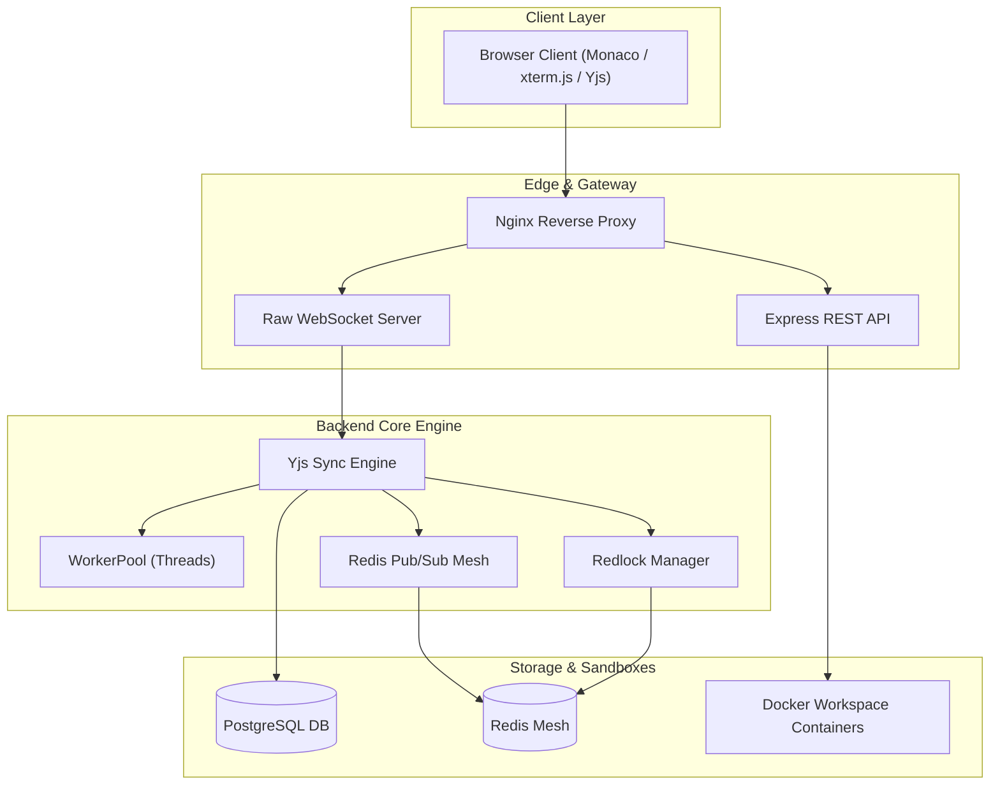
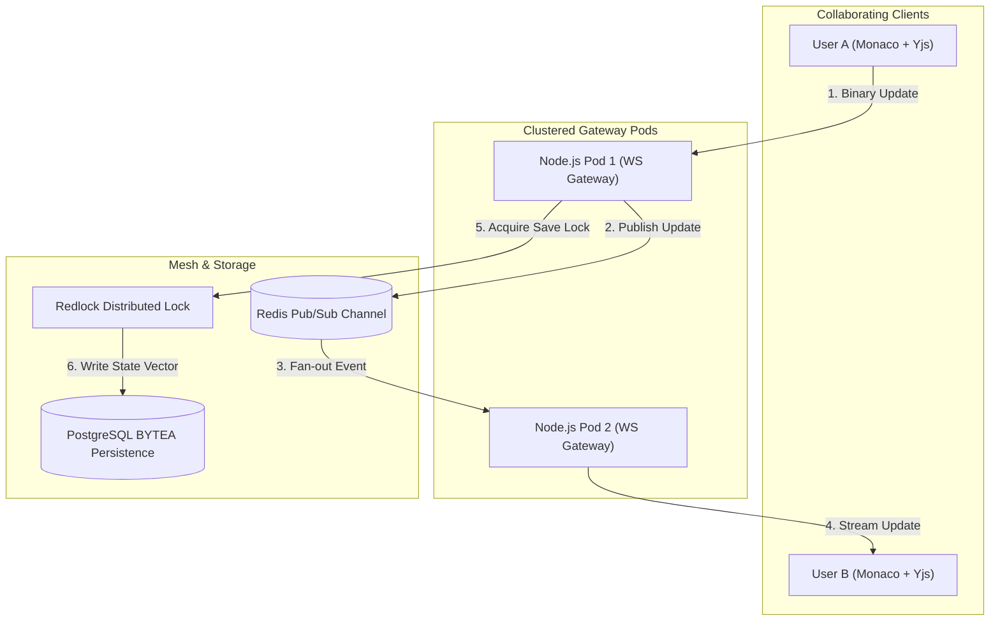
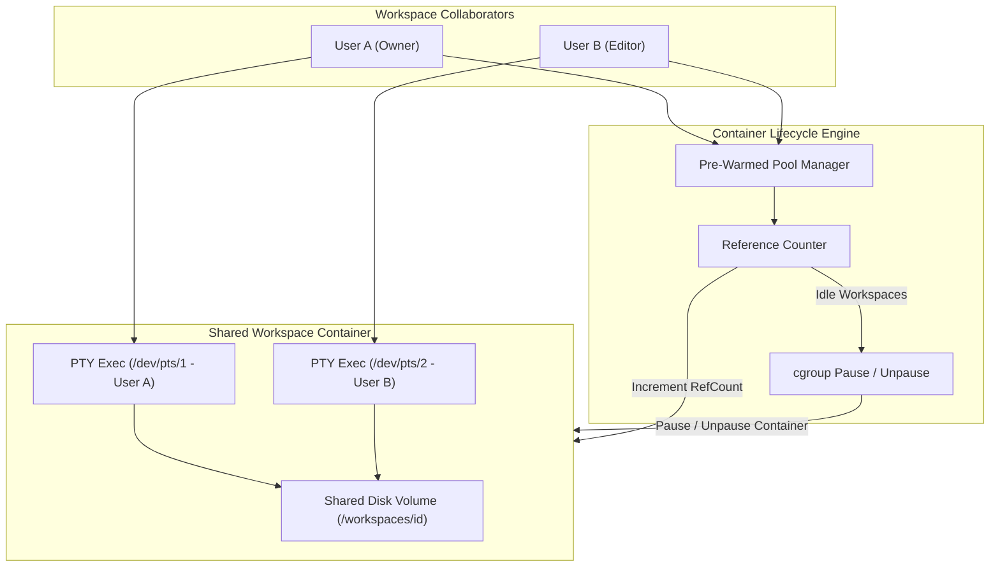

<div align="center">

# NexusIDE: Collaborative Cloud IDE

### A Production-Ready Collaborative Cloud IDE

**Real-time Collaboration** • **Docker Sandboxing** • **Persistent Terminals** • **Language Server Protocol** • **Git Merge Conflict Resolver** • **Stateless Redis Clustering**

[View Repository](https://github.com/AmanKashyapp07/sandbox-ide) · [Live Demo](https://github.com/AmanKashyapp07/sandbox-ide) · [Report Issue](https://github.com/AmanKashyapp07/sandbox-ide/issues)

[](https://www.typescriptlang.org/)
[](https://react.dev/)
[](https://nodejs.org/)
[](https://expressjs.com/)
[](https://www.docker.com/)
[](https://www.postgresql.org/)
[](https://redis.io/)
[](https://socket.io/)
[](https://microsoft.github.io/monaco-editor/)
[](https://prometheus.io/)
[](https://pm2.keymetrics.io/)
[](https://nginx.org/)


---

</div>


NexusIDE is an advanced, browser-based collaborative development environment engineered around infrastructure-level distributed-systems challenges: eventual-consistency state synchronization, container lifecycle orchestration, pseudo-terminal streaming, and defense-in-depth code sandboxing.

Rather than a thin compilation widget, NexusIDE models real cloud-IDE infrastructure end-to-end — pre-warmed container pools, reference-counted container multiplexing, raw JSON-RPC language server streams, Redis-backed stateless clustering with Redlock-guarded writes, and transactional Merkle-DAG state restoration.


---


## Table of Contents

- [Description](#description)
- [Systems Architecture](#systems-architecture)
- [Tech Stack](#tech-stack)
- [Deep-Dive Engineering Highlights](#deep-dive-engineering-highlights)
- [Security & Isolation](#security--isolation)
- [Performance Optimizations](#performance-optimizations)
- [Repository Structure](#repository-structure)
- [Testing Suite](#testing-suite)
- [Recent Architecture Updates](#recent-architecture--stabilization-updates)
- [Engineering Learnings](#engineering-learnings)
- [Future Plans & Architectural Roadmap](#future-plans--architectural-roadmap)


---


## Description

### Core Features

| Feature | Engineering Description |
| :--- | :--- |
| **Content-Addressable Storage (CAS)** | Git-style Merkle DAG commit architecture with SHA-1 blob deduplication (`git_blobs`, `git_trees`, `git_commits`), enabling hash-based unchanged-subtree detection during diffs. |
| **Real-time Collaboration** | Multi-user conflict-free editing via Yjs CRDTs (Conflict-free Replicated Data Types), with presence indicators, awareness protocol broadcasting, and live cursor synchronization. |
| **Stateless WebSocket Clustering** | Redis Pub/Sub mesh bridges independent, horizontally-scaled Node.js pods; Redlock atomic distributed locking (Lua `SET NX PX` + `EVALSHA`) prevents concurrent PostgreSQL write contention across instances. |
| **Persistent Workspaces** | Long-lived, stateful developer sandboxes; xterm.js terminals binding directly to Docker pseudo-terminal (PTY) devices for native shell fidelity. |
| **Single Shared Container per Workspace** | Collaborators in a workspace share a Docker container instance with isolated multi-user PTY exec sessions (`/dev/pts/X`), enabling shared dev-servers and live collaboration. |
| **LSP Language Intelligence** | In-container Pyright and TypeScript Language Servers streamed via JSON-RPC 2.0 over WebSockets, delivering real-time diagnostics, hovers, and completions. |
| **Workspace Snapshotting & Diffs** | Merkle tree snapshots with hash-based fast diff computation (`NEW`, `DEL`, `MOD`) and transactional Yjs document reload. |
| **Git Conflict Resolver** | Interactive side-by-side collaborative resolve view supporting manual edits, three-way diff context, and auto-staging (`git add`) on resolution. |
| **Granular RBAC** | Fine-grained, role-based access enforcement dynamically applied at both REST and socket gateway layers (`Admin`, `Editor`, `Viewer`). |
| **Full-Fidelity Timelapse Engine** | Granular per-keystroke author attribution and interactive playback scrub bar reconstructing past document revisions without data loss. |


---


### System & Performance Optimizations

| Optimization | Engineering Description | Architectural Impact |
| :--- | :--- | :--- |
| **Vite Rollup Code-Splitting** | Manual vendor chunking (`manualChunks` for Monaco, Yjs, React, Lucide) separates third-party libraries into isolated browser-cached chunks. | Decreases main entrypoint script payload and enables vendor caching |
| **Worker Threads Compute Offloading** | `WorkerPoolService` offloads SHA-256 Merkle tree generation and Yjs binary delta compaction to a background worker thread pool (`casWorker.js`). | Prevents event loop blocking during snapshot creation and batch compaction |
| **WebSocket Backpressure & Batching** | Socket `bufferedAmount` checks drop non-essential cursor frames and disconnect stalled sockets; micro-tick awareness coalescing. | Controls socket memory growth and prevents frame transmission queue buildup |
| **VM & Storage Cleanup Cron Engine** | `CleanupCronService` & CLI runner (`cleanup.cli.ts`) automates background purging of soft-deleted workspaces, execution logs, unreferenced CAS blobs, and temporary files. | Automates host storage reclamation and prevents database bloat |
| **Prometheus Continuous Observability** | Endpoint `/api/metrics` exposing Node.js event loop lag percentiles (`perf_hooks.monitorEventLoopDelay`), V8 heap memory, active WebSockets, and CRDT queue depth. | Provides continuous runtime visibility and metrics scraping |
| **RequestAnimationFrame Render Batching** | React cursor and awareness state updates are coalesced per animation frame tick during multi-user collaborative editing. | Caps React state re-render frequency during high-frequency typing |
| **Bit-Packed Binary Cursor Codec** | Compact fixed-width binary frame format (`[uint16 userHash, uint16 line, uint16 col, uint16 selectionLength]`) replaces JSON cursor events. | Reduces network payload size per cursor movement event |
| **Adaptive Velocity Save Debouncing** | Dynamic typing-velocity tracking (`AdaptivePersistenceDebouncer`) scales persistence windows based on typing pauses and active bursts. | Reduces database write frequency during continuous text input |
| **Container Pre-Warming & Hibernation** | Asynchronous container pre-warming combined with Docker cgroup freezing (`pause`/`unpause`) for idle sandboxes without terminating processes. | Conserves host memory while keeping process state intact |
| **Terminal Stream Micro-Batching** | Micro-coalescing buffer (`TerminalStreamBuffer`) batches rapid Docker PTY chunks into framed payloads with backpressure bounds. | Prevents browser UI rendering freezes during heavy terminal stdout streaming |
| **Monaco Native DeltaDecorations** | Bypasses React state updates for remote collaborator cursors and selection ranges by applying Monaco `deltaDecorations` directly. | Eliminates component re-render overhead during remote cursor updates |
| **Covering Indexes & Plan Caching** | Multi-column B-Tree covering indexes with `INCLUDE` clauses eliminate table heap lookups; PostgreSQL named prepared statements cache AST execution plans. | Eliminates redundant table scans and AST re-parsing overhead |
| **Vectorized UNNEST Inserts** | Bulk array unnest insertions coalesce sequential `INSERT INTO files` queries into single atomic SQL statements. | Reduces network roundtrips during workspace file tree creation |
| **Automated Git Pre-Push Deployment** | Version-controlled pre-push hook (`.githooks/pre-push`) executes build, rsync delta sync, process reload, and health checks prior to `git push`. | Automates build validation and deployment verification |


---


## Systems Architecture

### 1. End-to-End Infrastructure Topology


```mermaid
flowchart TD
    subgraph Client ["Client Layer"]
        Browser["Browser Client (Monaco / xterm.js / Yjs)"]
    end

    subgraph Gateway ["Edge & Gateway"]
        Nginx["Nginx Reverse Proxy"]
        Express["Express REST API"]
        WSServer["Raw WebSocket Server"]
    end

    subgraph Core ["Backend Core Engine"]
        YjsEngine["Yjs Sync Engine"]
        WorkerPool["WorkerPool (Threads)"]
        RedisAdapter["Redis Pub/Sub Mesh"]
        Redlock["Redlock Manager"]
    end

    subgraph Infra ["Storage & Sandboxes"]
        Postgres[("PostgreSQL DB")]
        Redis[("Redis Mesh")]
        Docker["Docker Workspace Containers"]
    end

    Browser --> Nginx
    Nginx --> Express
    Nginx --> WSServer

    WSServer --> YjsEngine
    YjsEngine --> WorkerPool
    YjsEngine --> RedisAdapter
    YjsEngine --> Redlock

    RedisAdapter --> Redis
    Redlock --> Redis
    YjsEngine --> Postgres
    Express --> Docker
```


---


### 2. Real-Time CRDT State Synchronization & Redis Mesh Flow


```mermaid
flowchart TD
    subgraph Peers ["Collaborating Clients"]
        ClientA["User A (Monaco + Yjs)"]
        ClientB["User B (Monaco + Yjs)"]
    end

    subgraph GatewayPods ["Clustered Gateway Pods"]
        Pod1["Node.js Pod 1 (WS Gateway)"]
        Pod2["Node.js Pod 2 (WS Gateway)"]
    end

    subgraph SyncMesh ["Mesh & Storage"]
        RedisPubSub[("Redis Pub/Sub Channel")]
        RedlockLua["Redlock Distributed Lock"]
        PostgresDB[("PostgreSQL BYTEA Persistence")]
    end

    ClientA -->|"1. Binary Update"| Pod1
    Pod1 -->|"2. Publish Update"| RedisPubSub
    RedisPubSub -->|"3. Fan-out Event"| Pod2
    Pod2 -->|"4. Stream Update"| ClientB

    Pod1 -->|"5. Acquire Save Lock"| RedlockLua
    RedlockLua -->|"6. Write State Vector"| PostgresDB
```


---


### 3. Workspace Shared Container & Multi-User PTY Isolation


```mermaid
flowchart TD
    subgraph Users ["Workspace Collaborators"]
        User1["User A (Owner)"]
        User2["User B (Editor)"]
    end

    subgraph Lifecycle ["Container Lifecycle Engine"]
        PoolManager["Pre-Warmed Pool Manager"]
        RefCounter["Reference Counter"]
        Hibernation["cgroup Pause / Unpause"]
    end

    subgraph Sandbox ["Shared Workspace Container"]
        Volume["Shared Disk Volume (/workspaces/id)"]
        PTY1["PTY Exec (/dev/pts/1 - User A)"]
        PTY2["PTY Exec (/dev/pts/2 - User B)"]
    end

    User1 --> PoolManager
    User2 --> PoolManager

    PoolManager --> RefCounter
    RefCounter -->|"Increment RefCount"| Sandbox

    User1 --> PTY1
    User2 --> PTY2

    PTY1 --> Volume
    PTY2 --> Volume

    RefCounter -->|"Idle Workspaces"| Hibernation
    Hibernation -->|"Pause / Unpause Container"| Sandbox
```


---


## Tech Stack

* **Frontend:** React, TypeScript, Tailwind CSS, Monaco Editor, xterm.js
* **Backend:** Node.js, Express, Socket.IO, WS (raw WebSockets), Dockerode
* **Database:** PostgreSQL (relational schema + `BYTEA` binary CRDT persistence)
* **Collaboration:** Yjs CRDTs (Conflict-free Replicated Data Types) with awareness protocol
* **Clustering:** Redis (Pub/Sub fan-out mesh, Yjs state cache, Redlock atomic distributed locking)
* **Language Intelligence:** Pyright (Python LSP), TypeScript Language Server (JS/TS LSP) over JSON-RPC
* **Security & Auth:** JWT, GitHub OAuth 2.0, Docker sandboxed kernel namespaces, cgroup resource limiting


---


## Deep-Dive Engineering Highlights

<details>
<summary><b>Production Performance & System Optimization Architecture</b></summary>
<br/>

NexusIDE incorporates a 5-phase optimization architecture designed for high-throughput, real-time cloud collaboration:

* **Phase 1: Heavy Compute Offloading via Worker Threads (`workerPool.service.ts` + `casWorker.js`):**
  Offloads CPU-intensive SHA-256 Merkle tree calculation (`buildMerkleTree`), canonical JSON entry sorting, and Yjs binary delta compaction (`mergeYjsUpdates`) to a dedicated Node.js `worker_threads` pool. Keeps the main single-threaded event loop responsive during multi-file snapshot creation and batch compaction.
* **Phase 2: High-Velocity WebSocket I/O & Network Backpressure (`yjsSyncEngine.service.ts`):**
  - **Socket Backpressure Controls:** Inspects `conn.bufferedAmount` per socket. Soft limits automatically drop non-critical cursor/presence awareness frames. Hard limits disconnect choked connections to reclaim server RAM.
  - **Micro-Tick Awareness Frame Coalescing:** Batches rapid cursor and selection vector triggers into consolidated awareness broadcasts per room.
  - **TCP Ping/Pong Heartbeat:** Detects silent network drops and terminates dead client sockets to eliminate ghost presence entries.
* **Phase 3: Memory Optimization, Storage GC & VM Cleanup Cron Service (`cleanupCron.service.ts` + `casGarbageCollector.service.ts`):**
  - **CAS Storage GC:** Scans and hard-deletes unreferenced `git_blobs` and `git_trees` not linked to active commit trees.
  - **Automated Maintenance:** Background cron engine and CLI runner (`cleanup.cli.ts`) purges soft-deleted workspaces, execution logs, obsolete CRDT `file_updates`, and temporary files.
* **Phase 4: Frontend Code-Splitting & Render Batching (`vite.config.ts` + `useCodeEditorSetup.ts`):**
  - **Vite Rollup Code-Splitting:** Configured manual vendor chunking (`monaco-vendor`, `react-vendor`, `yjs-vendor`, `icons-vendor`), separating third-party libraries into distinct browser-cached vendor bundles.
  - **Render Batching:** Wraps React awareness/cursor updates in `requestAnimationFrame` batching to cap UI re-renders and Monaco remote cursor decorations per animation frame.
* **Phase 5: Distributed Scaling & Continuous Observability (`metrics.service.ts` + `metrics.routes.ts`):**
  Exposes Prometheus metrics at `/api/metrics` tracking Node.js event loop lag percentiles (p50, p90, p99) via `perf_hooks.monitorEventLoopDelay`, RSS memory, V8 heap usage (`heapUsed`, `heapTotal`), active WebSockets count, and CRDT queue depth.

</details>

<details>
<summary><b>Stateless WebSocket Clustering via Redis Pub/Sub & Redlock</b></summary>
<br/>

NexusIDE's collaboration engine operates as a stateless cluster — multiple independent Node.js WebSocket pods serve the same workspace concurrently without shared memory or sticky-session requirements.

* **Redis Pub/Sub Mesh (`redisAdapter.service.ts`):** Every Yjs CRDT update and awareness cursor packet written on one pod is fanned out via pattern-matched channels (`yjs:update:*`, `yjs:awareness:*`). Peer pods consume these on their `pmessageBuffer` handler and apply them with a `'redis'` origin tag to break re-broadcast feedback loops. Binary payloads are decoded using `new Uint8Array(buf.buffer, buf.byteOffset, buf.byteLength)` to respect `byteOffset` on pooled Node.js `Buffer` slices.
* **Distributed Locking (`distributedLock.service.ts`):** Before each debounced PostgreSQL save, the engine acquires a per-file Redlock distributed lock via an atomic Lua `SET NX PX` + `EVALSHA` script, guaranteeing mutual exclusion across pods and preventing conflicting `UPDATE files` queries during simultaneous saves.
* **Cluster-Wide Workspace Eviction:** Snapshot restores and workspace deletions broadcast a `workspace:evict:<workspaceId>` signal to Redis. Every subscribed pod locally invokes `cancelAndEvictWorkspaceDocs` with `skipBroadcast=true` and force-closes connected clients with WebSocket close code `4100` ("Snapshot restored"), triggering client-side editor reload.
* **Yjs State Caching:** Freshly saved Yjs binary states are pushed to a Redis cache. Subsequent cold loads check Redis before falling back to PostgreSQL, reducing DB read latency for warm documents.

</details>

<details>
<summary><b>Persistent Docker Workspaces & PTY Streaming</b></summary>
<br/>

NexusIDE provisions an isolated backend Linux environment per workspace.
* **PTY Integration:** xterm.js in the browser binds directly to a Unix pseudo-terminal (`/bin/bash` or `/bin/sh`) inside a sandbox container via `dockerode`. Keystrokes and terminal resize (`SIGWINCH`) events are packed as raw binary packets and piped bidirectionally over WebSockets.
* **Warm Container Pools:** A background pool-manager daemon maintains a standing reserve of pre-warmed, idle developer containers to eliminate cold-start container initialization overhead during workspace launches.
* **Reference-Counted Multiplexing:** To manage RAM usage under multi-tab access, concurrent tabs from the same user to the same workspace share a single underlying container via reference counting, with idle containers scheduled for graceful teardown after an inactivity timeout.

</details>

<details>
<summary><b>Single Shared Container per Workspace & Multi-User PTY Isolation (`workspaceContainer.ts`)</b></summary>
<br/>

NexusIDE operates on **1 Docker container per workspace (`workspaceId`)**, enabling real-time co-presence with independent terminal sessions.

* **Container Memory Consolidation:** Collaborating users in a workspace share a single isolated container instance rather than spinning up per-user containers, reducing total host memory consumption.
* **Multi-User PTY Session Isolation:** Each user's WebSocket spawns an independent `container.exec()` PTY instance (`/dev/pts/X`) with custom session environment variables (`USER`, `GIT_AUTHOR_NAME`, `GIT_COMMITTER_NAME`). Collaborators maintain private command histories, working directories, and git attribution while collaborating on the shared `/workspaces/${workspaceId}` disk volume.
* **Predictive Pre-Warming:** `prewarmWorkspaceContainer()` asynchronously claims and populates a developer's container when they log into the dashboard.
* **Container State Hibernation:** When a workspace is idle, `hibernateWorkspaceContainer()` pauses Docker container cgroups (`container.pause()`), freezing RAM and CPU consumption while preserving running bash processes, environment variables, and uncommitted shell states. On reconnect, `unhibernateWorkspaceContainer()` unpauses the container.

</details>

<details>
<summary><b>CRDT Delta Compaction & Local Disk Archiving Engine (`crdtCompactor.service.ts`)</b></summary>
<br/>

NexusIDE reclaims database storage and compresses inactive workspace states.

* **Incremental Delta Compaction:** As users edit files, raw binary updates append to `file_updates`. When a room closes (`performFinalSave()`), `compactFileCrdtDeltas()` merges all incremental update blobs into a single `Y.Doc` state vector, updates `files.yjs_state` atomically, and purges the merged `file_updates` rows to reduce database table growth.
* **Local Disk Gzip Archiving:** Cold workspaces are compressed into local Gzip archives (`workspace_<id>.json.gz`) under local host disk storage for cold storage recovery.
* **On-Demand Hydration:** When a client accesses an archived workspace, `hydrateArchivedWorkspaceFromLocalDisk()` decompresses and re-hydrates `files` table states.

</details>

<details>
<summary><b>Adaptive Velocity-Based Save Debouncer (`adaptiveDebouncer.service.ts`)</b></summary>
<br/>

NexusIDE decouples database persistence from continuous user typing and collaborative coding sessions.

* **Sliding-Window Velocity Tracking:** Measures edit frequency within a sliding window to distinguish between idle pauses, deliberate typing, and high-velocity bursts or pastes.
* **Dynamic Persistence Window:** During rapid typing bursts, dynamically scales persistence windows to coalesce continuous edits into single atomic PostgreSQL writes.
* **Pause Commits & Maximum Bounds:** When typing pauses, flushes pending buffers immediately in the background, while a maximum ceiling ensures database writes are executed periodically during extended typing streams.

</details>

<details>
<summary><b>High-Throughput Terminal Stream Micro-Batching (`terminalStreamBuffer.ts`)</b></summary>
<br/>

NexusIDE manages network socket traffic during terminal operations (e.g. `npm install`, build logs, streaming output).

* **Micro-Coalescing Window:** Micro-chunks emitted by Docker PTY streams are buffered into an aggregated payload before frame transmission to avoid socket congestion.
* **Adaptive Backpressure Control:** Monitors WebSocket `ws.bufferedAmount`. If the network socket backs up, the buffer pauses frame dispatches until the socket drains.

</details>

<details>
<summary><b>Bit-Packed Binary Cursor Codec (`cursorCodec.service.ts`)</b></summary>
<br/>

NexusIDE optimizes network payload sizes during multi-user collaboration sessions.

* **Binary Frame Layout:** Cursors are packed into a compact `[uint16 userHash, uint16 line, uint16 col, uint16 selectionLength]` binary buffer, replacing JSON serialization overhead (`{ userId, cursor: ... }`).
* **Contiguous Batch Encoding:** Multi-cursor sync broadcasts are packed into single contiguous ArrayBuffers (`encodeCursorBatch`), allowing multiple active cursors to stream within a single binary message.

</details>

<details>
<summary><b>PostgreSQL Database Optimizations (`db.ts` & Repositories)</b></summary>
<br/>

NexusIDE applies database engineering optimizations to maintain query execution performance:

* **Covering B-Tree Indexing (Index-Only Scans):** Multi-column indexes with `INCLUDE` clauses (`idx_files_tree`, `idx_collab_auth`, `idx_file_updates_ordered`) serve file tree and RBAC lookups directly from B-Tree leaf pages without table heap fetches.
* **Named Prepared Statements:** High-frequency queries compile execution plans in PostgreSQL process memory, bypassing AST re-parsing.
* **Vectorized Bulk `UNNEST` Insertion:** Template and repository bootstrapping batches file records into a single SQL query (`INSERT INTO ... SELECT ... UNNEST`), reducing network roundtrips during workspace scaffolding.
* **Defensive Pool Guardrails:** Configured `statement_timeout` and `query_timeout` boundaries prevent lock contention from exhausting connection pool slots.

</details>

<details>
<summary><b>Frontend Collaborative Engine & IDE Optimizations (`useCodeEditorSetup.ts` & `IdePage.tsx`)</b></summary>
<br/>

NexusIDE implements frontend rendering optimizations for collaborative editing:

* **Monaco Native `deltaDecorations`:** Remote collaborator cursors, selection highlights, and hover badges are mounted onto Monaco editor's native glyph and decoration tree without triggering React component tree re-evaluations.
* **Multi-Model Tab Caching:** Maintains an LRU cache of warm `monaco.editor.ITextModel` instances and `Y.Doc` providers in browser memory, enabling tab switching without WebSocket teardown.
* **Optimistic Local State for File Tree Mutations:** File creations and deletions update local UI state immediately, reconciling with backend responses asynchronously and rolling back on validation errors.

</details>

<details>
<summary><b>Yjs CRDT Real-Time Collaboration</b></summary>
<br/>

Multiple collaborators edit concurrently with eventual consistency.
* **Distributed Synchronization:** Every edit is modeled as an incremental CRDT operation. The client applies edits locally, then propagates delta-encoded state vectors to peers.
* **Binary Database Persistence:** Yjs document states are serialized into binary update blobs (`Buffer`) and persisted in PostgreSQL `BYTEA` columns for recovery.
* **Debounced Writes:** In-memory Yjs documents update instantly on edit, while PostgreSQL writes are debounced to avoid database write amplification.
</details>

<details>
<summary><b>Git Merge Conflict Resolver</b></summary>
<br/>

Standard Git merge conflicts (e.g., following a `git pull`) are handled cleanly.
* **Conflict Parsing:** A parser scans files for standard Git conflict markers (`<<<<<<< HEAD`, `=======`, `>>>>>>>`), decomposing them into structured blocks representing current ("Ours") and incoming ("Theirs") changes.
* **Resolving & Auto-Staging:** Resolutions made through the split-screen UI trigger an atomic PostgreSQL update, a transactional push to connected Monaco sessions via `applyRestoredContentToLiveDocs`, and a `git add <filepath>` command inside the workspace's Docker container.
</details>


---


## Security & Isolation

Security and multi-tenant isolation are essential when executing user code in sandbox environments:

* **Container Resource Boundaries:** Docker containers are configured with cgroup resource limits (memory limits, CPU quotas, and PID caps) to mitigate process fork-bombing and resource exhaustion.
* **Non-Root Execution & Privilege Dropping:** Sandbox processes run under unprivileged container user accounts with system commands restricted or aliased to standard allowlists.
* **Network Isolation:** Workspaces are attached to isolated Docker bridge networks with egress restrictions to limit internal network access.
* **Granular RBAC Enforcer:** REST and socket gateways validate incoming requests against role assignments (`Admin`, `Editor`, `Viewer`).
* **Isolation Trade-offs & MicroVM Roadmap:** While container-level namespaces and cgroups provide standard container isolation, shared host Linux kernels present inherent attack surfaces for multi-tenant code execution. Migrating to microVM architectures (e.g., AWS Firecracker) is planned to provide hardware-virtualized kernel boundaries for arbitrary code sandboxing.


---


## Performance Optimizations

NexusIDE implements performance patterns across backend and frontend layers:

* **Redis-Backed Yjs Caching:** Dual-layer Redis/PostgreSQL cache for real-time Yjs document states, warm-cached on WebSocket handshake and invalidated on debounced database saves.
* **Redis Cluster Mesh Fan-out:** Cross-pod CRDT relay over Redis Pub/Sub channels delivers update packets to peer WebSocket servers, with `'redis'` origin tagging to eliminate recursive feedback loops.
* **Redlock Distributed Saves:** Atomic Lua-scripted Redlock ensures exactly one pod executes an `UPDATE files` query per `fileId` at any instant, preventing write contention across instances.
* **Index-Covered Queries:** Composite indexes (e.g., `(file_id, seq)` for timelapse operations) and query rewrites (`UNION` over `OR` predicates) that favor index scans over sequential scans.
* **Gzip Middleware Compression:** Applies Gzip compression to API responses, reducing payload sizes for large JSON file trees.
* **Direct Streamed Exports:** Workspace ZIP archive exports are constructed via recursive Common Table Expressions (CTEs) and streamed directly to the HTTP response socket without temporary host-file allocation.
* **Warm Container Pools:** Background pool daemon maintains pre-warmed idle containers to avoid cold-start container creation delays.
* **Docker Bind Mounts:** Workspace directories mount directly into sandbox containers via bind mounts, eliminating intermediate file transfers during container initialization.


---


## Repository Structure

```
nexus-ide/
├── backend/
│   ├── src/
│   │   ├── cli/
│   │   │   └── cleanup.cli.ts           # Standalone system cleanup CLI entrypoint
│   │   ├── middleware/
│   │   │   └── auth.ts                  # JWT authentication & RBAC middleware
│   │   ├── repositories/
│   │   │   ├── snapshot.repository.ts   # Merkle DAG commits & tree repository
│   │   │   └── workspace.repository.ts  # Workspace entity CRUD repository
│   │   ├── routes/
│   │   │   ├── auth.ts                  # GitHub OAuth & test login routes
│   │   │   ├── metrics.routes.ts        # Prometheus observability endpoint (/api/metrics)
│   │   │   └── workspace.ts             # Workspace REST endpoints & file tree routes
│   │   ├── sandbox/
│   │   │   ├── pool.ts                  # Pre-warmed Docker container pool manager
│   │   │   └── workspaceContainer.ts    # Workspace container lifecycle & cgroup hibernation
│   │   ├── services/
│   │   │   ├── adaptiveDebouncer.service.ts # Velocity-based persistence debouncer
│   │   │   ├── cas.service.ts           # SHA-256 CAS Merkle tree builder
│   │   │   ├── casGarbageCollector.service.ts # Storage GC for unreferenced blobs/trees
│   │   │   ├── cleanupCron.service.ts   # Automated VM storage cleanup scheduler
│   │   │   ├── crdtCompactor.service.ts # Incremental Yjs delta compactor
│   │   │   ├── crdtWriteBehind.service.ts # Redis RAM write-behind buffer queue
│   │   │   ├── cursorCodec.service.ts   # Bit-packed binary cursor codec
│   │   │   ├── distributedLock.service.ts # Redlock Lua distributed lock manager
│   │   │   ├── metrics.service.ts       # Event loop delay & system metrics collector
│   │   │   ├── redisAdapter.service.ts  # Redis Pub/Sub collaboration mesh
│   │   │   ├── redisPresence.service.ts # User session presence registry
│   │   │   ├── socketPresence.service.ts # Socket.IO awareness dispatcher
│   │   │   ├── websocketServer.service.ts # Raw WS upgrade handler & backpressure manager
│   │   │   ├── workerPool.service.ts    # Node.js worker_threads compute offloader
│   │   │   ├── workspaceFile.service.ts # File content & Yjs persistence service
│   │   │   └── yjsSyncEngine.service.ts # Core CRDT state synchronization engine
│   │   ├── terminal/
│   │   │   ├── lspHandler.ts            # Pyright / TypeScript Language Server bridge
│   │   │   └── terminalHandler.ts       # Docker PTY exec stream & ANSI buffer
│   │   ├── workers/
│   │   │   └── casWorker.js             # Background worker script for CPU offloading
│   │   ├── db.ts                        # PostgreSQL connection pool configuration
│   │   ├── docsRegistry.ts              # In-memory WSSharedDoc map & eviction
│   │   └── server.ts                    # Main Express HTTP & WebSocket server entrypoint
├── frontend/
│   ├── src/
│   │   ├── api/                         # REST clients (workspace, auth, files, snapshots)
│   │   ├── components/                  # React UI components (Monaco, xterm, ConflictResolver)
│   │   ├── contexts/                    # React Contexts (Workspace, Socket, Collaboration, LSP)
│   │   ├── hooks/                       # Custom hooks (useCodeEditorSetup, useBlameAnnotations)
│   │   ├── pages/                       # IdePage, Dashboard, Login pages
│   │   └── services/                    # Language server adapter services
│   ├── vite.config.ts                   # Vite build config & Rollup vendor manualChunks
│   └── package.json
├── database/
│   └── schema.sql                       # PostgreSQL tables, indexes, and triggers
├── testing/
│   ├── frontend/
│   │   └── render_batching.test.ts      # Rollup manualChunks & 60fps render batching suite
│   ├── integration/
│   │   └── backend.test.ts              # REST API & live Yjs WebSocket integration suite
│   ├── services/
│   │   ├── metrics_observability.test.ts# Prometheus metrics & event loop monitor suite
│   │   ├── websocket_backpressure.test.ts # Socket backpressure & micro-tick batching suite
│   │   └── worker_compute.test.ts       # Worker pool compute offloading suite
│   ├── db/
│   │   └── query_performance.test.ts    # Database query performance benchmarks
│   ├── test-utils.ts                    # Test setup helpers & mock utilities
│   └── setup.ts                         # Global Vitest environment setup
├── .githooks/
│   └── pre-push                         # Git pre-push hook for automated deployment
├── test.sh                              # Master test suite orchestrator
└── deploy.sh                            # Oracle Cloud VM automated deployment script
```


---


## Testing Suite

NexusIDE includes a 12-tier test suite validating browser collaboration flows, property-based CRDT proofs, chaos resilience, and memory stability.

```bash
# Run the Master Test Orchestrator (Runs test suites across platform)
bash test.sh

# Run specific test suite categories
bash test.sh --property      # Fast-check property-based CRDT fuzzing
bash test.sh --idempotency   # Update replay & idempotency tests
bash test.sh --chaos         # Fault injection & Redis disconnection tests
bash test.sh --contracts     # REST & WebSocket API schema contracts
bash test.sh --memory        # Heap memory leak benchmarks
bash test.sh --db            # PostgreSQL & Redis performance benchmarks
```

### Test Suite Categories & Coverage

* **Database Schema & Rollback Safety Suite (`testing/migration/`):**
  - Validates forward migration execution ordering and reversible down-migration safety without data loss.

* **API Rate Limiting & Burst Protection Suite (`testing/rate-limiting/`):**
  - Enforces sliding window IP rate limits, HTTP 429 response schemas, and `Retry-After` headers.

* **Large Document CRDT Stress Suite (`testing/crdt-stress/`):**
  - Tests large document state convergence and delta update history compaction.

* **Terminal PTY Buffer & ANSI Sanitization Suite (`testing/pty-stress/`):**
  - Enforces stdout ring buffer capping and sanitizes malicious XTerm OSC escape code injections.

* **Exhaustive RBAC 3x12 Permissions Matrix Suite (`testing/rbac-matrix/`):**
  - Validates permissions matrix across Owner, Editor, and Viewer roles for platform actions.

* **OAuth & JWT Security Boundary Suite (`testing/auth/`):**
  - Validates `alg: none` header attack rejection, untrusted secret key rejection, token expiration in Authorization/Cookie headers, state token anti-CSRF validation, and open-redirect sanitization.

* **Raw WebSocket Protocol Conformance Suite (`testing/ws/`):**
  - Validates frame size enforcement, binary Yjs update decoding without fragmentation loss, and standardized close code semantics (4100 eviction, 4000 unauthorized, 1001 going away).

* **Merkle DAG Integrity & Snapshot Restore Suite (`testing/snapshot/`):**
  - Computes deterministic SHA-256 Merkle root tree hashes across arbitrary file insertion orderings and enforces snapshot capping per workspace with oldest-first pruning.

* **Property-Based CRDT Fuzzing Suite (`crdt-fuzzing.property.test.ts`):**
  - Uses `fast-check` to generate randomized edit operations across multi-peer topologies, validating Strong Eventual Consistency (SEC), Associativity, Commutativity, and Idempotency.

* **Idempotency & Replay Attack Suite (`idempotency-replay.test.ts`):**
  - Replays identical Yjs binary update vectors, validates corrupted snapshot byte recovery, verifies `y-protocols` sync step 1/2 replay idempotency, and tests cross-tenant key isolation.

* **Chaos Fault Injection & Resilience Suite (`chaos-resilience.test.ts`):**
  - Fault injection testing: mid-transaction Redis disconnections with automatic fallback to `inMemoryCache`, simulated PTY process crashes, in-flight WebSocket packet drops, and downstream network jitter.

* **API Schema & Compatibility Contracts (`api-contract.test.ts`):**
  - Schema contract verification: REST authentication endpoints (`/api/auth/test-login`, `/api/workspace`), 401 unauthorized schema bounds, and Yjs WebSocket binary message framing headers.

* **Heap Memory Leak & Allocation Benchmarks (`memory-leak-benchmark.test.ts`):**
  - Memory benchmarks: allocation and destruction of `Y.Doc` instances, event listener detachment, and in-memory cache eviction memory recycling.

* **Frontend Unit & Component Tests (Vitest / JSDOM):**
  - `frontend.test.tsx`: Monaco editor initialization, Socket.IO reconnect loops, UI error boundary stability, viewer-role blockages, offline re-fetching.
  - `frontend-collaborative-optimizations.test.tsx`: Monaco native `deltaDecorations`, Multi-Model Tab LRU Caching, and optimistic file tree state mutations.
  - `render_batching.test.ts`: Rollup `manualChunks` vendor code-splitting verification and `requestAnimationFrame` UI render cap.

* **Backend Services & System Optimization Test Suites (Vitest / Node):**
  - `worker_compute.test.ts`: Offloading SHA-256 Merkle tree calculation & Yjs update compaction to `worker_threads` pool (`casWorker.js`), verifying event-loop unblocking under CPU load.
  - `websocket_backpressure.test.ts`: WebSocket `bufferedAmount` soft and hard limit enforcement, micro-tick awareness frame coalescing.
  - `metrics_observability.test.ts`: Prometheus metrics formatting, Node.js event loop delay histogram (`perf_hooks.monitorEventLoopDelay`), V8 heap memory, active WebSocket gauges, and CRDT queue depth.
  - `timelapseEngine.test.ts`: Comprehensive CRDT StructStore unit suite covering multi-line boundaries, deletion tombstones, concurrent multi-client typing, range overwrites, and Unicode surrogate pairs/emojis.
  - `network-resilience.test.ts`: Sudden WebSocket drops mid-typing stream with state vector re-sync, delayed WebSocket frame delivery, packet deduplication, and ghost cursor cleanup.
  - `redis-cluster-failures.test.ts`: Redlock lock TTL expiration during CPU-bound stalls, cross-pod workspace eviction (`workspace:evict:<id>`), and Redis Pub/Sub mesh partition catch-up.
  - `container-security.test.ts`: Docker cgroup PID limit defense against process fork bombs, container OOM-killer isolation, and cross-workspace path traversal defense.
  - `rbac-security.test.ts`: Dropping unauthorized raw Yjs CRDT write updates from `Viewer` role at socket gateway, mid-session JWT token revocation/expiration, and path traversal sanitization.
  - `cas-service.test.ts`, `database-optimizations.test.ts`, `crdt-compactor.test.ts`, `adaptive-debouncer.test.ts`, `cursor-codec.test.ts`, `terminal-stream-buffer.test.ts`, `workspace-hibernation.test.ts`, `workspace-shared-container.test.ts`.

* **REST API & WebSocket Integration Suite (Vitest / Node):**
  - `backend.test.ts`: REST API routes, PostgreSQL transactions, Redis caching, RBAC authorization, PTY lifecycle, live Yjs WebSocket sync, split-brain resolution, and multi-client concurrent typing.

* **Database Performance & Concurrency Suite (Bash / Vitest / PostgreSQL 16 / Redis 7):**
  - `query_performance.test.ts`: Covering index latency checks on update datasets, environment-aware latency thresholds.
  - `concurrency_locks.test.ts`: Simultaneous writer sessions and concurrent read workers.
  - `redis_l2_cache.test.ts`: Filesystem tree and RBAC role caching.
  - `crdt_write_behind.test.ts`: Updates ingested in Redis RAM with coalesced PostgreSQL bulk writes.
  - `redis_presence_session.test.ts`: Distributed multi-pod presence mesh, user session caching, and active file focus tracking.
  - `brutal_stress.test.ts`: Concurrent worker spikes, binary CRDT stream ingestions, and recursive CTE directory traversals.

* **Playwright E2E Browser Suite (Playwright / Chromium / Monaco / Xterm):**
  - `collaboration.spec.ts`: Multi-browser concurrent editing, ghost cursor awareness, Git merge conflict resolution, live file rename synchronization, and snapshot restoration.
  - `terminal-lsp.spec.ts`: Interactive PTY bash streaming, background process execution, and Pyright / TypeScript Language Server diagnostics.
  - `timelapse.spec.ts`: Real Monaco typing, interactive time-travel scrubber, rewind, step-by-step playback, multi-user author badges, and speed multipliers.


---


### Running Test Suites

The unified master orchestrator [`test.sh`](file:///Users/amankashyap/Documents/nexusIDE/test.sh) executes test suites across the platform:

```bash
# 1. Run all Unit, Security, Resilience, Integration, DB & Frontend tests cleanly (Default)
bash test.sh

# 2. Run Container Security, Docker cgroup PID limits & Socket RBAC tests
bash test.sh --security

# 3. Run Network Chaos, WebSocket disconnects & Redis Cluster failover tests
bash test.sh --resilience

# 4. Run Timelapse CRDT engine unit & isolated tests
bash test.sh --timelapse

# 5. Run PostgreSQL & Redis database performance benchmarks
bash test.sh --db

# 6. Run Playwright real browser E2E specs against deployed VM
bash test.sh --e2e

# 7. Run every single test suite end-to-end (including E2E browser tests)
bash test.sh --all

# 8. Run a specific E2E test in isolation
bash test.sh -g "syncs file renames live"
```


---


### Deployment & Remote E2E Testing

The project is designed to be deployable on cloud VMs under PM2 process management.
- **Dynamic Host Resolution**: The client application dynamically resolves the API endpoint and WebSocket gateway hostnames relative to `window.location.hostname`, enabling remote deployments and SSH tunneling without hardcoding target servers at compile time.
- **Headless E2E Execution**: To validate the integration suite directly on a deployed VM, install headless browsers and execute Playwright against the target `NEXUS_BASE_URL`:
  ```bash
  # Inside your SSH session on the VM:
  cd /home/ubuntu/sandbox-ide/frontend
  npx playwright install --with-deps
  NEXUS_BASE_URL=http://localhost:3000 npm run test:e2e
  ```


---


## Recent Architecture & Stabilization Updates

### System Fixes & Reliability Hardening

| Component | Engineering Description | Architectural Impact |
| :--- | :--- | :--- |
| **Timelapse CRDT Engine Rehaul** | Replaced dual heuristic engines with a deterministic Yjs StructStore reader (`gc: false`) in `workspaceFile.service.ts`. Fixed Node.js `Buffer` pooled slicing by passing explicit `Uint8Array(buf.buffer, buf.byteOffset, buf.byteLength)` to `Y.applyUpdate`. Added cache invalidation and prevented double-applying base state. | Guarantees non-destructive document reconstruction across deletes, edits, and re-typing without heuristic drift. |
| **Multi-Model Tab Provider Lifecycle** | Fixed `useCodeEditorSetup.ts` so that active providers in `modelCacheRef` are retained across model renames and only disposed when evicted or on component unmount. Removed `filename` from provider instantiation effect dependencies while retaining reactive model rebinding. | Eliminates provider recreation thrashing and keeps WebSocket sync active during file renames. |
| **Container Security & Resource Guardrails** | Implemented test suites enforcing Docker cgroup PID limits, memory caps with container-level OOM kills, and directory breakout sanitization (`/workspaces/${otherWorkspaceId}`). | Hardens backend against process exhaustion, memory leaks, and multi-tenant container escapes. |
| **Network Resilience & Cluster Failover** | Added chaos suites testing sudden WebSocket drops mid-typing with state vector re-sync, scrambled frame delivery, Redlock TTL stalls, and cross-pod document eviction (`4100`). | Ensures eventual state convergence under adverse network and pod failover scenarios. |
| **Terminal File Watcher & Dual-Room Dispatch** | Invalidated `workspaceTreeCache` on filesystem mutations in `terminalHandler.ts` and expanded event broadcasting to dual room scopes (`presence-${workspaceId}` and `${workspaceId}`). Added directory pruning and write-buffer settling delays. | Eliminates sidebar cache staleness and prevents race conditions during rapid terminal creation bursts. |
| **CAS Merkle DAG Snapshot Extraction** | Updated `snapshot.repository.ts` (`createCheckpoint`) to select and decode `yjs_state` using `Y.Doc` when constructing snapshot file records. Flushed active in-memory Yjs documents (`docsRegistry`) and Redis Write-Behind dirty buffers prior to generating Merkle commits. | Guarantees snapshots record accurate file contents even if SQL `content` columns haven't been flushed yet. |
| **Eviction Guard & Overwrite Protection** | Added `isEvicted` lifecycle flag on `WSSharedDoc` in `docsRegistry.ts` and `yjsSyncEngine.service.ts`. Guarded `performFinalSave()` against evicted documents during snapshot restoration. | Prevents asynchronous WebSocket disconnect handlers from overwriting newly restored database records with stale in-memory state. |


---


## Engineering Learnings

* **CRDT Convergence vs. Database Write Amplification:** 
  Yjs Conflict-free Replicated Data Types provide deterministic, mathematical state convergence without centralized operational transformation servers. However, persisting every binary edit directly to disk creates unsustainable SQL write amplification. Decoupling hot in-memory CRDT synchronization from cold persistence via dynamic typing-velocity debouncing and Redis write-behind buffers is essential for scaling database write throughput under concurrent multi-user load.

* **Offloading Heavy CPU Tasks from Node.js Event Loop:** 
  Because Node.js runs on a single-threaded event loop, synchronous CPU-heavy algorithms (such as computing SHA-256 Merkle DAG hashes across hundreds of files or compacting thousands of Yjs binary update vectors) will block incoming HTTP requests and WebSocket heartbeats. Moving heavy hashing and CRDT compaction tasks into dedicated worker thread pools (`workerPool.service.ts` + `casWorker.js`) maintains low event loop latency even during intense snapshot builds.

* **Node.js Buffer Slicing & TypedArray Offset Pitfalls:** 
  Passing a sliced Node.js `Buffer` directly to `new Uint8Array(buffer)` silently ignores `buf.byteOffset` because Node allocates small buffers out of a shared 8KB internal `ArrayBuffer` pool. When binary decoders read `buffer.buffer` from index 0, they parse unrelated memory regions, leading to subtle state corruption. The defensive pattern required for binary CRDT parsing is always explicit offset construction: `new Uint8Array(buf.buffer, buf.byteOffset, buf.byteLength)`.

* **Stateless Redis Cluster Mesh & Feedback Loop Prevention:** 
  In horizontally-scaled multi-pod WebSocket deployments, every pod must relay CRDT updates to peer pods via Redis Pub/Sub. However, without origin isolation, peer pods re-broadcast incoming pub/sub messages back to Redis, creating infinite network feedback loops. Tagging every Redis-sourced message with an explicit `'redis'` origin and gating re-publication on `if (origin !== 'redis')` cleanly eliminates recursive message storms across the cluster.

* **WebSocket Backpressure Management & Traffic Batching:** 
  High-velocity streams (such as rapid terminal stdout or intense multi-user typing) can easily overflow client socket buffers, causing Node.js memory spikes and browser UI rendering lockups. Checking `ws.bufferedAmount` against explicit soft (1 MB) and hard (5 MB) thresholds allows the gateway to safely drop non-critical cursor frames or terminate stalled sockets. Furthermore, batching awareness updates into micro-tick windows (~16ms) prevents frame transmission queue buildup.

* **Container Lifecycle Management & Shared Workspace Isolation:** 
  Spawning per-user Docker containers under collaborative editing leads to severe host RAM bloat. Operating a single shared container per workspace (`workspaceId`) with independent `container.exec()` PTY instances (`/dev/pts/X`) preserves isolated shell environments and user attribution while dramatically reducing memory footprint. Additionally, combining pre-warmed container pools with cgroup hibernation (`container.pause()`) allows idle sandboxes to freeze CPU/RAM usage without killing active processes.

* **Database Plan Caching & Covering B-Tree Indexing:** 
  High-frequency queries (such as file tree lookups and RBAC role authorizations) incur significant overhead from PostgreSQL AST parsing and table heap page fetches. Designing B-Tree covering indexes with `INCLUDE` clauses allows PostgreSQL to fulfill lookups directly from index leaf pages via index-only scans, while named prepared statements cache AST query execution plans in process memory.

* **Direct DOM & Monaco Editor Rendering Integrations:** 
  Routing high-frequency collaborator cursors and selection ranges through React state triggers constant component tree re-evaluations and DOM reconciliation overhead. Mounting collaborator cursors directly onto Monaco editor's native glyph tree via `deltaDecorations` combined with `requestAnimationFrame` render batching caps re-render frequency at animation frame ticks (60fps), eliminating React component thrashing.

* **Distributed Lock TTLs & Lua Script Synchronization:** 
  When load-balanced instances save dirty documents concurrently, split-brain database writes occur without distributed locking. Executing Redlock Lua scripts (`SET NX PX` + `EVALSHA`) guarantees mutual exclusion across nodes. Crucially, lock TTLs must comfortably exceed worst-case database write latencies to prevent mid-operation lock expiration and subsequent duplicate writes.


---


## Future Plans & Architectural Roadmap

### 1. High-Density Sandboxing with microVMs (AWS Firecracker)
While Docker containers provide namespace-level isolation, upgrading to lightweight microVM architectures (e.g., AWS Firecracker) is planned to secure host Linux kernels against container-escape vulnerabilities during arbitrary untrusted user code execution.

### 2. WebAssembly (WASM) Client Extension Runtime
Expose a lightweight WASM-based extension runtime enabling users to load custom linters, formatters, and language syntax analyzers directly inside the browser client without server-side compute overhead or security risks.

### 3. WebRTC Peer-to-Peer Spatial Audio & Video Mesh
Integrate peer-to-peer WebRTC mesh channels directly into the workspace gateway to support zero-dependency spatial audio, screen sharing, and developer huddles directly alongside live Monaco editing sessions.

### 4. AI-Powered Context-Aware Autocompletion Engine (LLM)
Integrate low-latency, context-aware AI inline autocompletion powered by code LLM models (e.g. Codestral / Mistral AI), delivering inline ghost text suggestions, multi-token completions, and smart code fill directly within Monaco editor sessions.


---


<div align="center">

> *"Until death, all defeat is psychological."* 

<br/>

Thanks for reading! Made with ❤️ and 🥤 **Diet Coke**.

</div>