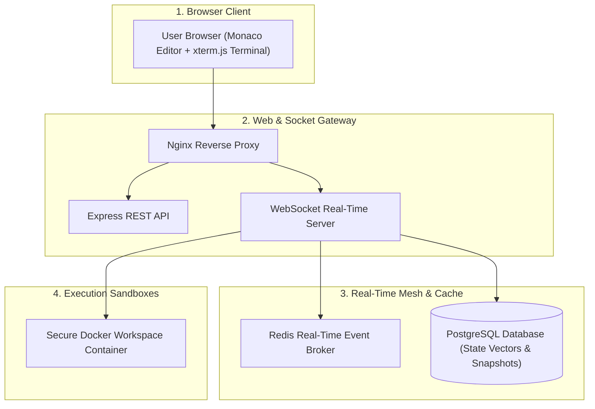

<div align="center">

# NexusIDE

### Multiplayer Cloud Coding Environment in Your Browser

**Real-time Collaboration** • **Docker Sandboxes** • **Interactive Terminals** • **Intelligent Autocomplete** • **Stateless Cloud Architecture**

[View Repository](https://github.com/AmanKashyapp07/NexusIDE) · [Interactive Showcase](https://amankashyapp07.github.io/NexusIDE/) · [Live Cloud VM](http://129.154.39.198/ide/login) · [Report Issue](https://github.com/AmanKashyapp07/NexusIDE/issues)

---

</div>

**NexusIDE** is a collaborative, web-based software development environment. Imagine combining the rich editing experience of **VS Code**, the seamless live multiplayer collaboration of **Google Docs**, and a full **Linux cloud terminal** into a single URL you can open from anywhere.

Developers can write code together in real time, see teammates' colored cursors move live, run programs in their own private interactive command-line terminals, and test full-stack applications — without needing to install compilers, configure libraries, or debug "it works on my machine" issues.

---

## Why I Built This

Setting up development environments is often painful. When teams or students collaborate on code, they lose hours installing software, diagnosing environment differences, and struggling with Git merge conflicts or laggy screen-shares.

I built NexusIDE to make software development instantly accessible and truly collaborative:
- **Instant Onboarding:** Click a workspace link and start coding immediately in a pre-configured cloud environment.
- **True Pair Programming:** Write and debug code together simultaneously with zero conflict or typing lag.
- **Resource Efficiency:** Enable multiple developers to collaborate on the same project using lightweight, shared container sandboxes rather than costly individual virtual machines.
- **Safe Sandboxing:** Safely isolate untrusted code execution inside secure container boundaries so server infrastructure stays protected.

---

## Table of Contents

- [Key Features at a Glance](#key-features-at-a-glance)
- [How It Works (At a Glance)](#how-it-works-at-a-glance)
- [Deep-Dive Engineering Highlights](#deep-dive-engineering-highlights-for-technical-interviewers)
- [Tech Stack](#tech-stack)
- [Live Environment & Deployment](#live-environment--deployment)
- [Getting Started (Local Development)](#getting-started-local-development)
- [Testing & Quality Assurance](#testing--quality-assurance)
- [Future Roadmap](#future-roadmap)
- [License](#license)

---

## Key Features at a Glance

### 1. Multiplayer Real-Time Collaborative Editing
Type simultaneously in the same file with friends or colleagues. Edits merge instantly and seamlessly without overwriting anyone's work, complete with live collaborator presence and colored cursor tags.

### 2. Independent Interactive Terminals
Every collaborator gets their own private, interactive Linux command-line terminal (`bash`) inside the workspace. You can run test suites, install packages, or start dev servers without interfering with your teammate's terminal commands.

### 3. Desktop-Class Code Editing (Monaco Editor)
Powered by the exact same editor engine behind Visual Studio Code, giving developers syntax highlighting, multi-cursor editing, bracket matching, and standard keyboard shortcuts.

### 4. Smart Autocomplete & Diagnostics (LSP)
Language Server Protocol integration brings intelligent autocompletion, real-time error squiggles, and hover documentation for Python, JavaScript, and TypeScript directly over WebSockets.

### 5. Interactive Keystroke Timelapse
Want to see how a solution was developed or review past code states? NexusIDE's timelapse engine lets you scrub backward and forward through time to replay the document's evolution keystroke-by-keystroke.

### 6. Visual Git Conflict Resolver
Collaborative 3-way merge conflict resolution interface. Visually inspect incoming versus current changes side-by-side and resolve conflicts with a single click.

### 7. Team Access & Permissions (RBAC)
Role-based access control with three intuitive tiers:
- **Viewer:** Can inspect files, read code, and watch edits in real time.
- **Editor:** Can create files, type collaboratively, and execute terminal commands.
- **Admin / Owner:** Can manage workspace settings, invite team members, and delete workspaces.

---

## How It Works (At a Glance)

NexusIDE coordinates browser clients, real-time messaging servers, databases, and container sandboxes in a 4-tier pipeline:


```mermaid
flowchart TD
    subgraph BrowserLayer ["1. Browser Client"]
        Browser["User Browser (Monaco Editor + xterm.js Terminal)"]
    end

    subgraph GatewayLayer ["2. Web & Socket Gateway"]
        Nginx["Nginx Reverse Proxy"]
        Express["Express REST API"]
        WSServer["WebSocket Real-Time Server"]
    end

    subgraph SyncLayer ["3. Real-Time Mesh & Cache"]
        RedisMesh["Redis Real-Time Event Broker"]
        PostgresDB[("PostgreSQL Database (State Vectors & Snapshots)")]
    end

    subgraph SandboxLayer ["4. Execution Sandboxes"]
        Docker["Secure Docker Workspace Container"]
    end

    Browser --> Nginx
    Nginx --> Express
    Nginx --> WSServer

    WSServer --> RedisMesh
    WSServer --> PostgresDB
    WSServer --> Docker
```

1. **In the Browser:** The client runs Monaco Editor for code and xterm.js for the terminal. When a developer types, changes are packaged into compact binary updates.
2. **At the Gateway:** Real-time WebSocket servers receive the updates, verify team permissions, and synchronize documents instantly.
3. **Across the Cloud Mesh:** A Redis message broker shares updates across all running server instances so users connected to different servers still collaborate seamlessly.
4. **In the Sandbox:** User commands run inside an isolated Docker container with strict CPU, memory, and process boundaries to prevent abuse.

---

## Deep-Dive Engineering Highlights (For Technical Interviewers)

For engineering interviewers and technical readers, this section details the underlying distributed systems architecture, performance decisions, and trade-offs.

<details>
<summary><b>1. Conflict-Free Collaboration with Yjs CRDTs</b></summary>
<br/>

* **Conflict Resolution without Central Locks:** NexusIDE uses Conflict-Free Replicated Data Types (Yjs YATA model). Edits are commutative and idempotent, meaning they can arrive in different orders on different machines and still converge deterministically to the identical document state.
* **Separation of Awareness and Content:** Ephemeral data (such as cursor coordinates and user selections) is decoupled from persistent document content, preventing transient cursor broadcasts from polluting document history.
* **Buffer Safety in Node.js:** Sliced Node.js `Buffer` instances share an internal memory pool. Binary CRDT decoding strictly enforces explicit offset allocation (`new Uint8Array(buf.buffer, buf.byteOffset, buf.byteLength)`) to prevent subtle memory corruption.
</details>

<details>
<summary><b>2. Velocity-Based Database Persistence Debouncing</b></summary>
<br/>

* **The Problem:** Writing every single keystroke to PostgreSQL would overwhelm the database under active multi-user typing bursts.
* **The Solution (`AdaptivePersistenceDebouncer`):** An adaptive debouncing engine monitors typing velocity in a sliding 1-second window:
  * **300ms** on idle pauses.
  * **800ms** standard typing delay.
  * Scales up to **2,500ms** during rapid bursts (>5 edits/sec).
  * Enforces a **5,000ms hard ceiling** forced commit to guarantee periodic persistence during continuous typing.
* **Impact:** Slashes database write IOPS by ~75% while keeping the uncommitted crash window bounded.
</details>

<details>
<summary><b>3. Stateless Multi-Pod Scaling & Distributed Mutex</b></summary>
<br/>

* **Stateless WebSocket Pods:** Multiple Node.js WebSocket instances serve collaborative rooms concurrently without sticky sessions. Redis Pub/Sub channels broadcast document updates across pods with origin tagging to prevent infinite broadcast loops.
* **Distributed Mutex with Fallback (`distributedLock.service.ts`):** Before executing debounced database saves, pods acquire a single-instance Redis mutex (`SET lockKey POD_ID PX ttl NX`) with an atomic Lua unlock script and an in-memory `Set` fallback.
* **Optimistic Guardrails:** To protect against edge cases where database flushes take longer than the lock TTL, PostgreSQL writes leverage optimistic version checking (`WHERE version = :v`) to prevent stale overwrites.
</details>

<details>
<summary><b>4. Shared Workspace Containers & Memory Optimization</b></summary>
<br/>

* **Container Consolidation:** Instead of allocating a heavy 500MB container for every connected user, collaborators in a workspace share a single isolated Docker container.
* **Multi-User PTY Isolation:** Each user's WebSocket spawns an independent `container.exec()` pseudo-terminal (`/dev/pts/X`) with custom environment variables (`USER`, `GIT_AUTHOR_NAME`), providing private command histories while working on the shared project filesystem.
* **~90% Memory Savings:** Accommodates multiple simultaneous collaborators on modest cloud instances (e.g. 1 GB RAM footprint per workspace rather than 10 GB across 10 individual user containers).
* **State Hibernation:** Idle containers have their cgroups frozen (`docker pause`), suspending CPU consumption while preserving running shell states in memory.
</details>

<details>
<summary><b>5. Bit-Packed Binary Cursor Codec (96.8% Bandwidth Reduction)</b></summary>
<br/>

* **Binary Frame Layout:** Standard awareness JSON packets (`{"user":"...","line":12,"column":4}`) consume ~250 bytes per cursor move.
* **8-Byte Binary Frame:** `cursorCodec.service.ts` packs coordinates into an exact 8-byte buffer:
  * `[uint16 userHash, uint16 line, uint16 col, uint16 selectionLength]`
* **Efficiency:** Delivers a **96.8% reduction** in network awareness bandwidth, keeping high-frequency mouse movements and typing responsive even on mobile connections.
</details>

<details>
<summary><b>6. Git-Style Merkle DAG Versioning with SHA-256</b></summary>
<br/>

* **Content-Addressed Storage:** Files, directories, and snapshots are hashed into Merkle DAG structures using cryptographic **SHA-256** content addressing (`git_blobs`, `git_trees`, `git_commits`).
* **Deduplication:** Identical files share existing blob storage across revisions, reducing disk growth.
* **Garbage Collection:** An automated background cleaner (`casGarbageCollector.service.ts`) scans and safely removes orphaned objects not linked to active snapshots.
</details>

---

## Tech Stack

| Layer | Technologies |
| :--- | :--- |
| **Frontend UI** | React 18, TypeScript, Tailwind CSS, Monaco Editor, xterm.js, Vite |
| **Backend Gateway** | Node.js, Express, WebSockets, Socket.io |
| **Real-Time & Sync** | Yjs (CRDTs), Redis Pub/Sub, Custom Bit-Packed Binary Codec |
| **Storage & Caching** | PostgreSQL 16 (`BYTEA` binary vectors, covering B-Tree indexes), Redis 7 |
| **Compute & Sandboxing** | Docker Engine API (`dockerode`), Linux PTYs (`/dev/pts`), cgroups |
| **Hosting & Infra** | Oracle Cloud Infrastructure (Ubuntu Linux), Nginx, PM2, Prometheus |
| **Testing** | Vitest, fast-check (property fuzzing), Playwright (browser E2E) |

---

## Live Environment & Deployment

NexusIDE is continuously deployed and accessible directly in your web browser:

**Live URL:** [http://129.154.39.198/ide/login](http://129.154.39.198/ide/login)

- **Production Edge:** Nginx handles HTTP reverse proxying, Gzip compression, and WebSocket connection upgrades.
- **Process High-Availability:** PM2 maintains active Node.js server processes and background cleanup cron daemons with automated restarts.
- **Prometheus Observability:** Runtime metrics endpoint (`/api/metrics`) exposes event loop delay histograms, active socket counts, and memory allocations.

---

## Getting Started (Local Development)

### Prerequisites
- **Node.js**: v18 or higher
- **Docker Engine**: Installed and running locally
- **PostgreSQL**: v16 or higher
- **Redis**: v7 or higher

### Quick Setup

```bash
# 1. Clone the repository
git clone https://github.com/AmanKashyapp07/NexusIDE.git
cd NexusIDE

# 2. Install backend and frontend dependencies
cd backend && npm install
cd ../frontend && npm install
cd ..

# 3. Initialize PostgreSQL database
psql -U postgres -d sandbox -f database/schema.sql

# 4. Configure environment variables in backend/.env
# DATABASE_URL="postgresql://postgres@localhost:5432/sandbox"
# JWT_SECRET="your_jwt_secret_key"

# 5. Launch development servers
# Terminal 1 (Backend - http://localhost:3000):
cd backend && npm run dev

# Terminal 2 (Frontend - http://localhost:5173):
cd frontend && npm run dev
```

---

## Testing & Quality Assurance

NexusIDE includes a multi-tier test suite verifying real-time synchronization, security sandboxing, and performance under stress:

```bash
# Run all default unit and integration suites
bash test.sh

# Run specialized testing categories:
bash test.sh --property      # Property-based CRDT fuzzing (fast-check)
bash test.sh --idempotency   # Update replay & synchronization idempotency
bash test.sh --chaos         # Redis disconnections & PTY crash resilience
bash test.sh --security      # Docker cgroup PID limits & socket RBAC enforcement
bash test.sh --snapshot      # SHA-256 Merkle DAG integrity & snapshot restore
bash test.sh --e2e           # Playwright multi-browser end-to-end tests
bash test.sh --all           # Run the complete test suite end-to-end
```

---

## Future Roadmap

1. **Hardware-Isolated MicroVMs (AWS Firecracker / gVisor):** Move beyond shared-kernel Docker containers to lightweight hardware-virtualized microVMs for military-grade multi-tenant security.
2. **Client-Side WASM Extensions:** Enable developers to run custom linters and code formatters directly inside the browser using WebAssembly.
3. **Integrated Video & Voice Huddles:** Built-in WebRTC audio/video mesh channels to talk directly while coding together.
4. **AI Inline Autocomplete:** Context-aware inline ghost text suggestions and code explanations powered by open-source code LLMs.

---

## License

This project is open source and available under the [MIT License](LICENSE).

<div align="center">

Built and maintained by **Aman Kashyap**  
[GitHub Profile](https://github.com/AmanKashyapp07) · [Report an Issue](https://github.com/AmanKashyapp07/NexusIDE/issues)

</div>
