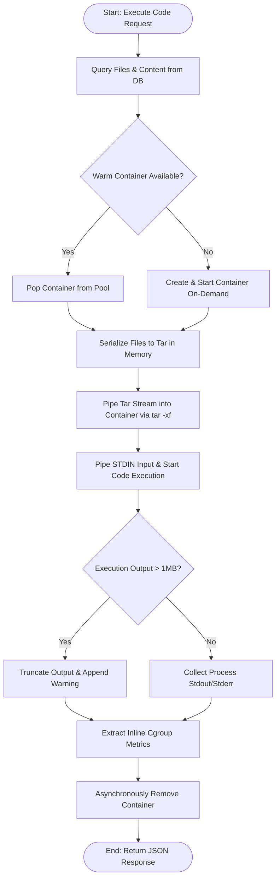

# Sandboxed Code Execution Engine: Deep Dive & First Principles

This document provides a highly technical, first-principles architectural breakdown of the Sandboxed Code Execution Engine built for this IDE project. It is designed as a study guide and reference for technical architecture and system design interviews.

---

## 1. System Topology & Flow of Information

The sandboxing execution architecture uses an **In-Memory Hydrated Warm Pool Pattern**. Below is the sequence of interactions when a user triggers code execution:



---

## 2. First Principles: Container Sandboxing Mechanics

Understanding *how* a process is sandboxed requires digging beneath Docker to the Linux Kernel APIs. Under the hood, a container is just a normal Linux process running on the host kernel, restricted by three primary abstractions: **Namespaces**, **Control Groups (cgroups)**, and **Seccomp/AppArmor profiles**.

### A. Linux Namespaces (Isolating Visibility)
Namespaces restrict what a process can *see*. When Docker starts a container, it invokes the `clone()` system call with specific flags:

| Namespace Flag | What it Isolates | Sandbox Benefit |
| :--- | :--- | :--- |
| `CLONE_NEWPID` | Process IDs | The user process is mapped as PID 1 inside its namespace. It has no visibility into, or ability to send signals (`kill`) to, processes running on the host or other sandboxes. |
| `CLONE_NEWNET` | Network Stack | Docker runs our sandboxes with `NetworkMode: 'none'`. This detaches the network interface entirely (except for a local loopback loop). The process cannot establish sockets, execute reverse shells, query DNS, or exfiltrate database contents. |
| `CLONE_NEWNS` | Mount Points | The process gets its own filesystem view. By combining this with `ReadonlyRootfs: true`, the host's Linux root is hidden. We mount small, temporary, memory-backed filesystems (`tmpfs`) at `/app` and `/tmp`, making disk operations incredibly fast and ensuring any writes do not persist on disk. |
| `CLONE_NEWIPC` | System V IPC / POSIX MQ | Prevents shared memory segments or message queue hijacking between containers. |
| `CLONE_NEWUTS` | Hostname / Domain name | Gives the sandbox its own hostname, isolating UTS identifiers. |

### B. Linux Control Groups (cgroups v2) (Isolating Resources)
While namespaces isolate visibility, Control Groups (cgroups) limit **resource consumption** to prevent Denial of Service (DoS) attacks. This project targets **cgroups v2** (unified hierarchy), which improves resource allocation consistency compared to cgroups v1.

```
Host cgroup Root
  └── /sys/fs/cgroup/system.slice/docker-<container-id>.scope/
        ├── cgroup.procs          # PIDs in this sandbox
        ├── cpu.max               # CPU quota limits (NanoCpus)
        ├── cpu.stat              # Cumulative CPU consumption metrics
        ├── memory.max            # Hard memory limit (e.g. 100MB)
        └── memory.peak           # Peak memory usage (OOM detection)
```

1. **CPU Constraints (`cpu.max`)**: 
   We configure `NanoCpus: 250,000,000` (representing 0.25 vCPU cores). The Linux Completely Fair Scheduler (CFS) throttles the process if it tries to execute an infinite CPU-bound loop, preserving host availability.
2. **Memory Constraints (`memory.max`)**:
   We enforce a hard cap of `100MB`. If the process requests memory beyond this limit, the Linux kernel's Out-Of-Memory (OOM) killer fires, sending a `SIGKILL` to the offending process.
3. **PID Limits (`pids.max`)**:
   We limit the sandbox to a maximum of `64` active threads/processes (`PidsLimit: 64`). This renders **fork bombs** (e.g., `:(){ :|:& };:`) harmless, as the system will refuse to spawn new processes once the quota is reached.

### C. Seccomp (Syscall Filtering)
Docker applies a default Seccomp (Secure Computing Mode) profile that disables over 300 risky Linux system calls (like `mount`, `reboot`, `sys_chroot`, and `kexec_load`). Even if a process runs as `root` inside the container, it cannot bypass filesystem permissions or compromise the host kernel because the kernel blocks the required syscalls at the boundary.

---

## 3. Sandboxing Technology Comparisons

During design sessions or system interviews, you may be asked to compare container-based sandboxing with other models. Below is a structural analysis:

| Metrics / Properties | OS Containers (This System - Docker / runc) | User-Space Kernels (Google gVisor) | MicroVMs (AWS Firecracker) | WebAssembly System Interface (WASI) |
| :--- | :--- | :--- | :--- | :--- |
| **Isolation Boundary** | Shared Host Kernel (Isolated via Namespaces/cgroups) | Intercepts system calls in user-space (Sentry/Gofer) | Separate guest Linux kernel per VM (KVM-backed virtualization) | Language-runtime abstraction (Single-process sandbox) |
| **Startup Latency** | ~400ms - 800ms (Cold)<br/>**~10ms (Warm Pool)** | ~150ms - 300ms | ~100ms - 150ms | **< 1ms** |
| **Security Strength** | Medium-High (Vulnerable to host kernel zero-days) | Very High (Syscall redirection prevents host kernel access) | Extreme (Hard virtualization boundary) | Extreme (Software fault isolation) |
| **Memory Overhead** | Low (~10-30MB per container) | Medium (~50MB per agent) | High (~100MB+ per MicroVM) | **Extremely Low (< 5MB)** |
| **System Call Support** | **Full / Native** | Partial (Needs manual mapping; database engines sometimes fail) | **Full / Native** | Highly Restrictive (No network/fork natively) |
| **Use Case Fit** | General multi-language IDEs, CI/CD runners, dev envs | Multi-tenant SaaS APIs, serverless platforms (Google Cloud Run) | Multi-tenant untrusted code hosting (AWS Lambda, Fly.io) | Edge functions, plug-in architectures (Cloudflare Workers) |

---

## 4. Key Architectural Engineering Wins in this Project

### A. Sub-100ms Execution via Warm Pools
Running `docker run` on demand forces Docker to configure union filesystems, provision veth interfaces, and set up cgroups. This takes 400-800ms. By maintaining a pool of pre-warmed containers executing a persistent `sleep infinity`, we skip this step. The backend pops an active container, pipes in code, runs it, and discards it. Latency is reduced to the network socket handshake overhead (~10ms).

### B. In-Memory Tar-over-Stdin Hydration
Traditional architectures map host directories into the container using bind mounts. Bind mounts introduce host disk I/O latency, create configuration dependencies on host directory structures, and risk exposing host file structures to directory traversal attacks.

We solve this by building a `.tar` archive in Node.js memory (`tar-stream`) and piping it directly to `docker exec tar -xf - -C /app` in the container.
- File writes happen in RAM (`tmpfs`), avoiding slow disk virtualization.
- Network and file injection happen in a single UNIX socket stream.
- **Race Condition Guard**: The backend holds execution until the `tar` extraction socket emits `end`, preventing the sandbox compiler from running before files are fully written to the memory-disk.

### C. Low-Latency Inline Cgroup Probing
Polling `docker stats` is slow because the Docker daemon gathers metrics at a coarse 1-second interval. To get microsecond-accurate metrics:
1. We construct a compound shell wrapper that executes the compiler/interpreter.
2. Immediately upon process completion, the wrapper extracts metrics directly from the kernel filesystem path:
   - CPU Time: `/sys/fs/cgroup/cpu.stat` (reads `usage_usec`)
   - Peak Memory: `/sys/fs/cgroup/memory.peak` (reads maximum memory high-water mark)
3. The wrapper outputs these metrics to `stderr` wrapped in arbitrary markers (`___NEXUS_CGROUP_BOUNDARY___`).
4. The Node.js backend strips this metadata out, computes delta metrics, and returns clean runtime outputs to the user.

---

## 5. Security Threat Modeling & Mitigations

| Threat Vector | Mechanism | Sandbox Mitigation |
| :--- | :--- | :--- |
| **Fork Bomb** | Spawning infinite sub-processes to exhaust OS thread tables (`pids`). | Hard limit configured on the container `PidsLimit: 64`. Spawns beyond 64 fail with `Resource temporarily unavailable`. |
| **Memory Exhaustion** | Allocating endless byte arrays to cause host OS paging/swapping. | Hard limit configured via cgroups `Memory: 100 * 1024 * 1024` (100MB). Container process is immediately sent `SIGKILL` (exit code 137). |
| **Infinite Loop** | Running `while(true)` to max out host CPU cores. | The Node.js execution loop initiates a background timer. If execution does not complete within `15,000ms`, the host sends a `docker exec` kill signal and terminates the run. |
| **Host System Compromise** | Running `rm -rf /` or modifying system binaries. | Rootfs is mounted read-only (`ReadonlyRootfs: true`). Writable regions are isolated RAM disks (`tmpfs`). System calls that edit mounting systems are blocked by Seccomp. |
| **Data Exfiltration** | Using curl/sockets to send tokens or secrets to an external server. | Network interfaces are disabled (`NetworkMode: 'none'`). Sockets throw `Network is unreachable` immediately. |
| **Buffer Overflow DoS** | Printing gigabytes of text to stdout to overwhelm host disk/memory buffers. | The Node.js stream reader tracks chunks. If output size exceeds `1MB`, it halts streaming, appends a truncation warning, and terminates data absorption. |
