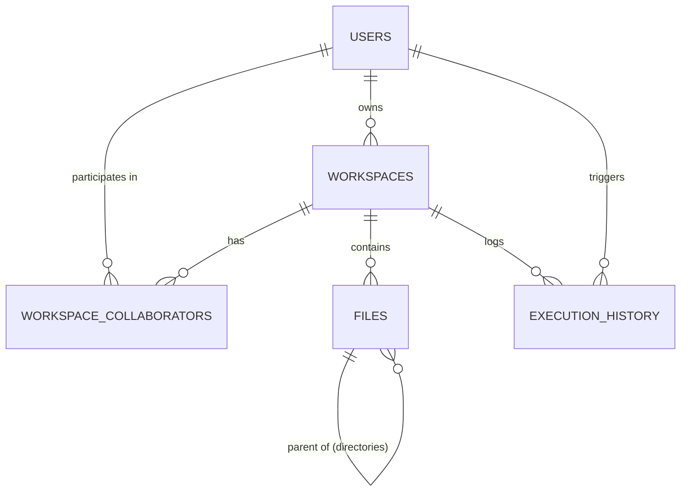

<!-- MERGED FROM: schema.md -->

# Database Schema Report

## Overview
This document outlines the PostgreSQL database schema used for the Collaborative Cloud IDE Sandbox project. The schema is designed to support user authentication, workspace management, role-based real-time collaboration, file system representation, and execution telemetry.

## Entity-Relationship Diagram

---

## Detailed Table Breakdown

### 1. `users`
Stores registered user accounts and authentication credentials.

| Column | Type | Constraints | Description |
| :--- | :--- | :--- | :--- |
| `id` | `UUID` | Primary Key | Unique identifier auto-generated using `uuid-ossp`. |
| `username` | `VARCHAR(50)` | Unique, Not Null | Display name for the user. |
| `email` | `VARCHAR(255)`| Unique, Not Null | Email address for login and notifications. |
| `password_hash`| `VARCHAR(255)`| Not Null | Bcrypt hashed password. |
| `avatar_url` | `VARCHAR(1024)`| | Optional URL for user's profile picture. |
| `created_at` | `TIMESTAMP` | Default NOW() | Timestamp of account creation. |
| `updated_at` | `TIMESTAMP` | Default NOW() | Auto-updating timestamp. |

---

### 2. `workspaces`
Represents an isolated project environment containing multiple files and directories.

| Column | Type | Constraints | Description |
| :--- | :--- | :--- | :--- |
| `id` | `UUID` | Primary Key | Unique workspace identifier. |
| `owner_id` | `UUID` | Foreign Key (`users.id`) | The user who created the workspace. Cascade on delete. |
| `title` | `VARCHAR(255)`| Default 'Untitled...' | The name of the workspace. |
| `description` | `TEXT` | | Optional context about the workspace. |
| `is_public` | `BOOLEAN` | Default false | Whether anyone can view the workspace. |
| `created_at` | `TIMESTAMP` | Default NOW() | Workspace creation time. |
| `updated_at` | `TIMESTAMP` | Default NOW() | Auto-updating timestamp. |

---

### 3. `workspace_collaborators`
Manages role-based access control (RBAC) allowing multiple users to edit a workspace.

| Column | Type | Constraints | Description |
| :--- | :--- | :--- | :--- |
| `workspace_id`| `UUID` | Primary/Foreign Key | References `workspaces.id`. |
| `user_id` | `UUID` | Primary/Foreign Key | References `users.id`. |
| `role` | `ENUM` | Default 'viewer' | One of `viewer`, `editor`, or `admin`. |
| `joined_at` | `TIMESTAMP` | Default NOW() | When the user joined the workspace. |

---

### 4. `files` (Files & Directories)
An adjacency list model to represent the hierarchical file tree (files and folders) within a workspace. Also handles Yjs state persistence for CRDT-based real-time editing.

| Column | Type | Constraints | Description |
| :--- | :--- | :--- | :--- |
| `id` | `UUID` | Primary Key | Unique file/directory identifier. |
| `workspace_id`| `UUID` | Foreign Key | References `workspaces.id`. |
| `parent_id` | `UUID` | Foreign Key (`files.id`) | Points to the parent directory. `NULL` means root level. |
| `name` | `VARCHAR(255)`| Not Null | File or directory name. |
| `type` | `ENUM` | Not Null | `file` or `directory`. |
| `content` | `TEXT` | | The plaintext source code for files. |
| `yjs_state` | `BYTEA` | | Binary CRDT update state for Yjs persistence. |
| `language` | `VARCHAR(50)` | | Language identifier (e.g., `typescript`, `python`). |
| `size_bytes` | `BIGINT` | Default 0 | File size in bytes. |

> [!NOTE] 
> A unique constraint ensures that within the same `workspace_id` and `parent_id`, no two nodes can have the same `name`.

---

### 5. `execution_history`
An audit log of all remote code executions triggered by users. Useful for telemetry, debugging, and potential rate-limiting.

| Column | Type | Constraints | Description |
| :--- | :--- | :--- | :--- |
| `id` | `UUID` | Primary Key | Execution log identifier. |
| `workspace_id`| `UUID` | Foreign Key | The workspace where execution happened. |
| `user_id` | `UUID` | Foreign Key | The user who triggered the run. |
| `language` | `VARCHAR(50)` | Not Null | The runtime environment used. |
| `code_snapshot`| `TEXT` | Not Null | The exact code that was executed. |
| `output` | `TEXT` | | `stdout` and `stderr` logs returned by the sandbox. |
| `status` | `ENUM` | Not Null | Result of execution (`success`, `failed`, `timeout`, `error`). |
| `duration_ms` | `INTEGER` | | How long the execution took. |
| `memory_usage`| `BIGINT` | | Memory consumed during execution (in bytes). |
| `executed_at` | `TIMESTAMP` | Default NOW() | When the execution occurred. |

## Triggers and Functions
The schema utilizes PostgreSQL functions and triggers (`trigger_set_timestamp()`) to ensure that all `updated_at` columns automatically update to `NOW()` whenever a row is modified, ensuring data integrity without application-level logic.

<!-- MERGED FROM: file_Structure.md -->

# Sandbox File Structure Report

## Overview
This document outlines the file and directory structure of the Collaborative Cloud IDE Sandbox project. The repository is organized into three main components: `frontend`, `backend`, and `database`, along with project-level configuration and documentation files.

## High-Level Structure
- `frontend/`: Contains the React-based client application.
- `backend/`: Contains the Node.js Express server.
- `database/`: Contains PostgreSQL schema and initialization files.
- `reports/`: Contains documentation, progress notes, and project reports.

---

## Detailed Breakdown

### 1. Root Directory
The root directory orchestrates the development environment and version control settings.
- `docker-compose.yml`: Defines the multi-container Docker applications. It sets up the local infrastructure, such as the PostgreSQL database and potentially Redis, required for development.
- `.gitignore`: Specifies intentionally untracked files and directories that Git should ignore (e.g., `node_modules`, `.env`, the `reports/` folder, and large assets).

### 2. Backend (`backend/`)
The backend provides the RESTful API, WebSocket communication for real-time collaboration (Yjs), interactive terminals, and Docker orchestration for the remote execution environment.

- `src/`
  - `server.ts`: The primary entry point for the Express application. Sets up routes, middleware, and the HTTP server.
  - `db.ts`: Manages the database connection to PostgreSQL using `pg-pool`, handling connections efficiently with a lazy-loading pattern.
  - `routes/`: Contains Express routers separated by domain logic.
    - `auth.ts`: Handles user authentication (login/register).
    - `workspace.ts`: Handles CRUD operations for files, directories, and workspaces.
  - `middleware/`: Contains custom Express middleware functions.
    - `auth.ts`: Validates JWT tokens and protects authenticated API routes.
  - `sandbox/`: Contains logic for the remote execution environment.
    - `docker.ts`: Interfaces with the Docker Daemon to spawn isolated containers for code execution.
    - `pool.ts`: Manages pre-warmed container pooling and image building.
    - `workspaceContainer.ts`: Implements unified workspace container tracking and reference-counting lifecycles.
  - `terminal/`: Relays persistent shell and diagnostics streams.
    - `terminalHandler.ts`: Bridges interactive terminal PTY standard inputs/outputs.
    - `lspHandler.ts`: Spawns containerized language servers and relays JSON-RPC autocomplete/diagnostic sockets.
- `package.json` & `package-lock.json`: Defines Node.js dependencies (Express, pg, jsonwebtoken) and npm scripts.
- `tsconfig.json`: Defines TypeScript compiler configurations for the backend.

### 3. Frontend (`frontend/`)
The frontend is a single-page application built with React, Vite, and TypeScript. It offers the UI for the code editor, file tree, and terminal.

- `src/`
  - `main.tsx`: Entry point for the React application, attaching it to the DOM.
  - `App.tsx` & `App.css`: Main application layout, routing provider, and global structural styles.
  - `components/`: Modular, reusable UI components.
    - `Editor/CodeEditor.tsx`: Integrates the code editor (e.g., Monaco Editor) for writing code.
    - `Sidebar/Sidebar.tsx`: Renders the file tree allowing users to create, select, and manage files within a workspace.
    - `Terminal/OutputPanel.tsx`: Displays terminal output and execution results.
  - `pages/`: Top-level page views.
    - `AuthPage.tsx`: The login and registration view.
    - `IdePage.tsx`: The main workspace view combining the sidebar, code editor, and terminal into a cohesive layout.
  - `index.css`: Global styles, CSS variables, and reset rules.
  - `assets/`: Static assets like images and SVGs (e.g., `hero.png`, `icons.svg`).
- `vite.config.ts`: Configuration for the Vite build tool and development server (proxying requests to the backend).
- `package.json` & `package-lock.json`: Defines frontend dependencies (React, Yjs, Lucide) and npm scripts.
- `tsconfig.json` (and `.app`, `.node`): Defines TypeScript settings ensuring type safety, including configurations for React.

### 4. Database (`database/`)
The database folder contains scripts to manage database state.
- `schema.sql`: Contains the raw SQL Data Definition Language (DDL) to initialize tables (e.g., `users`, `workspaces`, `files`) required by the application.