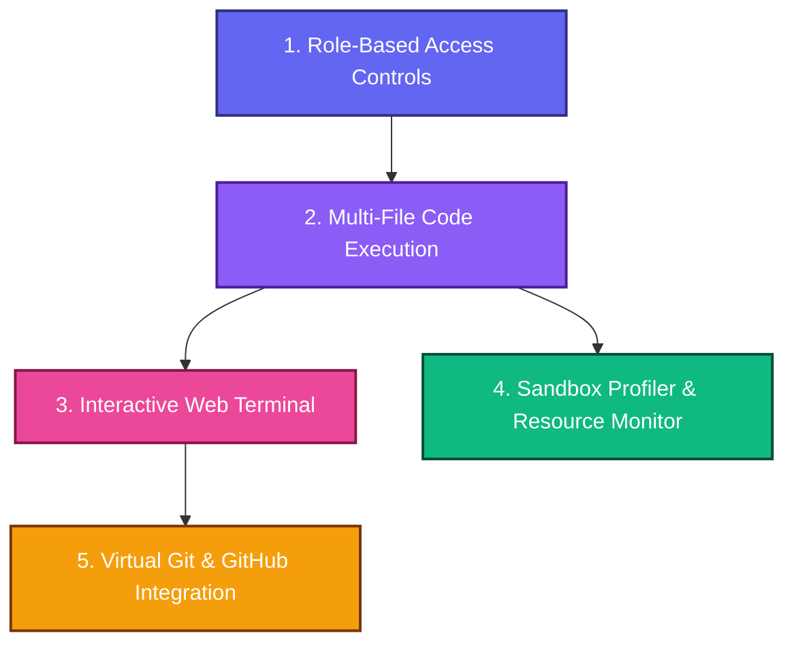
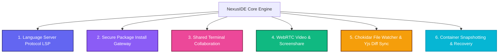

<!-- MERGED FROM: features.md -->

# NexusIDE: Production-Grade Feature Enhancements & Roadmap

This report details a curated list of production-grade features designed to elevate NexusIDE to a top-tier collaborative development platform. To help prevent confusion and ensure high reliability, these features are organized sequentially by implementation dependency and annotated with their architectural complexity.

---

## 🛠 Feature Checklist & Roadmap

---

## 1. Role-Based Collaboration & Live Permissions
### 📝 Description
Currently, collaborators accessing a workspace have uniform, unrestricted access. This feature enforces distinct, secure workspace roles (`viewer`, `editor`, `admin`) to protect code integrity. When a new user joins a workspace via a sharing link, they default to a `viewer` role. They can then issue a real-time request to the workspace owner/admin to unlock edit permissions.

### 🔬 Technical Implementation Strategy
* **Database & Auth:** 
  * Check the role of users in the `workspace_collaborators` table during the authentication handshake.
  * Default new collaborators to `'viewer'`.
* **Real-time Permission Broker:**
  * Utilize Socket.io / WebSocket connections to coordinate permission negotiation.
  * When a viewer requests editor status, a notification payload is pushed to the admin's UI.
  * Upon admin approval, the backend updates the role in `workspace_collaborators` and sends a `role_change` signal back to the client to dynamically switch the user's role.
* **Frontend Enforcement:**
  * Bind Monaco Editor's `readOnly` parameter to the collaborator's role state: `readOnly: role === 'viewer'`.
  * Conditionally hide execution triggers (e.g., the "Run Code" buttons) and the stdin input interfaces for viewers.
  * Show a floating "Request Edit Permissions" action button in the collaboration toolbar for viewers.

### 📊 Complexity Analysis
* **Complexity Level:** **Medium**
* **Estimation:** 1-2 sessions
* **Dependencies:** Relies on the existing JWT auth and PostgreSQL schema.

---

## 2. Multi-File Workspace Execution & Custom Run Commands
### 📝 Description
Currently, the runtime execution engine executes only the single, active file in the Monaco editor in isolation. If a user tries to import modules or run helper scripts (e.g., Python `import utils` or Node.js `const helper = require('./helper')`), the run fails because the container filesystem lacks those files. This feature syncs the *entire* workspace database directory tree into the container before execution, and introduces support for custom compilation/run script overlays.

### 🔬 Technical Implementation Strategy
* **Pre-Execution Directory Hydration:**
  * Before execution, query the database using a Recursive CTE to pull all file records inside the active workspace.
  * Rather than creating bind mounts (which pose security risks and require persistent folders on the host), stream the workspace filesystem structure directly into the running container over standard streams (`tar` archiving or programmatic recursive `cat` stream over a single `exec` channel).
* **Custom Execution Configurations:**
  * Introduce support for a `.nexusrun` or `nexus.config.json` file in the workspace root.
  * The configuration specifies customizable `build` and `run` command strings (e.g., `{ "run": "python main.py --env dev" }` or `{ "build": "g++ src/*.cpp -o app", "run": "./app" }`).
* **Sandbox Runtime Changes:**
  * The backend parser inspects the workspace for `.nexusrun`. If present, it executes the custom scripts in the pre-warmed sandbox instead of falling back to default single-file executors.

### 📊 Complexity Analysis
* **Complexity Level:** **Medium-High**
* **Estimation:** 2-3 sessions
* **Dependencies:** Requires robust directory traversal logic on the backend.

---

## 3. Interactive Web Terminal (xterm.js + WebSockets)
### 📝 Description
Static stdout/stderr compilation outputs don't replicate a fully functional IDE. This feature replaces the static output panel with an interactive, terminal emulation component using `xterm.js`. Users can interact with the running container shell in real time (e.g., run interactive scripts, view file lists, or execute CLI-based input prompts).

### 🔬 Technical Implementation Strategy
* **Client-Side Terminal Binding:**
  * Embed `xterm.js` and `xterm-addon-fit` within a panel in the IDE.
  * Establish a specialized WebSocket terminal namespace (`/ws/terminal/:workspaceId`).
* **Backend Shell Multiplexing:**
  * When a client connects, pull a warm container.
  * Programmatically spawn an interactive shell (e.g., `/bin/sh` or `/bin/bash`) within that container using Dockerode's `exec` API with `{ Tty: true, AttachStdin: true, AttachStdout: true, AttachStderr: true }`.
  * Pipe the WebSocket stream directly into the standard input (`stdin`) of the container exec shell, and pipe standard output/error (`stdout`/`stderr`) back through the WebSocket connection to the terminal renderer.
* **Tear-down and Cleanup:**
  * When the terminal socket closes or times out, immediately destroy the execution subshell and return the container to the pool (or terminate it to prevent lingering zombie processes).

### 📊 Complexity Analysis
* **Complexity Level:** **High**
* **Estimation:** 3 sessions
* **Dependencies:** Requires the Multi-File Directory Hydration feature to be completed first, so that the shell launches with a populated workspace filesystem.

---

## 4. Live Sandbox Resource Monitor & Profiler
### 📝 Description
In multi-tenant cloud environments, users need visibility into how their code runs. This feature adds a live diagnostic panel showcasing execution resource statistics (CPU usage percentages, RAM consumption, run duration, exit codes, and out-of-memory warnings) for every execution block.

### 🔬 Technical Implementation Strategy
* **Docker Container Metrics Pulling:**
  * Query the Docker Engine statistics API (`container.stats({ stream: false })`) immediately after a code execution completes.
  * Extract memory metrics (`memory_stats.usage`) and CPU usage percentages using the delta calculations between the container CPU counters and host system CPU counters.
* **Database logging:**
  * Log execution metrics (OOM flags, memory size in bytes, duration, code snapshots) to the PostgreSQL `execution_history` table.
* **Frontend Visualization:**
  * Display a visual execution metrics pill inside the run console.
  * Show a workspace dashboard panel with charts displaying CPU/memory trends over the last 10 executions.

### 📊 Complexity Analysis
* **Complexity Level:** **Medium**
* **Estimation:** 1-2 sessions
* **Dependencies:** Integrates directly with the Docker container lifecycle and `execution_history` log tables.

---

## 5. Virtual Git Engine & GitHub Synchronization
### 📝 Description
Enables users to import code directly from public/private GitHub repositories, collaborate in real time, and commit/push their collaborative revisions back to GitHub without leaving the browser interface.

### 🔬 Technical Implementation Strategy
* **GitHub Integration Gateway:**
  * Configure a GitHub OAuth authorization flow to acquire API access tokens.
* **Database & Memory Git Operations:**
  * Integrate a lightweight in-memory Git provider (e.g., `isomorphic-git` running on the backend or in a Node helper utility).
  * On import, fetch the target repository tree and insert the files into the PostgreSQL relational file schema.
* **Diffing & Staging Panel:**
  * Write a staging interface in the sidebar showing added, modified, and deleted workspace files.
  * Provide visual inline diff views comparing the active CRDT workspace state against the base commit.
  * Allow writing a commit message and triggering a `push` sequence that updates the remote origin.

### 📊 Complexity Analysis
* **Complexity Level:** **High / Critical**
* **Estimation:** 3-4 sessions
* **Dependencies:** Requires the Multi-File Workspace structure to be fully stable.

---

## 📅 Recommended Sequence of Implementation

To maintain stable code state and avoid overlapping conflicts, we should proceed in the following order:

1. **Phase 1: Role-Based Collaboration & Live Permissions**
   * Establishes secure multi-user collaboration before expanding filesystem capability.
2. **Phase 2: Multi-File Workspace Execution & Custom Run Commands**
   * Expands the single-file execution backend to compile complete directory trees.
3. **Phase 3: Interactive Web Terminal**
   * Bridges the workspace directory system into an interactive terminal environment.
4. **Phase 4: Sandbox Resource Profiler**
   * Adds diagnostic analytics on top of the execution channels.
5. **Phase 5: GitHub Sync & Virtual Git**
   * Integrates external project hosting tools once internal execution/collaboration channels are mature.

<!-- MERGED FROM: roadmap.md -->

# Collaborative Cloud IDE & Sandbox
## Project Guide & 4-Week Execution Framework

### What Exactly Are We Building?

You are building a **production-grade Collaborative Cloud IDE & Sandbox**. This is not a simple CRUD (Create, Read, Update, Delete) application. This system replicates the core engineering architecture of industry-leading platforms like **VS Code Live Share, Figma, and LeetCode**.

It tackles two of the most technically challenging paradigms in software engineering:
1. **Conflict-Free State Synchronization:** Ensuring multiple concurrent users can type in the same document simultaneously without character overlapping or losing data.
2. **Secure Multi-Tenant Execution:** Allowing users to execute arbitrary (and potentially malicious) code on your server without compromising the host machine or starving server resources.

#### The Tech Stack
* **Frontend:** React, Vite, Tailwind CSS (Classic GitHub Dark UI), Monaco Editor.
* **Synchronization:** Yjs (CRDTs), `y-websocket`, `y-monaco`.
* **Backend:** Node.js, Express, WebSockets (`ws`).
* **Database:** PostgreSQL (raw `pg` driver with advanced schema constraints).
* **Sandbox Engine:** Currently Local Execution (`child_process`), upgrading to Docker Engine API (`dockerode`).

---

### The 4-Week Framework

You have already completed a massive portion of Week 1 in our initial setup. Here is how you should structure the next 4 weeks to complete this project and prep for your internship interviews.

#### Week 1: Foundation & The "Single Player" Mode
*Goal: Build the base IDE that works flawlessly for one person.*
- [x] Scaffold the React frontend and Node/Express backend.
- [x] Configure the Monaco Code Editor with a sleek GitHub dark theme.
- [x] Establish the Postgres database schema (Users, Workspaces, Files, History).
- [x] Set up local code execution (Node/Python/C++/Bash via `child_process`).
- [x] **Next Step:** Implement a Sidebar File Tree so users can create, open, and delete multiple files within a single workspace.

#### Week 2: Real-Time Collaboration & CRDTs
*Goal: Turn it into a multiplayer experience without data corruption.*
- [x] Bind Yjs to the Monaco Editor over WebSockets.
- [x] Persist the Yjs binary state (BYTEA) to your Postgres database so document history survives server reboots.
- [x] Implement robust Live Cursors with floating name tags for active collaborators.
- [x] Handle network disconnects (offline editing) and auto-reconnection state syncing.
- [x] **Voice Chat:** Build a Discord-style WebRTC mesh network for real-time, low-latency audio communication directly inside the workspace.

#### Week 3: Security & The Docker Sandbox Orchestration
*Goal: Secure the execution engine so users can't hack or crash your server.*
- [ ] Transition from local `child_process` execution to the **Docker Engine API**.
- [ ] Pre-pull lean base images (e.g., `python:3.10-slim`, `node:20-slim`).
- [ ] Enforce Linux Kernel `cgroups` limitations:
  - Cap memory to 100MB.
  - Cap CPUs to 0.5.
  - Enforce `--pids-limit=50` to stop Fork Bombs (`while True: os.fork()`).
- [ ] Upgrade the execution route to stream `stdout` and `stderr` dynamically over WebSockets rather than waiting for the process to finish before returning a response.

#### Week 4: Polishing, Deployment & Interview Prep
*Goal: Make it portfolio-ready and prepare your interview defense.*
- [ ] Implement Workspace Authentication and Role-Based Access (Admin vs. Editor vs. Viewer).
- [ ] Add execution metrics to the UI (e.g., "Execution Time: 45ms, Memory: 12MB").
- [ ] Deploy the Frontend to Vercel/Netlify and the Backend + Postgres to a VPS (like Render or AWS EC2).
- [ ] **Interview Prep:** Be ready to confidently defend your architecture:
  - *Why CRDTs over Operational Transformation (OT)?* (Answer: CRDTs remove the need for a centralized, stateful authority server to sequence events, reducing server bottleneck).
  - *How do you secure arbitrary code execution?* (Answer: Hard isolated transient Docker containers with enforced PID limits).

---

> [!TIP]
> Use this roadmap as your guiding light. If an interviewer asks you about this project, this 4-week structure gives you a phenomenal narrative about how you progressively layered complexity into the system!

<!-- MERGED FROM: enhancements.md -->

# Production-Grade Technical Proposals: Enhancing NexusIDE

This report outlines six key feature enhancements designed to transition NexusIDE from a highly functional prototype into an enterprise-grade collaborative cloud IDE. Each proposal details the technical architecture, security considerations, and implementation strategies.

---

## 🗺️ Summary of Proposed Enhancements

---

## 1. Containerized Language Server Protocol (LSP) Orchestrator

### 📝 Description
Currently, the Monaco editor functions as a syntax-highlighted editor with simple language configurations. To make NexusIDE a full development environment, we need rich IntelliSense features: autocomplete, signature help, code diagnostics, hover tooltips, and "Go to Definition" commands.

### 🔬 Technical Implementation Strategy
* **LSP Run Environment:** Deploy language servers directly inside the user's isolated sandbox container. For example:
  * Python: `pyright` or `pylsp`
  * Node.js / TypeScript: `typescript-language-server`
  * C/C++: `clangd`
* **JSON-RPC Over WebSockets Relay:**
  * Establish a WebSocket route `/ws/lsp/:workspaceId` on the Node.js backend.
  * When a connection opens, the backend runs `docker exec` to spawn the language server process in the target container and redirects the WebSocket stream into the process's standard input and output.
  * In the frontend, initialize a Monaco language client (e.g., using `monaco-languageclient` or `@codingame/monaco-vscode-api`) and pipe Monaco interactions to the WebSocket.
* **Resources:** Dedicate a separate thread or limit CPU shares slightly to accommodate the LSP memory usage (typically 100-200MB, which requires increasing the container memory cap from 100MB to 300MB).

---

## 2. Secure Package Gateway & Caching Proxy

### 📝 Description
The sandbox containers run with `NetworkMode: 'none'` to block data exfiltration, rendering commands like `pip install` or `npm install` non-functional. Developers need to install third-party libraries while maintaining strict isolation.

### 🔬 Technical Implementation Strategy
* **Isolated Package Bridge:**
  * Create a secure proxy container (or host-level proxy server) that has internet access only to trusted package registries: `registry.npmjs.org` and `pypi.org`.
  * Configure containers on a private Docker bridge network that routes HTTP traffic exclusively to the proxy server using Squid or custom HTTP reverse proxies.
* **Security & Vulnerability Filter:**
  * Intercept package install metadata requests.
  * Cross-reference requested packages and versions against vulnerability databases (such as Snyk or GitHub Advisory Database) before caching and forwarding the files.
  * Enforce read-only package caches. Write downloaded packages into a shared container cache directory (e.g., `/cache/npm`), and bind-mount them into sandbox containers dynamically.

---

## 3. Shared PTY Terminal Collaboration (Multiplexed Session)

### 📝 Description
Currently, each user gets their own terminal sandbox, and collaborative view is limited to the restricted viewer mode. We can implement a shared terminal experience where multiple users can collaborate in the same CLI workspace, akin to `tmate` or VS Code Live Share.

### 🔬 Technical Implementation Strategy
* **PTY Stream Multiplexing:**
  * Instead of spinning up one container exec PTY per socket connection, map the PTY shell process to the workspace itself in the server memory.
  * Track active WebSocket connections on the room `/terminal/:workspaceId`.
  * The server reads from the active Docker exec stream once, and broadcasts the output chunk to all WebSockets in the workspace room.
* **Collaborator Access Controls:**
  * Implement an ownership lock. The host of the terminal session has full control.
  * The host can toggle permissions to allow specific editors to input keys (their keystroke bytes are written to the container's stdin). Other users stay in read-only listen mode.

---

## 4. WebRTC Video Chat & Screen Sharing

### 📝 Description
Currently, the WebRTC signaling gateway supports only audio connections. Adding screen-sharing and video tracks will allow users to conduct live code reviews, walkthroughs, and standups.

### 🔬 Technical Implementation Strategy
* **Media Stream Integration:**
  * In the frontend browser client, use `navigator.mediaDevices.getDisplayMedia({ video: true })` for screenshare, and `navigator.mediaDevices.getUserMedia({ video: true, audio: true })` for camera streams.
* **Signaling Broker Upgrades:**
  * Extend Socket.io signaling protocols to support renegotiation. When a user turns on their camera or starts screensharing, the client creates a new SDP offer, triggers renegotiation (`onnegotiationneeded`), and relays the tracks to connected peers.
  * Dynamically create overlay video cards next to collaborator cursors or in a floating toolbar panel.

---

## 5. Chokidar File Watcher & Incremental Yjs Diff Sync

### 📝 Description
The current reverse sync (container $\rightarrow$ editor/DB) runs a BASH shell script (`find` and `stat`) every 1.5 seconds. This generates high file I/O latency, is CPU intensive, and does not capture immediate file creations.

### 🔬 Technical Implementation Strategy
* **In-Container Native Watcher:**
  * Run a lightweight node process or Python script inside the container using `chokidar` or `watchdog` to leverage kernel-level `inotify` events.
  * Avoid spawning heavy Shell processes over Docker exec periodically.
* **Incremental Yjs Diffing:**
  * When a file is updated on disk (e.g., a build script changes a source file), read the change.
  * Instead of overwriting the database `content` string directly, calculate a diff (using diffing algorithms like `fast-myers-diff`) and apply it as a binary Yjs update to the active `Y.Doc` room.
  * This merges terminal filesystem modifications with the editor seamlessly, preserving the Undo/Redo stack.

---

## 6. Container State Snapshotting & Workdir Persistence

### 📝 Description
Currently, when a container is recycled, all terminal environment state, compiled cache binaries, and installed modules are lost. Developers require their environment variables and runtime tools to persist between sessions.

### 🔬 Technical Implementation Strategy
* **Sandbox Snapshotting:**
  * When a user closes the workspace or remains idle for 10 minutes, execute a `docker commit` command before removing the container.
  * Save the container layer diff as `sandbox-snapshot-${workspaceId}:latest`.
* **Container Restoration:**
  * When checking the pool for a workspace connection, search for the custom image `sandbox-snapshot-${workspaceId}:latest` first.
  * If found, instantiate the warm container using this snapshot image instead of the generic `sandbox-dev-env:latest` image.
  * This restores compiler configurations, node modules, and active environment states instantly.