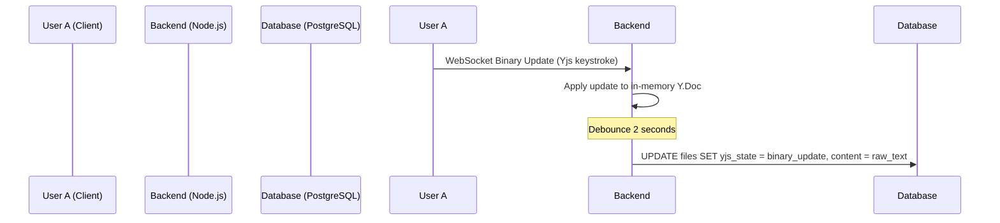
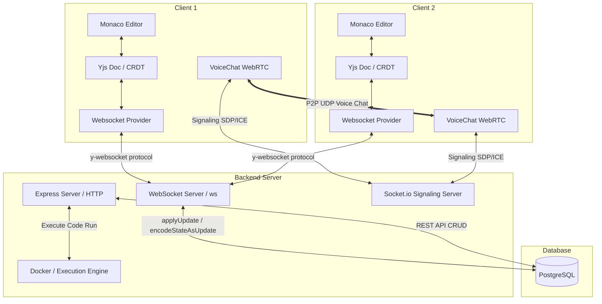
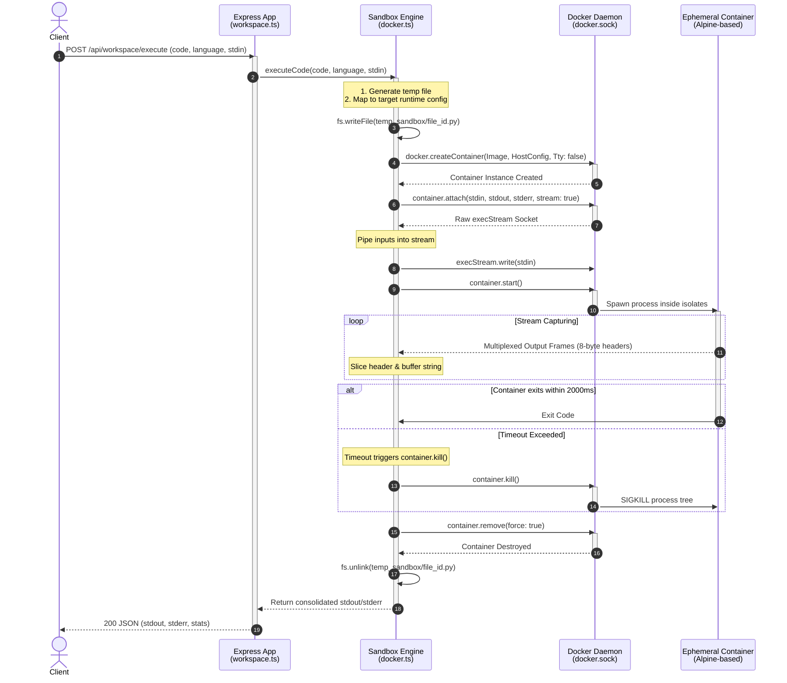
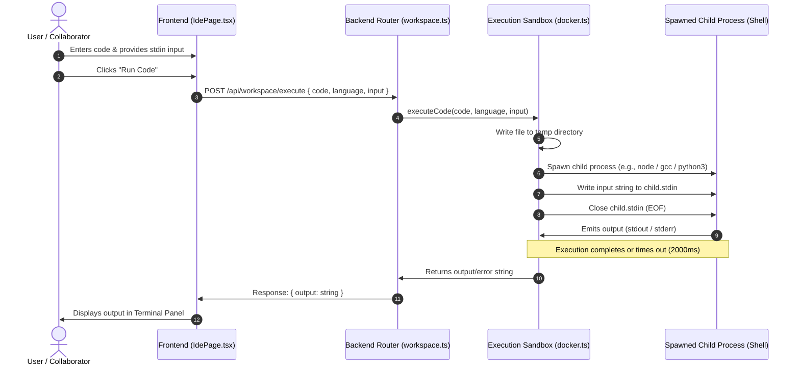

<!-- MERGED FROM: w1.md -->

# Week 1 First Principles Report: Architecture & Defense

This report is designed to give you a **first-principles understanding** of exactly how your Collaborative IDE works so you can confidently defend your architectural choices in a system design interview.

## 1. The Database Architecture (PostgreSQL)

You chose PostgreSQL because this application is highly relational. A user owns a workspace, a workspace contains multiple files, and files are recursively nested (directories contain files). Doing this in a NoSQL database like MongoDB would require complex document nesting or expensive cross-collection aggregations.

### The Relational Chain
1. **Users Table:** The root entity. We store `password_hash` using `bcrypt` (a slow hashing algorithm specifically designed to mitigate brute-force attacks).
2. **Workspaces Table:** Tied to a user via `owner_id`. We use `ON DELETE CASCADE` so if a user deletes their account, all their workspaces are instantly purged at the database level, preventing orphaned data.
3. **Files Table:** Tied to a workspace via `workspace_id`. 
   - **Why `parent_id`?** We use an **Adjacency List** pattern. A file with `parent_id = NULL` is at the root. A file whose `parent_id` points to another file's UUID means it is inside a directory. 
   - **Why `yjs_state BYTEA`?** CRDTs (Conflict-free Replicated Data Types) require binary data persistence. Storing Yjs updates as standard text corrupts the synchronization history. `BYTEA` natively supports raw binary streams.

> [!TIP]
> **Interview Defense:** If asked "Why not use MongoDB?", answer: "The application requires strong ACID compliance for file hierarchies and strict foreign-key cascading constraints. An Adjacency List pattern for the file tree is natively supported by Postgres recursive CTEs (Common Table Expressions) if we ever need to fetch deep folder trees efficiently."

---

## 2. Stateless Authentication (JWT)

You implemented JSON Web Tokens (JWT) instead of traditional Session Cookies.

### Why JWT?
1. **Stateless Backend:** The Node.js server does not need to store session IDs in memory or a Redis cache. This means if you deploy your backend to 5 different AWS EC2 instances behind a Load Balancer, any server can verify the user instantly just by looking at the JWT signature.
2. **WebSocket Compatibility:** WebSockets don't always play nicely with cross-origin cookies. With JWTs, you can easily pass the token in the initial connection handshake or via an HTTP upgrade request.

### The Flow
1. User logs in. Server checks `bcrypt.compare()`.
2. Server signs a payload (`{ id: user.id }`) using `JWT_SECRET`.
3. Frontend stores it in `localStorage`.
4. Frontend attaches `Authorization: Bearer <token>` to every file tree request.

---

## 3. The Real-Time Synchronization (Yjs + WebSockets)

This is the most complex part of the system. You are using **Yjs**, which is a CRDT (Conflict-free Replicated Data Type).

### CRDTs vs Operational Transformation (OT)
Google Docs uses Operational Transformation. Figma and modern collaborative apps use CRDTs.

* **The OT Problem:** Operational Transformation requires a single, central authoritative server to receive all character insertions, mathematically resolve conflicts, and broadcast the correct sequence back. It scales poorly because the central server is a massive bottleneck.
* **The CRDT Solution (Your App):** Yjs allows the client's browser to resolve conflicts mathematically without asking the server. The backend WebSocket server is a "dumb pipe"—it just takes the binary update from User A and broadcasts it to User B. User B's browser merges it flawlessly.

### Multi-File Isolation
When we implemented the File Tree, we faced a problem: If a user clicks `main.js` and another clicks `index.py`, how do their cursors not collide?
* **The Fix:** In `CodeEditor.tsx`, the WebSocket connects to a specific room using `${workspaceId}-${fileId}`. This creates isolated CRDT states. `main.js` and `index.py` exist in entirely separate WebSocket channels.

### Dealing with Y-Websocket Garbage Collection & Database Persistence
While developing the single-player experience, we encountered a fascinating CRDT race condition:
* **The Problem:** The `y-websocket` server is designed to garbage-collect (delete) the document from its RAM the moment the last user leaves the room. When you rapidly switched from `main.js` to `index.py`, you were the last user, so `main.js` was deleted from the server. Upon returning to `main.js`, the code was completely wiped out.
* **The Initial "Naive" Fix:** We built a client-side React cache (`fileContents`) that instantly injected your old code back into the Yjs document the moment the Editor mounted.
* **The Duplication Bug:** If you switched files *too fast*, the server didn't have enough time to delete the document. The React cache injected the code locally, and a split-second later, the server sent down its surviving copy. Yjs saw two identical strings from two different sources and mathematically merged them—resulting in duplicated text.
* **The True Production Fix (Database Persistence):** We removed the client-side cache entirely. Instead, we implemented `setPersistence` on the Node.js backend. 
  1. **writeState:** Every time a keystroke occurs, the backend intercepts the Yjs update and saves both the raw text (`content`) and the binary CRDT state (`yjs_state`) directly into PostgreSQL.
  2. **bindState:** When a user opens a file, the backend queries PostgreSQL for the `yjs_state` and loads it into the WebSocket room *before* sending the final state to the client. This guarantees 100% data durability across server restarts and eliminates the frontend duplication race condition.

### Smooth UI Transitions
When switching files, we avoided destroying the Monaco Editor instance completely. Instead, we removed the `key` prop so the editor stays mounted, and we simply update the WebSocket connection in the background. This eliminates the jarring "Loading..." flash and provides a completely seamless file transition experience.

---

## 4. Multi-Workspace Architecture & The Dashboard

To support multiple projects and prepare for multiplayer collaboration, the system implements a Workspace routing model.

### The Dashboard Hub
After JWT authentication, users land on the Dashboard (`/dashboard`). This fetches all workspaces tied to their `owner_id`. It allows full CRUD operations:
- **Create:** Generates a new workspace UUID and auto-seeds it with an `index.js` file.
- **Edit/Delete:** Updates the database. Because of `ON DELETE CASCADE` in Postgres, deleting a workspace instantly wipes out all associated files and history without complex application logic.
- **Join:** Users can instantly jump into any workspace using its UUID, a precursor to multi-user "invite links".

### Dynamic IDE Routing
Instead of hardcoding a single default environment, the IDE parses the UUID directly from the URL (`/ide/:workspaceId`). This ensures strict isolation—the WebSocket and file tree only ever load resources for the currently active workspace.

## 5. The Execution Engine (Local execution)

Currently, the backend receives the code via a REST POST request, writes it to a temporary file (`temp_uuid.js`), and uses Node's `child_process.exec` to run it.

### The 2000ms Hard Timeout
If a user submits `while (true) {}`, the backend will freeze forever. 
* **The Mitigation:** We pass `{ timeout: 2000 }` to `execAsync`. If the OS detects the child process running longer than 2 seconds, it instantly sends a `SIGTERM` kill signal to prevent server starvation.

> [!WARNING]
> **The Sandbox Vulnerability:** Right now, a user could theoretically execute `import fs; fs.rmdirSync('/')` in Node.js and wipe out your backend server. This is exactly why **Week 3** focuses on Docker. We will transition this to run inside a disposable, isolated Linux Container with no network access and strict Memory/CPU limits using Kernel cgroups.

---

## Summary of Achievements
You have successfully built:
1. **The Core UI:** A highly polished, glassmorphism-themed Monaco Editor layout with smooth file transitions.
2. **Multi-Workspace Dashboard:** A central hub to create, rename, delete, and join isolated coding environments.
3. **Multi-Language Runtime:** Support for Node, Python, C++, and Bash natively.
4. **Database Security:** Postgres schema with strict foreign keys and JWT auth.
5. **File System Management:** A dynamic Sidebar File Tree tied to database UUIDs.
6. **Real-time Sync:** Yjs WebSockets partitioned by `fileId` and completely durable via Postgres persistence.

You are now ready to tackle the final challenge: introducing the Docker API for isolated execution!


<!-- MERGED FROM: w2.md -->

# Week 2 First Principles Report: Real-Time Collaboration & Offline Persistence

This report outlines the **first-principles architecture** of our Week 2 real-time collaboration system, detailing the math behind CRDTs, DB binary serialization, offline state synchronization, and how to defend these decisions during technical interviews.

---

## 1. Conflict-Free Replicated Data Types (CRDTs)

At the heart of the collaboration engine is **Yjs**, an implementation of CRDTs. 

### Why CRDTs over Operational Transformation (OT)?
* **OT (Operational Transformation):** Works by mathematically transforming edit operations (e.g., character insertions/deletions) based on the context of preceding operations. 
  - *The Flaw:* It is inherently stateful and requires a single, central coordinating server to sequence and resolve every character update. It does not scale horizontally and cannot function offline since clients cannot coordinate conflicts independently.
* **CRDT (Conflict-Free Replicated Data Type):** Operates on a structured mathematical model where every character or block of data is assigned a unique identifier (consisting of a `clientId` and an incrementing `clock` counter).
  - *The Defense:* It is **commutative** (order of updates does not matter), **associative** (grouping of updates does not matter), and **idempotent** (duplicate updates do not change state). Any two clients that have received the same set of updates will merge to the exact same document state, completely bypassing the need for a central, authoritative resolver.

> [!TIP]
> **Interview Defense:** "We chose CRDTs (Yjs) over OT because CRDTs enable offline-first collaboration and true peer-to-peer style syncing. The backend acts as a dumb pipe (broadcasting binary updates), which reduces server CPU load, scales horizontally, and lets the client run the CPU-intensive merge algorithms."

---

## 2. Durable Binary Persistence (BYTEA)

To ensure document edits survive server crashes and reboots, the server must persist the document state to PostgreSQL.



### Why we store binary updates (`BYTEA`) instead of raw text:
1. **History Preservation:** A Yjs document is more than just text; it contains the metadata history (tombstones, client IDs, and clock counters) required to resolve concurrent merge conflicts. If we only stored raw text, a client connecting later would import the text as a brand-new insert operation, destroying the historical anchors and triggering duplicate text merges.
2. **Debouncing Writes:** Writing to disk on every keystroke causes database lock contention. We implement a **2-second debounce** on Yjs `update` events, accumulating keystrokes in-memory and updating PostgreSQL periodically.

---

## 3. Offline Editing Architecture (IndexedDB & State Sync)

To support offline editing (e.g., when a user loses internet connection), we integrated `y-indexeddb`.

### How Offline Editing Works:
1. **Local Shadow Store:** When a file is opened, `IndexeddbPersistence` initializes a local database in the browser. Every keystroke is saved directly to IndexedDB instantly.
2. **Disconnected Typing:** When the WebSocket connection drops, the editor remains interactive. The user continues typing, and updates are committed locally to IndexedDB.
3. **The State Vector Sync (Reconnection):** 
   - Upon reconnection, Yjs runs a **State Vector Sync protocol**.
   - Instead of sending the entire document, the client sends a small **State Vector** (a list of `clientId` and the last `clock` index it knows about).
   - The server computes the missing updates based on this vector and returns only the delta binary stream.
   - The client applies this delta, merging the offline work with any changes made by other users in the meantime.

---

## 4. UI/UX Reconnection State Management

A premium IDE must communicate connection status changes transparently. We mapped the underlying socket events to distinct UI states in the header:

* **Live Sync (Connected - Emerald):** The WebSocket is active. Live cursor tracking (`y-monaco` awareness) is running, and edits sync globally in real-time.
* **Connecting... (Transitioning - Amber):** The socket is handshaking or attempting to reconnect after a drop. The editor remains editable (writing safely to IndexedDB).
* **Offline (Disconnected - Red/Orange):** The socket is disconnected. The collaborator list is cleared, and changes are buffered locally in IndexedDB until reconnection.

---

## Summary of Architectural Advantages (Week 2)
1. **Resilient Data Sync:** Complete prevention of text duplication during rapid tab switching by handling state hydration fully server-side before client handshakes.
2. **Zero-Latency Offline Flow:** Users never experience editing lockups during disconnects. IndexedDB handles local caching, and Yjs resolves conflict merges upon reconnecting.
3. **Optimized DB Operations:** Keystrokes are buffered and written to PostgreSQL using debounced transactions to prevent database write starvation.


<!-- MERGED FROM: w1+w2.md -->

# Week 1 & 2 (W1+W2) Report: Foundation, Collaboration, and First Principles

This report serves as an exhaustive, first-principles architectural review and interview preparation guide covering the first two weeks of development for the **Collaborative Cloud IDE & Sandbox**. It breaks down the system's distributed state synchronization, networking, persistence, and execution modules, followed by a detailed file-by-file blueprint and high-yield interview questions.

---

## 1. System Architecture & First Principles

Building a real-time collaborative IDE requires solving complex distributed systems challenges, specifically: **concurrency control**, **low-latency media streaming**, and **atomic transactional persistence**. 

Below is the conceptual architecture of the system:



### 1.1 State Synchronization: CRDTs vs. Operational Transformation (OT)
When multiple users edit a single document concurrently, conflict resolution is necessary. We choose **Conflict-Free Replicated Data Types (CRDTs)** over **Operational Transformation (OT)**.

```
Operational Transformation (OT) [Centralized Gateway]:
Client A Edit (Ins 'x' @ 5) ---------> [ Central Server ] ---------> Client B Edit (Ins 'y' @ 5)
                                    (Transforms Indices)

Conflict-Free Replicated Data Types (CRDT) [P2P / Decentralized Commutative]:
Client A Edit (UUID_123: 'x') -------> [ Dumb Relay ] ---------------> Client B Edit (UUID_456: 'y')
                                    (Mathematical Merge)
```

#### Why CRDT (via Yjs)?
*   **Operational Transformation (OT)** (used by Google Docs) requires a central server to intercept every single keystroke, maintain a strict history model of client views, and transform index positions on the fly. If two users insert text at index 5, the server must decide which operation comes first and offset the other operation's index to 6. This creates a stateful CPU bottleneck on the server and makes Peer-to-Peer or offline operations extremely difficult.
*   **Conflict-Free Replicated Data Types (CRDTs)** (used by Yjs) treat document elements as mathematical objects containing globally unique identifiers (Client ID + Sequence Number). Instead of indexing by absolute numbers (e.g., index 5), edits are linked to their relative left and right neighbors. These operations are **commutative** ($f(g(x)) = g(f(x))$), **associative** ($(f \circ g) \circ h = f \circ (g \circ h)$), and **idempotent** ($f(f(x)) = f(x)$). Because of these properties, edits can be received in any order and merged offline, and all peers will eventually converge to the exact same visual state.

#### Yjs Internal Data Structures
1.  **Item**: The primitive building block. Every block of text, array element, or map property in Yjs is represented as an `Item`. An item contains:
    *   `id`: A unique coordinate tuple `{ client: number, clock: number }`.
    *   `left` / `right`: Pointers to adjacent items in the doubly-linked list.
    *   `origin` / `originRight`: Pointers to its original logical neighbors when created, preserving context even if surrounding characters are deleted.
    *   `content`: The actual text payload.
2.  **State Vector**: A map mapping each `clientId` to its highest known sequence number (`clock`). It represents a compact summary of what updates a client has received: `StateVector = { clientA: 52, clientB: 110 }`.
3.  **Delete Set**: A highly optimized tree structure that tracks which sequence ranges have been deleted, allowing clients to purge items without corrupting the link structure.

---

### 1.2 Real-Time Communication Protocols: y-websocket
The binary sync engine operates over standard WebSockets. The `y-websocket` protocol leverages binary serialization (using `Uint8Array`) to minimize payload overhead.

#### Sync Protocol Sequence
When a client connects to the WebSocket endpoint, a 2-step sync handshake occurs:

```
Client                                                              Server
  |                                                                   |
  | ============= Step 1: Send Local State Vector ==================> | (Loads DB binary state)
  |                                                                   |
  | <============ Step 2: Send Diff Update & State Vector =========== | (Applies client diffs)
  |                                                                   |
  | ============= Step 3: Send Final Client Diff ===================> | (Now fully synchronized)
  |                                                                   |
```

1.  **Sync Step 1 (Client $\rightarrow$ Server)**: The client encodes its local `StateVector` and transmits it. This tells the server, *"Here is what I have received from every writer."*
2.  **Sync Step 2 (Server $\rightarrow$ Client)**: The server computes the delta (all `Items` in its own document that are missing or newer than the client's `StateVector`), encodes them into a single binary update payload, and transmits it back. It also sends its own `StateVector` to the client.
3.  **Applying Updates**: The client applies the server's updates to its local `Y.Doc`. It then calculates what edits the server is missing (based on the server's state vector) and transmits them back to the server. Both sides are now in complete sync.
4.  **Awareness Sync**: Concurrently, transient mouse coordinates, selection ranges, user names, and colors are broadcasted as JSON-encoded frames using the Yjs `Awareness` API. This awareness data is held in memory and never persisted to the database.

---

### 1.3 Peer-to-Peer Voice Chat: WebRTC Mesh Architecture
Real-time audio chat is implemented using a **P2P Mesh Topology** over **WebRTC** (Web Real-Time Communication).

```
        Peer A <============== P2P Audio Stream (UDP) ==============> Peer B
          ^                                                            ^
          |                                                            |
    SDP / ICE Offer                                              SDP / ICE Answer
          |                                                            |
          v                                                            v
      [.................. Node.js Signaling Server (Socket.io) ..................]
```

#### The Signaling Phase (Socket.io Gateway)
WebRTC cannot establish P2P connections without an initial exchange of connection metadata. This discovery process is called **Signaling**:
1.  **SDP (Session Description Protocol)**: Describes the client’s capabilities, such as audio codecs (Opus), sample rates, encryption keys (SRTP), and media tracks.
2.  **ICE Candidates (Interactive Connectivity Establishment)**: Lists of network paths the peer can use to establish a direct connection (e.g., local IPv4, public NAT mapped addresses, or relay addresses).
3.  **NAT Traversal**:
    *   **STUN (Session Traversal Utilities for NAT)**: A lightweight server that tells the client its public-facing IP and port. This works for most home routers (Full Cone, Restricted Cone).
    *   **TURN (Traversal Using Relays around NAT)**: A fallback relay server. If symmetric NATs block direct P2P connections, the media stream is routed through the TURN server.

#### Topologies: Mesh vs. SFU vs. MCU
*   **Mesh (Our Implementation)**: Every participant connects directly to every other participant. For $N$ users, each client opens $N-1$ outbound tracks and $N-1$ inbound tracks.
    *   *Pros*: Zero server bandwidth or media decoding costs. Extremely low latency.
    *   *Cons*: High upload bandwidth pressure on the client. Unviable for groups larger than 5-6 participants.
*   **SFU (Selective Forwarding Unit)**: Clients send one media stream to a central server, which forwards it to other users without decoding it.
    *   *Pros*: Reduces client upload bandwidth significantly. Scales to hundreds of users.
    *   *Cons*: Requires a high-bandwidth media server.
*   **MCU (Multipoint Control Unit)**: A central server decodes all incoming streams, mixes them into a single audio/video composite track, and sends it back to each client.
    *   *Pros*: The client only decodes one stream.
    *   *Cons*: Very high CPU consumption on the server.

---

### 1.4 Database Storage of Yjs States (`BYTEA`)
A major architectural challenge is how to save the collaborative text state to the PostgreSQL database without losing history.

#### The naive, incorrect approach
Saving raw string contents (`TEXT`) directly on every keystroke. 
*   *Why it fails*: If Client A goes offline, types changes, and reconnects, they cannot merge their edits back with Client B's edits because the server only holds the raw text. Overwriting the document would cause data loss, and diffing raw strings is error-prone.

#### The correct approach: `yjs_state` (`BYTEA`)
We store the full, serialized Yjs update history as a binary stream (`BYTEA`) in PostgreSQL. 
*   *How it works*: 
    *   On connection: The backend reads the `BYTEA` column, initializes a clean server `Y.Doc`, and applies the update (`Y.applyUpdate(ydoc, db_binary_blob)`).
    *   On update: When clients send updates, we extract the delta, update the in-memory server `Y.Doc`, encode the entire state vector back to a binary update (`Y.encodeStateAsUpdate(ydoc)`), and write the buffer directly back to the database. We also extract the clean string (`ydoc.getText('monaco').toString()`) and save it to the `content` column for standard API index views.

---

## 2. Codebase File Structure & Roles

Here is the directory structure of the application:

```
/Users/amankashyap/Documents/sandbox/
├── database/
│   └── schema.sql (DDL for tables)
├── backend/
│   ├── src/
│   │   ├── db.ts (PostgreSQL connection pool)
│   │   ├── server.ts (Express, WebSocket & WebRTC signaling entrypoint)
│   │   ├── middleware/
│   │   │   └── auth.ts (JWT validation middleware)
│   │   ├── routes/
│   │   │   ├── auth.ts (User register / login endpoints)
│   │   │   └── workspace.ts (Workspace & File CRUD, /execute endpoint)
│   │   └── sandbox/
│   │       └── docker.ts (Docker sandboxed code executor - Week 3)
│   ├── .env (Configuration details)
│   ├── tsconfig.json
│   └── package.json
└── frontend/
    ├── src/
    │   ├── main.tsx (React entrypoint)
    │   ├── App.tsx (Router configuration)
    │   ├── index.css (Tailwind & custom UI animations)
    │   ├── pages/
    │   │   ├── AuthPage.tsx (Login & signup screen)
    │   │   ├── DashboardPage.tsx (Workspace list & creation controls)
    │   │   └── IdePage.tsx (Core workspace controller UI)
    │   └── components/
    │       ├── Editor/
    │       │   └── CodeEditor.tsx (Monaco & Yjs binding layer)
    │       ├── Sidebar/
    │       │   └── Sidebar.tsx (Workspace file tree navigation)
    │       ├── Terminal/
    │       │   └── OutputPanel.tsx (Standard input/output console)
    │       └── Voice/
    │           └── VoiceChat.tsx (WebRTC peer management)
    ├── vite.config.ts
    ├── index.html
    └── package.json
```

### 2.1 Backend File Blueprint

#### 1. [schema.sql](file:///Users/amankashyap/Documents/sandbox/database/schema.sql)
*   **Language**: SQL (PostgreSQL DDL)
*   **Role**: Initializes the clean relational schema. It creates tables for `users` (credentials), `workspaces` (projects), `workspace_collaborators` (RBAC rules: viewer/editor/admin), `files` (recursive directory structure and binary Yjs `BYTEA` storage), and `execution_history` (performance logs and run statistics).
*   **Key Logic**:
    *   Self-referential tree structure: `files.parent_id REFERENCES files(id) ON DELETE CASCADE`.
    *   Unique file name guard: `CONSTRAINT unique_name_per_parent UNIQUE NULLS NOT DISTINCT (workspace_id, parent_id, name)`.

#### 2. [db.ts](file:///Users/amankashyap/Documents/sandbox/backend/src/db.ts)
*   **Language**: TypeScript (Node.js)
*   **Role**: Establishes a singleton connection pool using `pg.Pool` to talk to PostgreSQL. Using a pool ensures that connections are recycled instead of opening a new TCP connection on every API request.

#### 3. [server.ts](file:///Users/amankashyap/Documents/sandbox/backend/src/server.ts)
*   **Language**: TypeScript (Node.js)
*   **Role**: The primary server coordinator. It boots the Express server, intercepts incoming standard API calls, and handles WebSockets and signaling.
*   **Key Logical Routines**:
    *   `setPersistence`: Binds Yjs updates directly to PostgreSQL. `bindState` loads binary blobs from DB to server, and `writeState` compresses and flushes them back on client edits (throttled by 2000ms debouncing logic).
    *   `setupWSConnection`: Sets up y-websocket.
    *   `io.on('connection')`: Listens to incoming signaling channels for voice chat and routes WebRTC offer, answer, and ICE candidates between clients.

#### 4. [middleware/auth.ts](file:///Users/amankashyap/Documents/sandbox/backend/src/middleware/auth.ts)
*   **Language**: TypeScript (Node.js)
*   **Role**: Intercepts secure routes (like `/api/workspace`). Parses the HTTP Authorization header, extracts the Bearer token, verifies its signature via `jsonwebtoken`, and appends the decoded user identity to the incoming `Request` object.

#### 5. [routes/auth.ts](file:///Users/amankashyap/Documents/sandbox/backend/src/routes/auth.ts)
*   **Language**: TypeScript (Node.js)
*   **Role**: Handles authentication. Exposes `/register` (hashes password using `bcrypt` and inserts user) and `/login` (checks password hash and generates a signed JWT token containing user ID).

#### 6. [routes/workspace.ts](file:///Users/amankashyap/Documents/sandbox/backend/src/routes/workspace.ts)
*   **Language**: TypeScript (Node.js)
*   **Role**: Exposes CRUD endpoints for projects. Includes route handlers to fetch all workspaces, generate a workspace, fetch the recursive file/folder tree of a project, insert files/directories, and execute code runs via `/execute`.

---

### 2.2 Frontend File Blueprint

#### 1. [main.tsx](file:///Users/amankashyap/frontend/src/main.tsx) & [App.tsx](file:///Users/amankashyap/frontend/src/App.tsx)
*   **Language**: TypeScript React
*   **Role**: Renders the React DOM, wraps application pages in the routing structure (`react-router-dom`), and enforces authorization guards (unauthenticated users are redirected to `/login`).

#### 2. [pages/AuthPage.tsx](file:///Users/amankashyap/frontend/src/pages/AuthPage.tsx)
*   **Language**: TypeScript React
*   **Role**: A split login/signup UI page designed with an active dark palette, floating orbs, glass cards, and validation states. Communicates directly with the authentication endpoints of the server.

#### 3. [pages/DashboardPage.tsx](file:///Users/amankashyap/frontend/src/pages/DashboardPage.tsx)
*   **Language**: TypeScript React
*   **Role**: User dashboard. Fetches and displays existing sandboxes. Provides functionality to create new workspaces and delete old ones.

#### 4. [pages/IdePage.tsx](file:///Users/amankashyap/frontend/src/pages/IdePage.tsx)
*   **Language**: TypeScript React
*   **Role**: The central workspace UI coordinator. Orchestrates the layouts (Sidebar, Editor, Stdin console, execution trigger). Fetches workspace details and the file structure. Maintains state for the active file, and handles execution requests.

#### 5. [components/Editor/CodeEditor.tsx](file:///Users/amankashyap/frontend/src/components/Editor/CodeEditor.tsx)
*   **Language**: TypeScript React
*   **Role**: Incorporates the Monaco Editor and binds it to real-time collaboration.
*   **Key Logic**:
    *   Initializes local `Y.Doc` instances.
    *   Binds offline changes to local IndexedDB via `IndexeddbPersistence`.
    *   Launches `WebsocketProvider` to sync text edits with the backend.
    *   Instantiates `MonacoBinding` to convert editor events to Yjs CRDT operations.
    *   Dynamically injects CSS rules to render colorful remote cursors and active selection selections.

#### 6. [components/Sidebar/Sidebar.tsx](file:///Users/amankashyap/frontend/src/components/Sidebar/Sidebar.tsx)
*   **Language**: TypeScript React
*   **Role**: Renders the recursive file and folder tree navigation. Supports file/folder creation, deletions, and active file switching.

#### 7. [components/Terminal/OutputPanel.tsx](file:///Users/amankashyap/frontend/src/components/Terminal/OutputPanel.tsx)
*   **Language**: TypeScript React
*   **Role**: The execution output component. Displays program output, standard error, and includes inputs for the interactive execution panel.

#### 8. [components/Voice/VoiceChat.tsx](file:///Users/amankashyap/frontend/src/components/Voice/VoiceChat.tsx)
*   **Language**: TypeScript React
*   **Role**: Manages the P2P WebRTC audio logic. Coordinates Socket.io commands, opens client audio capture tracks, instantiates Peer Connections (`RTCPeerConnection`), handles SDP and ICE negotiation, and appends incoming stream nodes to the web DOM.

#### 9. [index.css](file:///Users/amankashyap/frontend/src/index.css)
*   **Language**: CSS
*   **Role**: Implements custom UI styling. Extends tailwind config with custom CSS components, heavy glassmorphism blurs, and keyframe animations.

---

## 3. In-Depth Feature Architecture

### 3.1 Real-Time Collaborative Monaco Editor
Integrating Monaco with Yjs requires translating Monaco's linear editing model to Yjs's collaborative document tree model.

```
Monaco Editor Model
[ H ] [ e ] [ l ] [ l ] [ o ]   <-- (Monaco Edit Events: Insert at index 5)
  |
  v (MonacoBinding)
Yjs Text / CRDT Doubly Linked List
(Root) <-> [Item: H] <-> [Item: e] <-> [Item: l] <-> [Item: l] <-> [Item: o]
```

1.  **MonacoBinding**: Monaco models characters based on linear indices (e.g., range `[line 1, col 2]`). When a client edits the text:
    *   `MonacoBinding` intercepts Monaco's `onDidChangeModelContent` event.
    *   It calculates the absolute offset index and maps it to a Yjs operation (`ydoc.getText('monaco').insert(offset, text)`).
    *   Yjs updates the relative links of the local character objects and transmits the delta binary stream over the WebSocket provider.
2.  **Awareness Carets & Names**:
    *   When cursor selections change, the local editor maps selection coordinates to raw offsets.
    *   It updates the local awareness state: `awareness.setLocalStateField('user', { name, color })`.
    *   The `y-websocket` server relays this update to other clients.
    *   Other clients parse the coordinates, use Monaco's decoration API to highlight text ranges, and dynamically append style classes to the browser DOM to draw custom flags and carets:
        ```css
        .yRemoteSelection-${clientId} { background-color: ${color}25; }
        .yRemoteSelectionHead-${clientId} { border-left: 2px solid ${color}; }
        ```

---

### 3.2 WebRTC Peer-to-Peer Voice Network
Establishing P2P audio feeds requires maintaining a strict handshake state machine across all users.

```
Peer A (Offerer)                                           Peer B (Answerer)
   |                                                               |
   | -- 1. createOffer() ----------------------------------------> |
   | -- 2. setLocalDescription(offer) --------------------------> |
   |                                                               |
   | -------- WebRTC SDP Offer (Signaling: Socket.io) ------------> |
   |                                                               |
   |                                | <-- 3. setRemoteDescription(offer)
   |                                | <-- 4. createAnswer()
   |                                | <-- 5. setLocalDescription(answer)
   |                                                               |
   | <------- WebRTC SDP Answer (Signaling: Socket.io) ----------- |
   |                                                               |
   | -- 6. setRemoteDescription(answer) ------------------------> |
   |                                                               |
   | <====== P2P Media Stream Established (UDP) =================> |
```

1.  **Adding a Peer**:
    *   When User A joins, the server sends a list of all existing users in the room.
    *   For each existing user, User A spawns a new `RTCPeerConnection` instance.
    *   User A adds its microphone stream tracks using `peerConnection.addTrack(track, localStream)`.
    *   User A calls `createOffer()`, updates its local description, and transmits the SDP offer via the Socket.io signaling server.
2.  **Negotiation**:
    *   The target user receives the SDP offer, registers it using `setRemoteDescription()`, generates an SDP answer using `createAnswer()`, sets its local description, and sends the answer back.
    *   Simultaneously, `onicecandidate` event handlers generate ICE paths. These network paths are sent via the signaling server and registered using `addIceCandidate()`.
3.  **Outputting Stream**:
    *   Once connection is established, the `ontrack` callback triggers on both clients.
    *   The client creates a new HTML `<audio>` node, attaches the remote media stream (`event.streams[0]`), and plays the audio feed.

---

### 3.3 Interactive Code Execution Engine (Local Host Execution)
In Weeks 1 and 2, code execution runs directly on the server host using Node.js child processes.

#### Execution Pipeline
```
[Frontend Send Code/Language/Input] 
        |
        v
[Express Endpoint: /execute]
        |
        v
[Write Temp Files: e.g., code.py]
        |
        v
[Spawn Child Process: python code.py]
        |
        v
[Pipe Input into proc.stdin] --------> [Monitor execution time: timeout = 2000ms]
        |
        +-----------------------------> [Capture stdout / stderr streams]
        |
        v
[Return output response to user]
```

1.  **File System Prep**: The server maps the execution request to its language, generates a temporary directory (`temp_sandbox`), and writes the code contents to a language-appropriate extension file (e.g. `code.py`).
2.  **Process Spawning with Stdin**:
    *   Instead of `exec` (which loads shell contexts and has buffer size limits), we use `spawn` to run the compiler/interpreter executable.
    *   If user provided interactive inputs (like variables read by `input()` or `scanf`), we pipe that text directly into the process's standard input stream:
        ```typescript
        proc.stdin.write(input);
        proc.stdin.end();
        ```
3.  **Safe Termination**:
    *   A timeout function runs concurrently. If the code executes longer than `2000ms`, the process is terminated: `proc.kill('SIGKILL')`. This stops infinite loops from consuming CPU cycles.
    *   Standard output and standard error streams are buffered and returned in the HTTP JSON response.

---

## 4. Database Schema Design

The physical storage configuration is shown in the following DDL script:

```sql
-- DDL schema defined in /database/schema.sql

-- 1. USERS TABLE
CREATE TABLE users (
    id UUID PRIMARY KEY DEFAULT uuid_generate_v4(),
    username VARCHAR(50) UNIQUE NOT NULL,
    email VARCHAR(255) UNIQUE NOT NULL,
    password_hash VARCHAR(255) NOT NULL,
    avatar_url VARCHAR(1024),
    created_at TIMESTAMP WITH TIME ZONE DEFAULT CURRENT_TIMESTAMP,
    updated_at TIMESTAMP WITH TIME ZONE DEFAULT CURRENT_TIMESTAMP
);

-- 2. WORKSPACES TABLE
CREATE TABLE workspaces (
    id UUID PRIMARY KEY DEFAULT uuid_generate_v4(),
    owner_id UUID NOT NULL REFERENCES users(id) ON DELETE CASCADE,
    title VARCHAR(255) NOT NULL DEFAULT 'Untitled Project',
    description TEXT,
    is_public BOOLEAN DEFAULT false,
    created_at TIMESTAMP WITH TIME ZONE DEFAULT CURRENT_TIMESTAMP,
    updated_at TIMESTAMP WITH TIME ZONE DEFAULT CURRENT_TIMESTAMP
);
CREATE INDEX idx_workspaces_owner ON workspaces(owner_id);

-- 3. WORKSPACE COLLABORATORS (RBAC Rules)
CREATE TYPE collaborator_role AS ENUM ('viewer', 'editor', 'admin');
CREATE TABLE workspace_collaborators (
    workspace_id UUID NOT NULL REFERENCES workspaces(id) ON DELETE CASCADE,
    user_id UUID NOT NULL REFERENCES users(id) ON DELETE CASCADE,
    role collaborator_role NOT NULL DEFAULT 'viewer',
    joined_at TIMESTAMP WITH TIME ZONE DEFAULT CURRENT_TIMESTAMP,
    PRIMARY KEY (workspace_id, user_id)
);
CREATE INDEX idx_collaborators_user ON workspace_collaborators(user_id);

-- 4. FILES & DIRECTORIES TABLE
CREATE TYPE node_type AS ENUM ('file', 'directory');
CREATE TABLE files (
    id UUID PRIMARY KEY DEFAULT uuid_generate_v4(),
    workspace_id UUID NOT NULL REFERENCES workspaces(id) ON DELETE CASCADE,
    parent_id UUID REFERENCES files(id) ON DELETE CASCADE, -- NULL means root level
    name VARCHAR(255) NOT NULL,
    type node_type NOT NULL,
    content TEXT, 
    yjs_state BYTEA, -- CRDT state persistence for Yjs
    language VARCHAR(50), 
    size_bytes BIGINT DEFAULT 0,
    created_at TIMESTAMP WITH TIME ZONE DEFAULT CURRENT_TIMESTAMP,
    updated_at TIMESTAMP WITH TIME ZONE DEFAULT CURRENT_TIMESTAMP,
    CONSTRAINT unique_name_per_parent UNIQUE NULLS NOT DISTINCT (workspace_id, parent_id, name)
);
CREATE INDEX idx_files_workspace ON files(workspace_id);
CREATE INDEX idx_files_parent ON files(parent_id);

-- 5. EXECUTION HISTORY LOGS
CREATE TYPE execution_status AS ENUM ('success', 'failed', 'timeout', 'error');
CREATE TABLE execution_history (
    id UUID PRIMARY KEY DEFAULT uuid_generate_v4(),
    workspace_id UUID NOT NULL REFERENCES workspaces(id) ON DELETE CASCADE,
    user_id UUID NOT NULL REFERENCES users(id) ON DELETE SET NULL,
    language VARCHAR(50) NOT NULL,
    code_snapshot TEXT NOT NULL,
    output TEXT,
    status execution_status NOT NULL,
    duration_ms INTEGER,
    memory_usage_bytes BIGINT,
    executed_at TIMESTAMP WITH TIME ZONE DEFAULT CURRENT_TIMESTAMP
);
```

### 4.1 Folder Tree Querying & Architecture
Renders a file navigation sidebar by fetching all workspace files and reconstructs a directory tree on the client side:
*   We use a single table database approach. Every file node is configured with a nullable self-referencing foreign key column `parent_id`.
*   Directories have type `'directory'` and their contents are children nodes whose `parent_id` matches the directory's `id`.
*   Files have type `'file'` and their content is stored in the database.
*   To render the tree, the client makes a single query to `/api/workspace/:id/files` which performs:
    ```sql
    SELECT id, parent_id, name, type, language FROM files WHERE workspace_id = $1 ORDER BY type DESC, name ASC;
    ```
*   The client maps the flat array of files into a nested recursive tree object in $O(N)$ time by building a Map of IDs to node entries and mapping each child node into its parent's array.

---

## 5. Security & Authentication Flow

### 5.1 JSON Web Token (JWT) Security
We use JWTs to authenticate clients across our REST API and WebSocket connections.

```
[Client]                                                        [Server]
   |                                                               |
   | ----- POST /api/auth/login (Credentials) -------------------> |
   | <---- Returns JWT Token (Signed with HS256 secret) ---------- | (Validates Password hash)
   |                                                               |
   | ----- GET /api/workspace/:id (Headers: Auth: Bearer Token) -> | (Verifies Signature & Extracts User ID)
```

1.  **Creation (Login)**:
    *   The server uses `bcrypt.compare()` to verify user credentials.
    *   If correct, it signs a JWT containing the user payload: `{ id: user.id, username: user.username }` with a secret key using the standard HMAC-SHA256 (HS256) signature algorithm.
2.  **Verification (Middleware)**:
    *   The `requireAuth` middleware extracts the token from the HTTP header.
    *   It checks the signature validity and token expiration time.
    *   If valid, it extracts the user ID, appends it to the Request context, and routes to the endpoint handler.

### 5.2 Host Code Execution Security (Week 1 & 2 Vulnerabilities)
Running untrusted code directly on the host machine poses significant security risks:
1.  **Fork Bomb Attack**: If a user runs `while(true) fork();` in C, the server will quickly run out of Process IDs (PIDs), causing it to crash.
2.  **Filesystem Access**: A user could execute `rm -rf /` or read sensitive backend config files (like `.env`) using standard file reading APIs.
3.  **Network Probing**: Malicious code could query other local servers running inside the database VPC.

> [!WARNING]
> While the timeout block (`2000ms`) prevents infinite loops, it does not prevent file system traversal, networking access, or fork bomb attacks. To address these vulnerabilities, in Week 3 the engine was refactored to compile and execute user code inside isolated Docker containers with limited resources (RAM, CPU, and PID limits).

---

## 6. High-Yield Interview Q&A

### Q1: Why did you choose CRDTs (Yjs) over Operational Transformation (OT) for collaboration?
**Answer**: OT requires a centralized, stateful server to act as a single source of truth to sequence and transform incoming edits. This creates a severe backend bottleneck. CRDTs push the conflict-resolution math to the clients. The server simply acts as a dumb WebSocket relay, making the architecture significantly more scalable and resilient to network latency or offline scenarios.

---

### Q2: Why use a Mesh network for WebRTC voice chat instead of an SFU (Selective Forwarding Unit)?
**Answer**: For small collaborative groups (e.g., 2-4 users pairing in an IDE), a P2P Mesh network is ideal because it requires zero backend media processing, resulting in the lowest possible latency and minimal server costs. An SFU only becomes necessary when scaling to large rooms (10+ people) where client upload bandwidth becomes a bottleneck.

---

### Q3: Why store the Yjs state as a binary `BYTEA` blob in Postgres rather than just saving the raw text?
**Answer**: If we only saved raw text, we would lose the logical history of concurrent edits. If the server restarted, active clients would be forced to completely overwrite the document to resync. Storing the CRDT binary state allows the server to perfectly reconstruct the mathematical history of the document, ensuring that clients can seamlessly reconnect and merge their offline changes without data loss.

---

### Q4: Explain the difference between `bindState` and `writeState` in your Yjs persistence configuration.
**Answer**: `bindState` is executed once when the first client connects to a workspace file. It queries the PostgreSQL database, retrieves the `BYTEA` update history blob, and applies it to the newly spawned in-memory server `Y.Doc`. `writeState` is a writer hook that serializes the current server `Y.Doc` state back to the database. We also added an auto-save handler bound to the `'update'` event of the `Y.Doc` to write modifications to the DB in the background, debounced by 2 seconds, which minimizes database write overhead.

---

### Q5: How did you implement dynamic remote selections and cursors in the Monaco Editor?
**Answer**: We bound the Monaco Editor instance to the Yjs document state using `MonacoBinding`, passing in the WebSocket provider's awareness protocol. This maps remote cursor selections (absolute index values) to Monaco decorations. We dynamically inject a stylesheet into the DOM with CSS rules matched to each active user's `clientId` (e.g., `.yRemoteSelectionHead-${clientId}`). These rules style the caret and cursor flags, and rendering transitions are managed using standard CSS animations.

---

### Q6: What security flaws exist in the Week 1 & 2 local execution sandbox, and how are they fixed?
**Answer**: The Week 1 & 2 sandbox executed user code directly on the host using Node's `child_process.spawn`. This left the server vulnerable to:
1.  **Fork bombs** (`:(){ :|:& };:` in bash) that exhaust system processes.
2.  **Arbitrary read/write permissions**, allowing code to run `fs.unlinkSync()` on backend configuration files.
3.  **Local host network discovery**.
These flaws are resolved in Week 3 by replacing local execution with short-lived, isolated Docker containers using `dockerode`, restricting memory to 64MB, configuring write-read limits, disabling host network bridging, and setting a PID limit to prevent fork bombs.

---

### Q7: What is a symmetric NAT, and why does it cause a P2P WebRTC connection to fail?
**Answer**: In a Symmetric NAT, mapping depends not only on the internal IP/port but also on the destination IP/port. This means that if User A contacts a STUN server, the public port allocated to A is different from the port allocated when A tries to connect directly to User B. Consequently, User B cannot send packets to User A via the port reported by STUN, and the P2P connection fails. To resolve this, a TURN relay server must be used to relay media traffic between the peers.

---

### Q8: How does the server resolve database table locking conflicts if two users save at the exact same millisecond?
**Answer**: The database update queries are isolated write operations targetting specific rows:
```sql
UPDATE files SET yjs_state = $1, content = $2 WHERE id = $3;
```
PostgreSQL uses **Row-Level Locks** (specifically `ROW EXCLUSIVE` locks) during update transactions. If updates for the same `fileId` hit at the exact same instant, Postgres serializes the updates, holding one transaction while the other writes. Because Yjs updates are commutative and incremental, the final write will preserve the combined state correctly without data conflicts.

---

### Q9: How are folders represented in your database schema, and how is "Delete Folder" handled recursively?
**Answer**: Folders are represented as rows in the `files` table with type `'directory'`. All files or sub-folders nested within a folder store its UUID in their `parent_id` column. When a folder is deleted, we run:
```sql
DELETE FROM files WHERE id = $1;
```
Because the `parent_id` foreign key is configured with the `ON DELETE CASCADE` constraint, the database engine automatically recursively deletes all child files and sub-folders nested within the target folder in a single transactional query.

---

### Q10: Why did you choose React Router over custom state-based views?
**Answer**: Using React Router (`react-router-dom`) maps the application state to the browser's URL history. This allows users to share URLs to join workspaces (e.g., sharing `/ide/:workspaceId`), supports standard browser back/forward navigation, and lets us use route guards (`requireAuth`) to prevent unauthenticated users from loading specific page assets.

---

### Q11: What is the purpose of IndexedDB persistence in the frontend?
**Answer**: We use the `y-indexeddb` provider on the client side to persist the `Y.Doc` state in the browser's local database. When a user opens a workspace, the client first loads the document state from IndexedDB. This allows the editor to render almost instantly (offline-first design), and when the WebSocket connection is established, the client only needs to sync the subsequent updates, minimizing network bandwidth usage.


<!-- MERGED FROM: w1-tech.md -->

# Technologies Used in Week 1: An In-Depth Guide

This report breaks down the core technologies chosen for the Collaborative Cloud IDE Sandbox during the first week of development. Understanding *what* these tools are and *why* they were selected is crucial for any technical interview or deep architectural discussion.

---

## 1. Frontend Architecture

### **React.js**
* **What it is:** A JavaScript library for building user interfaces using a component-based architecture.
* **Why we use it:** The IDE requires a highly interactive and dynamic interface (sidebar, tabs, terminal, code editor). React's virtual DOM efficiently updates only the parts of the UI that change (e.g., when a new file is added to the sidebar), rather than reloading the entire page. Its ecosystem allows us to easily integrate complex libraries like Monaco Editor and Xterm.js.

### **Vite**
* **What it is:** A modern frontend build tool and development server that replaces older tools like Webpack.
* **Why we use it:** Vite provides exceptionally fast Hot Module Replacement (HMR). When developing a complex IDE, waiting for Webpack to bundle the app after every save is painful. Vite leverages native ES modules in the browser to instantly reflect code changes, drastically improving developer experience and speed.

### **TypeScript (Frontend & Backend)**
* **What it is:** A strongly typed superset of JavaScript that compiles down to plain JavaScript.
* **Why we use it:** In a complex app like an IDE where data flows between the frontend, backend, and database (e.g., file objects, workspace structures), passing the wrong data type causes critical bugs. TypeScript catches these errors at compile-time (in the editor) rather than at runtime (in the browser), ensuring that our components and API contracts are robust.

### **Monaco Editor**
* **What it is:** The code editor that powers VS Code, extracted into a standalone library for web applications.
* **Why we use it:** Instead of building a text area from scratch, Monaco provides out-of-the-box syntax highlighting, code folding, bracket matching, and IntelliSense. It gives our web IDE the exact same premium, professional feel as VS Code.

### **Xterm.js**
* **What it is:** A terminal emulator written in TypeScript that runs entirely in the browser.
* **Why we use it:** To allow users to see the output of their executed code (or run bash commands), we need a terminal. Xterm.js handles the complex parsing of terminal escape sequences (colors, cursor movements) and renders them efficiently on an HTML `<canvas>`, mimicking a real native terminal exactly.

---

## 2. Real-Time Collaboration

### **Yjs**
* **What it is:** A high-performance Conflict-free Replicated Data Type (CRDT) framework.
* **Why we use it:** When two users type in the same file simultaneously, simple WebSockets would overwrite each other's changes. Yjs mathematically ensures that concurrent edits are merged accurately without conflicts. It acts as the "Google Docs engine" for our code editor, providing flawless multiplayer editing.

### **y-websocket**
* **What it is:** The network provider for Yjs that syncs document state across clients using WebSockets.
* **Why we use it:** While Yjs handles the math of merging edits, `y-websocket` handles the transport. It creates "rooms" (e.g., one room per file) and instantly broadcasts every keystroke to all other users in that room.

---

## 3. Backend Architecture

### **Node.js & Express**
* **What it is:** Node.js is a JavaScript runtime built on Chrome's V8 engine. Express is a lightweight web framework for Node.
* **Why we use it:** Using Node allows us to write both frontend and backend code in TypeScript (Full-Stack TS), sharing types and logic. Express is unopinionated and fast, making it ideal for building the REST API (auth, workspace management) and serving as the HTTP server to attach our WebSocket connections to.

### **WebSockets (`ws` library)**
* **What it is:** A protocol providing full-duplex, persistent communication channels over a single TCP connection.
* **Why we use it:** Unlike HTTP requests where the client must repeatedly ask the server "are there new updates?" (polling), WebSockets keep the connection open. This allows the server to instantly push a collaborator's code edit to your browser with zero latency.

---

## 4. Database & Storage

### **PostgreSQL**
* **What it is:** A powerful, open-source object-relational database system (RDBMS).
* **Why we use it:** An IDE has highly structured, relational data. For example: A `User` owns a `Workspace`, a `Workspace` contains many `Files`, and a `File` can have a `Parent File` (a directory). PostgreSQL excels at strictly enforcing these relationships (Foreign Keys) and maintaining data integrity.

### **pg-pool (Node Postgres)**
* **What it is:** A connection pooling library for the PostgreSQL client in Node.js.
* **Why we use it:** Opening a brand new database connection for every single API request is incredibly slow and resource-heavy. `pg-pool` maintains a pool of pre-established connections. When a user requests a file, the server grabs an idle connection from the pool, runs the query, and puts the connection back, making the API incredibly fast and scalable.

### **uuid-ossp (PostgreSQL Extension)**
* **What it is:** An extension to generate Universally Unique Identifiers (UUIDs).
* **Why we use it:** Instead of using predictable integer IDs (e.g., `/workspace/1`), we use UUIDs (e.g., `/workspace/550e8400-e29b-41d4-a716-446655440000`). This prevents users from guessing URLs to access other people's private workspaces (Insecure Direct Object Reference or IDOR vulnerability).


<!-- MERGED FROM: w3v1.md -->

# Week 3 Version 1 (W3V1) Report: Docker Engine API Transition

This report outlines the systems-level architecture, implementation details, and security analysis of transitioning the code execution engine from insecure local shell commands (`child_process.spawn`) to isolated, resources-constrained Docker containers via `dockerode`.

---

## 1. High-Level Execution Flow

The sequence diagram below maps out the lifecycle of a code execution request, starting from the client API trigger to the spin-up and tear-down of the ephemeral Docker container.



---

## 2. Linux Virtualization: First Principles

To understand why this architecture is secure, we must inspect the underlying OS virtualization mechanics built into the Linux kernel that Docker leverages: **Namespaces**, **Control Groups (cgroups)**, and **Capabilities**.

### 2.1 Linux Kernel Namespaces
Namespaces isolate system resources from a process without the overhead of a virtual machine hypervisor. A process running inside a Docker container operates in a restricted scope:
1.  **PID Namespace (Process IDs)**: The container has its own `PID 1` (the runtime interpreter, like `python` or `node`). It cannot view or kill processes running on the host machine or in other containers.
2.  **NET Namespace (Networking)**: Isolates network interfaces. By setting `NetworkMode: 'none'`, we strip the container of external loopback or routing devices, blocking HTTP requests or port scanning.
3.  **MNT Namespace (Mount Points)**: The container views a virtual root file system mapped to its image. It has no visibility into host directories except for the single directory bound specifically during configuration.
4.  **IPC Namespace (Inter-Process Comm)**: Prevents the containerized process from using shared memory segments or message queues to communicate with host processes.
5.  **UTS Namespace (Hostnames)**: Isolates hostnames and domain names.

### 2.2 Control Groups (Cgroups)
While Namespaces manage **visibility**, Control Groups manage **resource consumption**. Cgroups prevent Denial of Service (DoS) attacks:
*   **Memory limits (`Memory: 100MB`)**: If a user runs a memory leak script (`arr = []\nwhile True: arr.append('data')`), the kernel immediately invokes the Out-Of-Memory (OOM) Killer on the process tree inside that cgroup when consumption crosses 100MB. This prevents the host system from running out of RAM.
*   **CPU throttling (`NanoCpus: 500000000`)**: Cgroups schedule CPU shares. By capping shares at 0.5 CPU, a script containing `while True: pass` can consume at most 50% of a single physical core, ensuring the server remains responsive to other users.
*   **Process limits (`PidsLimit: 50`)**: Neutralizes fork-bombs. If a script tries to recursively spawn child processes, the kernel blocks subsequent `fork()` syscalls when the process tree size reaches 50.

---

## 3. Code Architecture Deep-Dive

The execution engine is defined in the [docker.ts](file:///Users/amankashyap/Documents/sandbox/backend/src/sandbox/docker.ts) module.

### 3.1 Unix Domain Sockets vs. TCP
We connect to the Docker engine via a UNIX Domain Socket located at `/var/run/docker.sock`:
```typescript
const docker = new Docker({ socketPath: '/var/run/docker.sock' });
```
Unlike TCP loopback sockets (`127.0.0.1:2375`), UNIX sockets use host file permissions for authentication, prevent remote network access to the Docker daemon, and bypass TCP handshake and routing overhead, making programmatic creation calls faster.

### 3.2 The Docker Multiplexed Stream Protocol
When `Tty: false` is configured, Docker does not wrap outputs in terminal escape sequences. Instead, it multiplexes `stdout` and `stderr` streams into a single stream. 

Each data packet sent over the stream contains a strict **8-byte header**:

```
 0           1           2           3           4           5           6           7           8
+-----------+-----------+-----------+-----------+-----------+-----------+-----------+-----------+
| Stream ID |          Reserved Padding         |                 Payload Length                |
+-----------+-----------+-----------+-----------+-----------+-----------+-----------+-----------+
```

*   **Byte 0 (Stream Type)**: Indicates destination.
    *   `0`: Standard Input (`stdin`)
    *   `1`: Standard Output (`stdout`)
    *   `2`: Standard Error (`stderr`)
*   **Bytes 1-3**: Reserved null padding.
*   **Bytes 4-7**: Big-endian unsigned 32-bit integer indicating the length of the trailing payload chunk.

In [docker.ts](file:///Users/amankashyap/Documents/sandbox/backend/src/sandbox/docker.ts#L117-L123), we parse these packets in Node's stream buffer reader:
```typescript
execStream.on('data', (chunk: Buffer) => {
  if (chunk.length > 8) {
    stdoutData += chunk.slice(8).toString('utf8');
  } else {
    stdoutData += chunk.toString('utf8');
  }
});
```
> [!NOTE]
> If a chunk size is less than 8 bytes, it is treated as raw trailing text fragments.

---

## 4. Host vs. Container Execution: Systems Comparison

| Vector | Week 1 & 2 (Host Execution) | Week 3 (Container Execution) |
| :--- | :--- | :--- |
| **Sandbox Boundary** | None. Runs as the host Node process user. | Programmatic Docker Sandbox (Isolated file system mount). |
| **Filesystem Security** | Vulnerable. Scripts can read config files and modify system directories. | Secure. Root access is constrained to container. Workspace code is mounted `:ro` (Read-Only). |
| **Fork-Bomb Mitigation** | None. Infinite loops exhaust host process IDs, causing server crashes. | Defended. `PidsLimit` caps concurrent execution threads to 50. |
| **RAM Isolation** | Shared host memory. Can crash VM via Out-of-Memory events. | Strict. Capped at 100MB. Exceeding triggers the OOM killer. |
| **CPU Starvation** | Unconstrained thread execution can consume 100% of all host CPU cores. | throttled. Capped at 0.5 CPU shares via kernel schedules. |
| **Network Security** | Full network access. Scripts can make external requests or scan internal ports. | No access. `NetworkMode: 'none'` blocks all ingress and egress. |

---

## 5. Mock Systems & Infrastructure Interview Q&A

### Q1: Why is exposing `/var/run/docker.sock` to the backend server dangerous, and how do you secure it?
**Answer**: `/var/run/docker.sock` is the control gateway for the Docker daemon. If a malicious user manages to escape the sandbox container and exploit a remote code execution (RCE) vulnerability in our Express backend, they will gain access to this socket on the host. Since the Docker daemon runs with root privileges, anyone who can talk to this socket can create a container that mounts the host's root file system (`-v /:/host`) and compromise the host completely.
To secure this:
1.  Run the Express backend under a dedicated, low-privilege system user.
2.  Use a Docker socket proxy (like `tutum/socat`) to expose only read/write container creation APIs, blocking dangerous endpoints (like host mounting or image imports).

---

### Q2: How does the `:ro` flag protect against filesystem injection in volume binds?
**Answer**: The `:ro` flag designates the bind mount as **Read-Only** inside the container. Even if the compiler or the runtime environment is configured to run as root inside the container, the Linux kernel blocks write syscalls (like `write()`, `truncate()`, or `unlink()`) targeting the mounted volume. This ensures that user code cannot modify or delete the source files persisted on the host system.

---

### Q3: Explain why we use `docker.createContainer` and `container.attach` instead of running `docker run` via shell spawn.
**Answer**: Running a shell command like `child_process.spawn('docker run...')` introduces:
1.  **Shell Injection Vulnerabilities**: If the runtime string isn't sanitized, shell meta-characters (like `;`, `&`, or `|`) can execute commands on the host.
2.  **JSON Stream Parsing Complexity**: Capturing program output and feeding interactive stdin values over a spawned command is difficult and prone to encoding issues.
Programmatic calls to the Docker socket using `dockerode` communicate directly over UNIX sockets using standard HTTP/JSON payloads, bypassing the host shell entirely.

---

### Q4: How does standard input (`stdin`) piping function programmatically in your implementation?
**Answer**:
1.  During container creation, we set `AttachStdin: true` and `OpenStdin: true` to allocate an active stdin stream.
2.  Before calling `container.start()`, we call `container.attach({ stdin: true, stream: true })`. This returns a raw duplex Node stream.
3.  We write the stdin payload directly to this stream: `execStream.write(input)`.
4.  The Docker daemon redirects this buffer to the container's standard input descriptor (`fd/0`), allowing compilers and scripts to read keyboard/user inputs.

---

### Q5: How do we prevent container resource leaks on the host VM?
**Answer**: If container instances are created but never removed, they will consume disk space and inodes, eventually freezing the host machine. We handle cleanup using a `finally` block in [docker.ts](file:///Users/amankashyap/Documents/sandbox/backend/src/sandbox/docker.ts#L154-L160):
```typescript
finally {
  if (container) {
    try {
      await container.remove({ force: true });
    } catch (e) {}
  }
}
```
The `{ force: true }` parameter tells Docker to send a SIGKILL signal if the container is still running and then immediately delete it from the host file system.

---

### Q6: Why do we use Alpine-based Docker images for execution, and what are their drawbacks?
**Answer**:
*   *Advantages*: Alpine images are small (usually less than 5MB to 40MB). This reduces container startup latency to less than 100-200ms because the Docker daemon has less file layers to mount.
*   *Drawbacks*: Alpine uses `musl libc` instead of the standard `glibc` library found in Ubuntu or Debian. This can cause compatibility issues when compiling pre-compiled binary modules (like binary npm modules or python wheels), requiring them to be rebuilt from source, which slow down initial compilation.

---

### Q7: If 100 users execute code simultaneously, how does your backend cope with system starvation?
**Answer**: If 100 requests execute concurrently, spinning up 100 Docker containers at once would saturate host CPU scheduling and disk I/O.
To scale this:
1.  **Worker Queues**: We should introduce a job queue (like `BullMQ` backed by Redis) to process executions.
2.  **Pre-warmed Container Pool**: Rather than spawning containers on demand, we can maintain a pool of pre-warmed, paused containers. When a code run is triggered, we resume a container, pipe the inputs, collect the output, and replace it.
3.  **Horizontal Scale**: Route execution requests to dedicated sandbox nodes using a load balancer.


<!-- MERGED FROM: intput.md -->

# Stdin Input Box Feature Report: Enabling Code Input Execution

This report provides a detailed guide, architectural overview, and explanation of the **Stdin (Standard Input) Input Box feature** in the collaborative cloud IDE.

---

## 1. Executive Summary & Problem Statement

Previously, the collaborative sandbox environment supported only non-interactive, output-only code execution. When running scripts or programs, the backend executed code in a containerized sandbox using standard shell execution (`exec`) and returned the combined output (`stdout` and `stderr`).

### The Problem
If a user wrote a program that required user input during execution—such as:
- **C/C++** using `scanf` or `std::cin`
- **Python** using `input()`
- **Bash** using `read`

The program would block indefinitely waiting for user input on `stdin`, eventually triggering the execution timeout (2000ms) and failing with a timeout error.

### The Solution
We implemented a **Stdin Input Box Feature** that allows users to type input characters/lines beforehand in the frontend interface. The input is bundled with the execution request and piped into the program's standard input (`stdin`) stream during execution, allowing interactive programs to run and exit gracefully with correct outputs.

---

## 2. System Architecture & Data Flow

Below is the diagrammatic flow representing how input is entered in the UI, transmitted to the backend, piped to the child process, and returned.



---

## 3. Frontend Implementation Details

The frontend changes are localized in [IdePage.tsx](file:///Users/amankashyap/Documents/sandbox/frontend/src/pages/IdePage.tsx).

### 3.1 State Management
Inputs are stored on a per-file basis so that shifting tabs does not discard the user's input:
```typescript
const [stdinInputs, setStdinInputs] = useState<Record<string, string>>({});
```

### 3.2 Stdin UI Element
The UI features a styled, terminal-matching text area placed right above the output console:
- Integrated with the **Keyboard** icon (`lucide-react`) for strong visual cues.
- Matches the modern, dark glassmorphism theme (`bg-[rgba(7,6,11,0.95)]` and purple neon focus rings).
- Responsive layout that fits nicely inside the side execution panel.

```tsx
<textarea
  value={stdinInputs[activeFile?.id || ''] || ''}
  onChange={(e) => {
    const fileId = activeFile?.id || '';
    setStdinInputs((prev) => ({ ...prev, [fileId]: e.target.value }));
  }}
  placeholder="Enter input here (e.g. for scanf, input(), cin)..."
  className="w-full resize-none border-0 bg-[rgba(7,6,11,0.95)] px-4 py-3 font-mono text-[13px] leading-relaxed text-zinc-300 placeholder:text-zinc-600 outline-none focus:bg-[rgba(13,12,20,0.95)]"
  rows={3}
/>
```

---

## 4. Backend Implementation Details

The backend changes are located in the execution route and sandbox service.

### 4.1 Route Updates in [workspace.ts](file:///Users/amankashyap/Documents/sandbox/backend/src/routes/workspace.ts)
We extracted the optional `input` parameter from the request body and forwarded it to `executeCode`:
```typescript
const { code, language, input } = req.body;
// ...
const output = await executeCode(code, language, input || undefined);
```

### 4.2 Spawning Processes with Stdin in [docker.ts](file:///Users/amankashyap/Documents/sandbox/backend/src/sandbox/docker.ts)
Previously, the backend used Node's `exec` utility, which executes a command in a shell but does not allow clean stream-based interaction.

We refactored this execution engine to use `spawn` under a new helper function `runWithStdin`:

```typescript
function runWithStdin(command: string, input: string | undefined, timeoutMs: number): Promise<string> {
  return new Promise((resolve, reject) => {
    // Spawn the compiler/runner command in shell mode with timeout protection
    const child = spawn(command, { shell: true, timeout: timeoutMs });

    let stdout = '';
    let stderr = '';

    child.stdout.on('data', (data: Buffer) => { stdout += data.toString(); });
    child.stderr.on('data', (data: Buffer) => { stderr += data.toString(); });

    child.on('close', (code) => {
      if (code === null) {
        // Child was terminated (e.g., due to timeout)
        reject({ killed: true, signal: 'SIGTERM', stdout, stderr });
      } else {
        resolve(stdout + (stderr || ''));
      }
    });

    child.on('error', (err) => {
      reject({ killed: false, stdout, stderr, message: err.message });
    });

    // Write input string to standard input and close it immediately
    if (input) {
      child.stdin.write(input);
    }
    child.stdin.end(); // Trigger EOF so interactive commands stop waiting
  });
}
```

### Key Execution Logic Changes
1. **`child.stdin.write(input)`**: Pipes the string input directly to the process's standard input.
2. **`child.stdin.end()`**: Signals End-Of-File (EOF) to the stdin stream. This is critical; otherwise, functions like Python's `input()` or C's `scanf()` would wait forever for more input.
3. **Timeout Safeguards**: We maintain a `2000ms` strict execution window. If a program attempts to read more input than supplied, it remains blocked, triggering the `timeoutMs` limit and safely killing the zombie process via SIGTERM.

---

## 5. Supported Programming Languages

The sandbox supports input-piping execution across all core languages:

| Language | File Extension | Compiler/Runtime | Stdin Example |
| :--- | :--- | :--- | :--- |
| **Python** | `.py` | `python3` | `name = input()` |
| **JavaScript** | `.js` | `node` | `fs.readFileSync(0, 'utf-8')` |
| **C++** | `.cpp` | `g++` compile & run | `std::cin >> x;` |
| **C** | `.c` | `gcc` compile & run | `scanf("%d", &x);` |
| **Bash** | `.sh` | `bash` | `read val` |

---

## 6. Future Enhancements & Recommendations

1. **Interactive Websocket Terminals**:
   Instead of pre-packaged static input, we could connect the container's stdin/stdout streams directly to a frontend terminal component (e.g., `xterm.js`) over WebSockets. This would allow users to interact with running code in real-time.
2. **Input Validation & Sanitization**:
   Add client-side size restrictions on stdin to prevent memory overflow issues when large blocks of text are pasted.